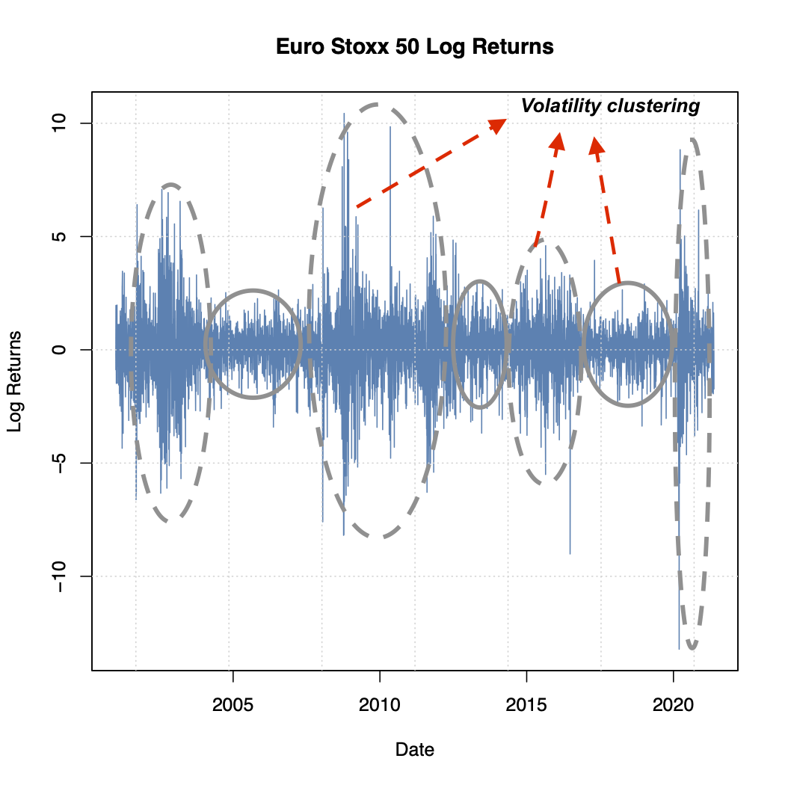

---
output:
  #bookdown::html_document2: default
  #bookdown::word_document2: default
  bookdown::pdf_document2: 
    template: templates/brief_template.tex
    citation_package: biblatex
    extra_dependencies: ["booktabs","threeparttable"]
documentclass: book
bibliography: references.bib
---

# Data and methodology {#dat-and-meth}

\chaptermark{Data and methodology}

\minitoc <!-- this will include a mini table of contents-->

```{r dataloading, include=F}
require(readxl)
require(xts)
require(PerformanceAnalytics)
require(kableExtra)
require(rugarch)
require(fitdistrplus)
require(fGarch)
require(tree)  # do we need this?
require(sgt)
# require(tseries) # do we need this
require(openxlsx) 
require(TTR)
require(lmtest)
require(latex2exp)
require(stringr)

options(scipen = 999)
knitr::opts_chunk$set(message = FALSE)
knitr::opts_chunk$set(warning = FALSE)
# data <- readxl::read_excel("data/datastream.xlsx",col_types = c("date", rep("numeric", 6)),skip = 2) 
# colnames(data) <- c("Date",gsub(pattern = " - PRICE INDEX", replacement='' , colnames(data)[2:7]))
# Price_indices <- as.xts(data[,-1], order.by = data$Date)
# Estoxx <- Price_indices[-1,1] #see if price index
# R <- diff(Estoxx, log = TRUE, na.pad = FALSE)*100
# write.xlsx(R, "data/Eurostoxx50.xlsx", sheetName = "Eurostoxx50", 
#   col.names = TRUE, row.names = TRUE, append = FALSE)

data <- suppressWarnings(read_excel("data/Price_Return.xlsx", 
    sheet = "Return", col_types = c("date", 
        "numeric", "numeric", "numeric", 
        "numeric"))) #warnings are NA's
colnames(data) <- c("Date", colnames(data)[-1])
indices <- as.xts(data[,-1], order.by = data$Date)
Estoxx <- indices[,1] #see if price index
Estoxx <- na.omit(Estoxx)
R <- diff(Estoxx, log = TRUE, na.pad = FALSE)*100
R <- na.omit(R) 

Rbali <- window(R, end = "2004-12-31") #up till end of balis dataset


```

## Data

\noindent We worked with daily returns on the Euro Stoxx 50 Return Index[^data-meth-1] retrieved from Datastream denoted in EUR from `r format(index(head(Estoxx,1)), '%d %B, %Y')` to `r format(index(tail(Estoxx,1)),'%d %B, %Y')`. The choice of daily data is motivated as follows. The primary interest in this paper is (C)VaR models for banks' (or financial institutions') internal trading desks. Their positions are usually short-term, making risk management at the daily level the most appropriate. As such, in reference to the literature review, regulators require VaR forecast for one day in advance. All following analysis could be applied on monthly returns as well. The Euro Stoxx 50, the leading blue-chip index of the Eurozone, was founded in 1999 and covers 50 of the most liquid and largest (in terms of free-float market capitalization) stocks. For its composition and computation we refer to the factsheet [@EUROSTOXXFactSheet]. Given that in the 20th century computing return series was time consuming, the Eurostoxx 50 Return index is shorter than the Euro Stoxx 50 Price index (going back to `r  format(index(head(Estoxx,1)), '%Y')`). As a robustness check, we ran all subsequent analysis for the longer price index as well. This did not yield a qualitative difference in terms of most efficient model(s). \

[^data-meth-1]: The same analysis has been performed for the FTSE 100, CAC 40, BEL 20 and the DAX 30 return indices and yielded broadly similar conclusions. The findings of these researches are available upon requests.

\noindent Table \@ref(tab:dsTable) provides the main statistics describing the return series analyzed. Let daily returns be computed as $R_{t}=100\left(\ln P_{t}-\ln P_{t-1}\right)$,where $P_{t}$ is the index price at time $t$ and $P_{t-1}$ is the index price at $t-1$. \

```{r prepstats, echo=F}
## RETURNS
#selecting relevant statistics only from table.Stats
Statistics <-  table.Stats(R)
Stats.names <- rownames(Statistics)[-c(1,2,4,7,8,10:13)]
Statistics <- Statistics[-c(1,2,4,7,8,10:13),] 
names(Statistics) <- Stats.names

# Skewness test
skewtest <- normtest::skewness.norm.test(coredata(R)) #as you can see the skewness is the same as the table.Stats method
Skewness <- round(skewtest$statistic,4)
names(Skewness) <- "Skewness"
skewness.pvalue <- skewtest$p.value
kurttest <- normtest::kurtosis.norm.test(coredata(R)) #this is normal kurtosis (not excess)
Excess_kurtosis <- round(kurttest$statistic,4) - 3 
names(Excess_kurtosis) <- "Excess Kurtosis"
kurtosis.pvalue <- kurttest$p.value

# Jb test
robustjb_R <- DescTools::JarqueBeraTest(coredata(R)) #robust?
jb_R <- normtest::jb.norm.test(R)

jb_R <- paste0(round(jb_R$statistic,4),"***")
names(jb_R) <- "Jarque-Bera"

# PART 1
Statistics <-  c(Statistics[1:5], Skewness, paste0("(",skewness.pvalue,"***)"), Excess_kurtosis, paste0("(",kurtosis.pvalue,"***)"),jb_R)

## STANDARDIZED RESIDUALS
garchspec.R <- ugarchspec(mean.model = list(armaOrder = c(1,0)),
                     variance.model = list(model = "sGARCH", variance.targeting = F), 
                     distribution.model = "norm")
# Estimate the model
garchfit.R <- ugarchfit(data = R, spec = garchspec.R)

# Compute stdret using residuals()
stdret.R <- rugarch::residuals(garchfit.R, standardize = TRUE)

Statistics.S <-  table.Stats(stdret.R)
Stats.names.S <- rownames(Statistics.S)[-c(1,2,4,7,8,10:13)]
Statistics.S <- Statistics.S[-c(1,2,4,7,8,10:13),] #selecting relevant columns only
Statistics.S <- Statistics.S[,1]
names(Statistics.S) <- Stats.names.S

# Skewness test
skewtest <- normtest::skewness.norm.test(coredata(stdret.R)) #as you can see the skewness is the same as the table.Stats method
Skewness <- round(skewtest$statistic,4)
names(Skewness) <- "Skewness"
skewness.pvalue <- skewtest$p.value
kurttest <- normtest::kurtosis.norm.test(coredata(stdret.R)) #this is normal kurtosis (not excess)
Excess_kurtosis <- round(kurttest$statistic,4) - 3
names(Excess_kurtosis) <- "Excess Kurtosis"
kurtosis.pvalue <- kurttest$p.value

# Jb test
robustjb_R <- DescTools::JarqueBeraTest(coredata(stdret.R)) #robust?
jb_R <- normtest::jb.norm.test(stdret.R)

jb_R <- paste0(round(jb_R$statistic,4),"***")
names(jb_R) <- "Jarque-Bera"

Statistics.S <- c(Statistics.S[1:5], Skewness, paste0("(",skewness.pvalue,"***)"), Excess_kurtosis, paste0("(",kurtosis.pvalue,"***)"),jb_R)

# for table 1
table1 <- data.frame(Statistics = names(Statistics.S)[c(3,2,4,1,5:10)], `Euro Stoxx 50` = Statistics[c(3,2,4,1,5:10)], `Standardized Residuals`= Statistics.S[c(3,2,4,1,5:10)])
colnames(table1) <- gsub(pattern = '\\.', replacement=' ',colnames(table1))

fn1 <- sprintf(paste0('This table shows the descriptive statistics of the daily percentage returns of %s over the period %s to %s (', nrow(R),' observations). Including arithmetic mean, median, maximum, minimum, standard deviation. The skewness, excess kurtosis with p-value and signicance and the Jarque-Bera test with significance.'),str_to_title(gsub(pattern = '\\.', replacement=' ',colnames(R))),gsub(" UTC", "",min(index(R))),gsub(" UTC", "",max(index(R))))
fn2 <- paste("The standardized residual is derived from a maximum likelihood estimation (simple GARCH model) as follows: ", "$ R_t=\\\\alpha_0+\\\\alpha_1 R_{t-1}+ \\\\varepsilon_t \\\\\\\\ \\\\sigma_t^2=\\\\beta_0+\\\\beta_1 \\\\varepsilon_{t-1}^2+\\\\beta_2 \\\\sigma_{t-1}^2, \\\\\\\\$",  "Where $\\\\varepsilon_t$ is given by $z_t \\\\sigma_t$")
fn3 <- '*, **, *** represent significance levels at the 5, 1 and <1 procent.'
```

\noindent The arithmetic mean of the series is `r round(as.numeric(table1[1,2]),2)`% with a standard deviation of `r round(as.numeric(table1[5,2]),2)`% and a median of `r round(as.numeric(table1[2,2]),2)` which translate to an annualized mean of `r round(as.numeric(table1[1,2])*252,2)`% and an annualized standard deviation of `r round(as.numeric(table1[5,2])*sqrt(252),2)`%. The skewness statistic is highly significant and negative at `r round(as.numeric(table1[6,2]),2)` and the excess kurtosis is also highly significant and positive at `r round(as.numeric(table1[8,2]),2)`. These 2 statistics give an overview of the distribution of the returns which has fatter tails than the normal distribution with a higher presence of left tail observations. A formal test such as the Jarque-Bera one with its statistic at `r round(normtest::jb.norm.test(stdret.R)$statistic,2)` and a high statistical significance, confirms the non-normality. \

```{r stats, echo=F, results='asis', fig.pos="!ht"}
table1 %>% kbl(caption = "Summary statistics of the returns","latex",
      label = 'dsTable',
      booktabs = T,
      position = "h!",
      digits = 3 )%>%
  kable_classic(full_width = F)%>% 
  footnote(general = "Notes",number=c(fn1,fn2,fn3),threeparttable = T,footnote_as_chunk = F, escape=F, general_title = "") 
```

\noindent The right column of table \@ref(tab:dsTable) exhibits the same descriptive statistics but for the standardizes residuals obtained from a simple GARCH model as mentioned in table \@ref(tab:dsTable) in Note 2. Again, Skewness statistic at `r round(as.numeric(table1[6,3]),3)` with a high statistical significance level and the excess Kurtosis at `r round(as.numeric(table1[8,3]),3)` also with a high statistical significance, suggest a non normal distribution of the standardized residuals and the Jarque-Bera statistic at `r round(normtest::jb.norm.test(R)$statistic,3)`, given its high significance, confirms the rejection of the normality assumption. \

\clearpage
\noindent As can be seen in figure \@ref(fig:plot1) the Euro area equity and later, since 1999 the Euro Stoxx 50, went up during the tech ("dot com") bubble reaching an ATH of €`r max(Estoxx)`. Then, there was a correction to boom again until the burst of the 2008 financial crisis. After which it decreased significantly. With an ATL at `r format(index(Estoxx)[Estoxx == min(Estoxx["2000/"])], '%d %B, %Y')` of €`r min(Estoxx["2000/"])`. There is an improvement, but then the European debt crisis, with its peak in 2010-2012, occurred. From then there was some improvement until the "health crisis", which arrived in Europe, February 2020. This crisis recovered very quickly reaching already values higher then the pre-COVID crisis level.

```{r plot1, echo=F, fig.cap='Euro Stoxx 50 prices', fig.align='center', out.width="95%", fig.pos='!ht'}
par(mfrow=c(1,1),mar =c(5.1, 4.1, 4.1, 2.1))
Estoxx <- na.omit(Estoxx)
plot(as.zoo(Estoxx), screen = 1, col = "steelblue", xlab = "Date", ylab = "Price", main = "Euro Stoxx 50"); grid(); 

# abline(v= index(Estoxx$`EURO STOXX 50`["1999-01-01"]),lty = 2); text(index(Estoxx$`EURO STOXX 50`["1998-07-01"]), y = 1550,"Launch of Euro", cex=0.7, srt=90,font=4);
# 
# abline(v= index(Estoxx$`EURO STOXX 50`["2000-04-14"]),lty = 2); text(index(Estoxx$`EURO STOXX 50`["1999-10-14"]), y = 1550,"Dot com bubble", cex=0.7, srt=90,font=4);

abline(v= index(Estoxx$`EURO STOXX 50`["2007-12-31"]),lty = 2); text(index(Estoxx$`EURO STOXX 50`["2007-06-27"]), y = 1450,"US housing bubble", cex=0.7, srt=90,font=4);

# abline(v= index(Estoxx$`EURO STOXX 50`["2008-09-15"])); text(index(Estoxx$`EURO STOXX 50`["2008-05-27"]), y = 2170,"Lehman brothers collapse", cex=0.8, srt=90); 

abline(v= index(Estoxx$`EURO STOXX 50`["2011-01-03"]),lty = 2); text(index(Estoxx$`EURO STOXX 50`["2010-08-06"]), y = 1340,"European bond crisis peak", cex=0.7, srt=90,font=4); 

abline(v= index(Estoxx$`EURO STOXX 50`["2020-02-20"]),lty = 2); text(index(Estoxx$`EURO STOXX 50`["2019-08-27"]), y = 1480,"COVID-19 crisis", cex=0.7, srt =90,font=4); 
```
\clearpage
\noindent In figure \@ref(fig:plot2) the daily log-returns are visualized. A stylized fact that is observable is the volatility clustering. As can be seen: periods of large volatility are mostly followed by large volatility and small volatility by small volatility.

```{r plot2, echo=F, fig.cap='Euro Stoxx 50 log returns', fig.align='center', out.width="70%", fig.pos='!ht'}
# pdf("figures/vol-clustering.pdf") # happened only once
# plot(as.zoo(R), screen = 1, col = "steelblue", xlab = "Date", ylab = "Log Returns",main = "Euro Stoxx 50 Log Returns");grid()
# dev.off()

```

<!-- \noindent In figure \@ref(fig:plot3) you can see a proxy for risk, the rolling volatility over one month (22 trading days), annualized 252 days. As in figure \@ref(fig:plot2), you can see again the pattern of volatility clustering arise. -->

<!-- # ```{r plot3, echo=F, fig.cap='Euro Stoxx 50 rolling volatility (22 days, calculated over 252 days)', out.width= "65%", fig.align='center', fig.pos='h'} #Plotting volatility
# par(mfrow = c(1,1))
# realized.vol <- xts(apply(R,2,runSD,n=22), index(R))*sqrt(252)
# plot.zoo(realized.vol, screen = 1, col = "steelblue", xlab = "Date", ylab = "Annualized 22-day volatility",main = "Euro Stoxx 50 rolling 22-day volatility (annualized)");grid()
# chart.RollingPerformance(R = R, width = 22,FUN = "sd.annualized", scale = 252, main = "One month rolling volatility", colorset="steelblue")
```-->
\noindent In figure \@ref(fig:plot4) the density distribution of the log returns are examined. As can be seen, as already mentioned in part \@ref(styl-facts), log returns are not really normally distributed. \

```{r plot4, echo=F,fig.cap='Density vs. Normal Euro Stoxx 50 log returns', out.width= "75%", fig.align='center', fig.pos="!ht"}
#Histogram to eyeball normality

# h <- hist(R, breaks = 75, density = 10,
#           col = "lightgray", xlab = "Accuracy", main = "Barplot")
# xfit <- seq(min(R), max(R), length = 40)
# yfit <- dnorm(xfit, mean = mean(R), sd = sd(R))
# yfit <- yfit * diff(h$mids[1:2]) * length(R)
# lines(xfit, yfit, col = "black", lwd = 1)

chart.Histogram(R = R, methods = c("add.normal"), breaks = 100, main = "Returns Histogram Vs. Normal", colorset = c("steelblue","black", "black"), cex.legend = 0.7, ylim=c(0,0.8)) 
```
\noindent In figure \@ref(fig:acfplots) the prediction errors (in absolute values and squared) are visualized in autocorrelation function plots. It is common practice to check this as in GARCH models the variance is for a large extent driven by the square of the prediction errors. The first component[^data-meth-2] $\alpha_0$ is set equal to the sample average. As can be seen there is presence of large positive autocorrelation. This reflects, again, the presence of volatility clusters. \

[^data-meth-2]: $\alpha_0$ is most of the time referred to as the $\mu$ in the conditional mean equation. Here we have followed @bali2008.

```{r acfplots, echo=F, fig.align='center', fig.cap="Absolute prediction errors", fig.subcap="This figure shows the absolute prediction errors and the autocorrelation function for the Euro Stoxx 50.", out.width= "100%", fig.pos='!ht'}
# Compute the mean daily return
m <- mean(R)
# Define the series of prediction errors
e <- R - m
# Plot the absolute value of the prediction errors
par(mfrow = c(2,2),mar=c(2,4,4,2)+0.1)
plot.zoo(abs(e), main = "Absolute Prediction Error",col = "steelblue", ylab = expression(paste("|",epsilon,"|")))
plot.zoo(e^2,main = "Squared Prediction Error", col = "steelblue", ylab =(expression(paste(epsilon^2))))
# Plot the acf of the absolute prediction errors
acfPlot(abs(e), lag.max = 22, labels=F)
title("ACF (absolute prediction errors)")
acfPlot(e^2, lag.max = 22, labels=F)
title("ACF (Squared prediction errors)")
```

\clearpage

## Methodology

### Garch models {#garch-method}

\noindent As already mentioned in part \@ref(univ-garch), the following models: SGARCH, EGARCH, IGARCH, GJRGARCH, NGARCH, TGARCH and NAGARCH (or TSGARCH) will be estimated. Additionally the distributions will be examined as well, including the normal, Student-t distribution, skewed Student-t distribution, generalized error distribution, skewed generalized error distribution and the skewed generalized t distribution. They will be estimated using maximum likelihood[^data-meth-3]. \

[^data-meth-3]: As already mentioned, fortunately, @alexios2020 has made it easy for us to implement this methodology in the R language[\^data-meth-4] [@Rteam] with the package "rugarch" v.1.4-4 (*R univariate garch*), which gives us a bit more time to focus on the results and the interpretation.

\noindent Maximum likelihood estimation is a method to find the distribution parameters that best fit the observed data, through maximization of the likelihood function, or the computationally more efficient log-likelihood function (by taking the natural logarithm). It is assumed that the return data is i.i.d. and that there is some underlying parametrized density function $f$ with one or more parameters that generate the data, defined as a vector $\theta$ in equation \@ref(eq:pdf). These functions are based on the joint probability distribution of the observed data as in equation \@ref(eq:logl). Subsequently, the (log)likelihood function is maximized using an optimization algorithm shown inequation \@ref(eq:optim).

```{=tex}
\begin{align} 
  y_1,y_2,...,y_N \sim i.i.d
    \\
  y_i \sim f(y|\theta)
 (\#eq:pdf)
\end{align}
```
```{=tex}
\begin{align} 
 L(\theta) = \prod^N_{i=1}f(y_i|\theta)
 (\#eq:logl)
\end{align}
\vspace{-15mm}
```
$$\log(L(\theta)) = \sum^N_{i=1} \log f(y_i |\theta)$$

```{=tex}
\begin{equation} 
\theta^{*} = arg \max_{\theta} [ L] 
 (\#eq:optim)
\end{equation}
\vspace{-15mm}

\begin{equation} 
\theta^{*} = arg \max_{\theta} [\log(L)]
\end{equation}
```

\noindent After estimation of the GARCH models in-sample, out-sample analysis is done by performing a rolling window approach. With assumptions: a window of 2500 observations and re-estimation every year.

### ACD models {#acd-models-meth}

\noindent Following @ghalanos2016, arguments of ACD models are specified as in @hansen1994. The skewness and kurtosis (shape) parameters which are constant in GARCH models (or time-invariant), are here time-varying following a piecewise linear dynamic. In equation \@ref(eq:acd) the parameters of the GARCH-ACD model are specified.

```{=tex}
\begin{equation}
\begin{array}{l}
y_{t}=\alpha_0 + \alpha_1 \times \varepsilon_{t}, \\
\varepsilon_{t}= \sigma_{t} \times z_{t}, \\
z_{t} \sim \Delta\left(0,1, \rho_{t}, \zeta_{t}\right), \\
\sigma_{t}^{2}=\beta_0+\beta_{1} \varepsilon_{t-1}^{2}+\beta_{2} \sigma_{t-1}^{2}, \\
\rho_{t}= \chi_{0}+\chi_{1} z_{t-1} I_{z_{t-1}<x}+\chi_{2} z_{t-1} I_{z_{t-1} \geqslant x}+\xi_{1} \bar{\rho}_{t-1},\\
\zeta_{t}=\kappa_{0}+\kappa_{1}\left|z_{t-1}\right| I_{z_{t-1}<x}+\kappa_{2}\left|z_{t-1}\right| I_{z_{t-1} \geqslant x}+\psi_{1} \bar{\zeta}_{t-1},
\end{array}
(\#eq:acd)
\end{equation}
```
\noindent where $y_t$, $z_t$ and $\sigma_t$ are familiar from GARCH models. $\rho_t$ and $\zeta_t$ are respectively the time-varying skewness and shape parameter (with shape parameter meaning here the tail-tickness) and the standardized residuals $z_t$ follows a distribution $\Delta$ that has a skewness and shape parameter. $\rho_t$ and $zeta_t$ are following a piecewise linear dynamic with $I$ the indicator variable (taking one if the underlying expression is true, 0 otherwise). $x$ is a treshold value set to 0. 

\noindent Again @ghalanos2016 makes it easier to implement the somewhat complex ACD models using the R language with package "racd".

### Analysis Tests VaR and CVaR

#### Unconditional coverage test of @kupiec1995

\noindent A number of tests are computed to see if the value-at-risk estimations capture the actual losses well. A first one is the unconditional coverage test by @kupiec1995. The unconditional coverage or proportion of failures method tests if the actual value-at-risk exceedances are consistent with the expected exceedances (a chosen percentile, e.g. 1% percentile) of the VaR model. Following @kupiec1995 and @ghalanos2020, the number of exceedences follow a binomial distribution (with thus probability equal to the significance level or expected proportion) under the null hypothesis of a correct VaR model. The test is conducted as a likelihood ratio test with statistic like in equation \@ref(eq:uccov), with $p$ the probability of an exceedence for a confidence level, $N$ the sample size and $X$ the number of exceedences. The null hypothesis states that the test statistic $L R^{u c}$ is $\chi^2$-distributed with one degree of freedom or that the probability of failure $\hat p$ is equal to the chosen percentile $\alpha$.

```{=tex}
\begin{align}
L R^{u c}=-2 \ln \left(\frac{(1-p)^{N-X} p^{X}}{\left(1-\frac{X}{N}\right)^{N-X}\left(\frac{X}{N}\right)^{X}}\right)
(\#eq:uccov)
\end{align}
```
#### Conditional coverage test of @christoffersen2001

\noindent @christoffersen2001 proposed the conditional coverage test. It is tests for unconditional coverage and serial independence. The serial independence is important while the $L R^{u c}$ can give a false picture while at any point in time it classifies inaccurate VaR estimates as "acceptably accurate" [@bali2007]. For a certain VaR estimate an indicator variable, $I_t(\alpha)$, is computed as equation \@ref(eq:ccov).

```{=tex}
\begin{align}
I_{t}(\alpha)=\left\{\begin{array}{ll}
1 & \text { if exceedence occurs } \\
0 & \text { if no exceedence occurs }
\end{array} .\right.
(\#eq:ccov)
\end{align}
```
\noindent It involves a likelihood ratio test's null hypothesis is that the statistic is $\chi^2$-distributed with two degrees of freedom or that the probability of violation $\hat p$ (unconditional coverage) as well as the conditional coverage (independence) is equal to the chosen percentile $\alpha$. While it tests both unconditional coverage as independence of violations, only this test has been performed and the unconditional coverage test is not reported.

#### Dynamic quantile test

\noindent @engle2004 provides an alternative test to specify if a VaR model is appropriately specified by proposing the dynamic quantile test. This test specifies the occurrence of an exceedance (here hit) as in \@ref(eq:dq1), with $I(.)$ a function that indicates when there is a hit, based on the actual return being lower than the predicted VaR. $\theta$ is the confidence level. They test jointly $H_0$ that the expected value of hit is zero and that it is uncorrelated with any variables known at the beginning of the period ($B$), notably the current VaR estimate and hits in previous periods, specified as lagged hits. This is done by regressing hit on these variables as in \@ref(eq:dq2). $X\delta$ corresponds to the matrix notation. Under $H_0$, this regression should have no explanatory power. As a final step, a $\chi^2$-distributed test statistic with $m$ degrees of freedom equal to the parameters to be estimated (constant, number of hits and VaR estimate) is constructed as in \@ref(eq:dq3).

```{=tex}
\begin{align}
Hit_{t}=I\left(R_{t}<-\operatorname{VaR}_{t}(1-\alpha)\right)-1-\alpha,
(\#eq:dq1)
\end{align}
\vspace{-15mm}
```
```{=tex}
\begin{align}
\begin{array}{c}
Hit_{t}=\delta_{0}+\delta_{1} H i t_{t-1}+\ldots+\delta_{p} Hit_{t-p}+\delta_{p+1} VaR_{t}+ \\
\delta_{p+2} I_{year1, t}+\ldots+\delta_{p+2+n} I_{year n, t}+u_{t} \end{array}
(\#eq:dq2)
\end{align}
\vspace{-15mm}
```
$$Hit_{t}=X \delta+u_{t} \quad u_{t}=\left\{\begin{array}{ll}
-(1-\alpha) & \text { prob }(\alpha) \\
(\alpha) & \text { prob } 1-\alpha
\end{array}\right.$$

```{=tex}
\vspace{-15mm}
\begin{align}
\frac{\hat{\delta}_{O L S}^{\prime} X^{\prime} X \hat{\delta}_{O L S}^{a}}{1-\alpha(\alpha)} \sim \chi^{2}(m)
(\#eq:dq3)
\end{align}
```
#### CVaR Test

The Expected Shortfall (or CVaR) test by @mcneil2000 tests whether the excess conditional shortfall has a mean of zero. Under the alternative hypothesis, this mean is greater than zero. This test uses a one sided t-statistic and bootstrapped p-values, as the distribution of the excess conditional shortfall is not assumed to be normal.
