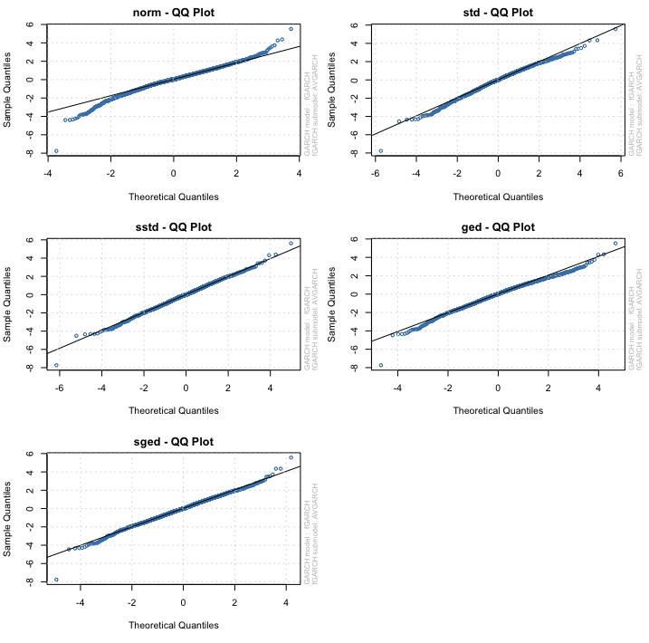

---
#####################
## thesis metadata ##
#####################
title: |
 The importance of higher moments in VaR and CVaR estimation. 
author: 
- name: Faes E.^[Enjo.Faes@student.ams.ac.be]
- name: \ \ \ Mertens de Wilmars S.^[Stephane.MertensdeWilmars@student.ams.ac.be]
- name: \ \ \ Pratesi F.^[Filippo.Pratesi@student.ams.ac.be]
university: Antwerp Management School
university-logo: templates/amslogo.pdf
submitted-text: A thesis submitted for the degree of
degree: Master in Finance
degreedate: June 2021
text: "Prof. dr. Annaert \\ Prof. dr. De Ceuster \\ Prof. dr. Zhang"
abstract: |
  `r paste(readLines("front-and-back-matter/_abstract.Rmd"), collapse = '\n  ')`
acknowledgements: |
  `r paste(readLines("front-and-back-matter/_acknowledgements.Rmd"), collapse = '\n  ')`
dedication: For our families and loved ones
fontsize: 11pt
abbreviations: "front-and-back-matter/abbreviations" # path to .tex file with abbreviations

#######################
## bibliography path ##
#######################
bibliography: references.bib
csl: templates/apa.csl
########################
## PDF layout options ###
#########################
masters-submission: false
corrections: true # correction highlighting 

## binding / margins ##
page-layout: nobind #'nobind' for equal margins (PDF output), 'twoside' for two-sided binding (mirror margins and blank pages), leave blank for one-sided binding (left margin > right margin)

## position of page numbers ##
ordinary-page-number-foot-or-head: foot #'foot' puts page number in footer, 'head' in header
ordinary-page-number-position: C  #C = center, R = right, L = left. If page layout is 'twoside', O = odd pages and E = even pages. E.g. RO,LE puts the page number to the right on odd pages and left on even pages
chapter-page-number-foot-or-head: foot #you may want it to be different on the chapter pages
chapter-page-number-position: C

## position of running header ##
running-header: true #indicate current chapter/section in header?
running-header-foot-or-head: head
running-header-position-leftmark: LO #marks the chapter. If layout is 'nobind', only this is used.
running-header-position-rightmark: RE  #marks the section.

draft-mark: false # add a DRAFT mark?
draft-mark-foot-or-head: foot ##'foot' = in footer, 'head' = in header
draft-mark-position: C

## section numbering ##
section-numbering-depth: 2 # to which depth should headings be numbered?

## tables of content ##
toc-depth: 2 # to which depth should headings be included in table of contents?
lof: true # include list of figures in front matter?
lot: true # include list of tables in front matter?
mini-toc: false  # include mini-table of contents at start of each chapter? (this just prepares it; you must also add \minitoc after the chapter titles)
mini-lot: false  # include mini-list of tables by start of each chapter?
mini-lof: false  # include mini-list of figures by start of each chapter?

## code block spacing ##
space-before-code-block: 10pt
space-after-code-block: 8pt

## linespacing ##
linespacing: 22pt plus2pt # 22pt is official for submission & library copies
frontmatter-linespacing: 17pt plus1pt minus1pt #spacing in roman-numbered pages (acknowledgments, table of contents, etc.)

### other stuff ###
abstractseparate: false  # include front page w/ abstract for examination schools?
hidelinks: false # false to highlight clickable links with a colored border
includeline-num: false

### citation and bibliography style ###
bibliography-heading-in-pdf: Works Cited

# biblatex options #
# unless you run into 'biber' error messages, use natbib as it lets you customise your bibliography directly
use-biblatex: true
bib-latex-options: "style=authoryear, sorting=nyt, backend=biber, maxcitenames=2, useprefix, doi=true, isbn=false, uniquename=false" #for science, you might want style=numeric-comp, sorting=none for numerical in-text citation with references in order of appearance

# natbib options #
# natbib runs into fewer errors than biblatex, but to customise your bibliography you need to fiddle with .bst files
use-natbib: false # to use natbib, set this to true, and change "output:bookdown::pdf_book:citation_package:" to "natbib"
natbib-citation-style: authoryear #for science, you might want numbers,square
natbib-bibliography-style: ACM-Reference-Format #or plainnat or some .bst file you download

#####################
## output options  ##
#####################
output:
  bookdown::pdf_book:
    citation_package: biblatex
    template: templates/template.tex
    keep_tex: true
    #pandoc_args: 
    pandoc_args:
      - '--lua-filter=templates/scholarly-metadata.lua'
      - '--lua-filter=templates/author-info-blocks.lua'
      - '--lua-filter=scripts_and_filters/colour_and_highlight.lua'
  bookdown::bs4_book: 
    css: 
      - templates/bs4_style.css
      - templates/corrections.css # remove to stop highlighting corrections
    theme:
      primary: "#6D1919"
    repo: https://github.com/ulyngs/oxforddown
    #pandoc_args: "--lua-filter=scripts_and_filters/colour_and_highlight.lua"
  bookdown::gitbook:
    css: templates/style.css
    config:
      sharing:
        facebook: false
        twitter: yes
        all: false
  bookdown::word_document2:
    toc: true   
link-citations: true
documentclass: book
always_allow_html: true #this allows html stuff in word (.docx) output
# The lines below make the 'knit' button render the whole thesis to PDF, HTML, or Word
# When outputting to PDF, you can clean up the files LaTeX generates by running 
# 'file.remove(list.files(pattern = "*.(log|mtc|maf|aux|bbl|blg|xml)"))' in the R console
knit: (function(input, ...) {bookdown::render_book(input, output_format = "bookdown::pdf_book")})
#knit: (function(input, ...) {bookdown::render_book(input, output_format = "bookdown::bs4_book")})
#knit: (function(input, ...) {bookdown::render_book(input, output_format = "bookdown::gitbook")})
#knit: (function(input, ...) {bookdown::render_book(input, output_format = "bookdown::word_document2")})
---

```{r install_packages, include=FALSE}
source('scripts_and_filters/install_packages_if_missing.R')
```

```{r create_chunk_options, include=FALSE, eval=knitr::is_latex_output()}
source('scripts_and_filters/create_chunk_options.R')
source('scripts_and_filters/wrap_lines.R')
```

```{=html}
<!--
Include the create_chunk_options chunk above at the top of your index.Rmd file
This will include code to create additional chunk options (e.g. for adding author references to savequotes)
and to make sure lines in code soft wrap
If you need to create your own additional chunk options, edit the file scripts/create_chunk_options.R
-->
```
<!-- This chunk includes the front page content in HTML output -->

```{r ebook-welcome, child = 'front-and-back-matter/_welcome-ebook.Rmd', eval=knitr::is_html_output()}
```

<!--chapter:end:index.Rmd-->

---
#########################################
# options for knitting a single chapter #
#########################################
output:
  bookdown::pdf_document2:
    template: templates/brief_template.tex
    citation_package: biblatex
  bookdown::html_document2: default
  bookdown::word_document2: default
documentclass: book
bibliography: references.bib
---

# List of Symbols {.unnumbered}

```{=tex}
\adjustmtc
\markboth{Introduction}{}
```
+---------------+------------------------------------------------------------------------------------------------------------------------------------------------------------------------------------------------------------------------------------------+
| Symbol        | Interpretation                                                                                                                                                                                                                           |
+===============+==========================================================================================================================================================================================================================================+
| $\alpha$      | Significance level, or the percentile chosen for the VaR.                                                                                                                                                                                |
+---------------+------------------------------------------------------------------------------------------------------------------------------------------------------------------------------------------------------------------------------------------+
| $\alpha_0$    | The constant in the conditional mean equation. In other papers sometimes referred to as $\mu$.                                                                                                                                           |
+---------------+------------------------------------------------------------------------------------------------------------------------------------------------------------------------------------------------------------------------------------------+
| $\alpha_1$    | The slope in the conditional mean equation.                                                                                                                                                                                              |
+---------------+------------------------------------------------------------------------------------------------------------------------------------------------------------------------------------------------------------------------------------------+
| $\beta_0$     | The constant in the variance equation and (G)ARCH models. In other papers sometimes referred to as $\omega$.                                                                                                                             |
+---------------+------------------------------------------------------------------------------------------------------------------------------------------------------------------------------------------------------------------------------------------+
| $\beta_1$     | The parameter estimate of the innovation process in the variance equation and (G)ARCH models. In other papers sometimes referred to as $\alpha$. This is also known as the ARCH component ($p$).                                         |
+---------------+------------------------------------------------------------------------------------------------------------------------------------------------------------------------------------------------------------------------------------------+
| $\beta_2$     | The parameter estimate of the autoregressive component in the variance equation and GARCH models. In other papers sometimes referred to as $\beta$. This is also known as the GARCH componenet ($q$)                                     |
+---------------+------------------------------------------------------------------------------------------------------------------------------------------------------------------------------------------------------------------------------------------+
| $\gamma$      | The leverage term in the asymmetric GARCH models: GJRGARCH and EGARCH.                                                                                                                                                                   |
+---------------+------------------------------------------------------------------------------------------------------------------------------------------------------------------------------------------------------------------------------------------+
| $\varepsilon$ | The innovation term or "noise" term. The random part or return shock of the previous period in the variance equation in GARCH models.                                                                                                    |
+---------------+------------------------------------------------------------------------------------------------------------------------------------------------------------------------------------------------------------------------------------------+
| $\zeta$       | The time-varying kurtosis parameter in the ACD specification following a piecewise linear dynamic.                                                                                                                                       |
+---------------+------------------------------------------------------------------------------------------------------------------------------------------------------------------------------------------------------------------------------------------+
| $\theta$      | The vector of parameters to estimate by the log likelihood functions in the maximum likelihood estimation of GARCH and distribution parameters.                                                                                          |
+---------------+------------------------------------------------------------------------------------------------------------------------------------------------------------------------------------------------------------------------------------------+
| $\eta$        | This is the tail-thickness parameter of the unconditional and conditional distribution. Following the notation of @bali2008, the parameter rises in the SGT distribution. For the T distribution this parameter is equal to the $\nu/2$. |
+---------------+------------------------------------------------------------------------------------------------------------------------------------------------------------------------------------------------------------------------------------------+
| $\kappa$      | The peakedness parameter which is only present in the SGT distribution and equal to 2 for the other distributions used in this paper.                                                                                                    |
+---------------+------------------------------------------------------------------------------------------------------------------------------------------------------------------------------------------------------------------------------------------+
| $\nu$         | The degree of freedom parameter from the T distribution.                                                                                                                                                                                 |
+---------------+------------------------------------------------------------------------------------------------------------------------------------------------------------------------------------------------------------------------------------------+
| $\xi$         | The skewness parameter in the skewed distributions (SGT, SGED, ST) and in the GARCH models. Sometimes referred to as $\lambda$.                                                                                                          |
+---------------+------------------------------------------------------------------------------------------------------------------------------------------------------------------------------------------------------------------------------------------+
| $\rho$        | The time-varying skewness parameter in the ACD specification following a piecewise linear dynamic.                                                                                                                                       |
+---------------+------------------------------------------------------------------------------------------------------------------------------------------------------------------------------------------------------------------------------------------+

# Introduction {.unnumbered}

```{=tex}
\adjustmtc
\markboth{Introduction}{}
```
\noindent A general assumption in finance is that stock returns are normally distributed. However, various authors have shown that this assumption does not hold in practice: stock returns are not normally distributed [among which @theodossiou2000; @subbotin1923; @theodossiou2015]. For example, @theodossiou2000 mentions that "empirical distributions of log-returns of several financial assets exhibit strong higher-order moment dependencies which exist mainly in daily and weekly log-returns and prevent monthly, bimonthly and quarterly log-returns from obeying the normality law implied by the central limit theorem. As a consequence, price changes do not follow the geometric Brownian motion." So in reality, stock returns exhibit fat-tails and peakedness [@Officer1972], these are some of the so-called stylized facts of returns. Additionally, a point of interest is the predictability of stock prices [@fama1965; @Fama1970; @welch2008]. This makes it difficult for corporations to manage market risk, i.e. the variability of stock prices. \

\noindent Risk, in general, can be defined as the volatility of unexpected outcomes [@jorion2007]. Corporations have to manage their risks both for their own sake and due to regulatory requirements. Consequentially, the Value at Risk metric (VaR), developed in response to the financial disaster events of the early 1990s, has been very influential in the financial world. The tool of VaR has become a standard measure of risk for many financial institutions going from banks, that use VaR to calculate the adequacy of their capital structure, to other financial services companies to assess the exposure of their positions and portfolios. The 1% VaR can be defined as the maximum loss of a portfolio, during a time horizon, excluding all the negative events with a combined probability lower than 1% while the Conditional Value at Risk (CVaR) can be defined as the average of the events that are lower than the VaR. Also @bali2008 explains that many implementations of the CVaR have the assumption that asset and portfolio's returns are normally distributed but that this is inconsistent with the evidence. Assuming normality can lead to incorrect VaR and CVaR numbers, an underestimation of the probability of extreme events happening and ultimately a poor understanding of risk exposure. \

\noindent This paper has *two goals*. The first goal is to *develop a deeper understanding of GARCH models*, their mechanics and the properties of these models in regard to risk management. Second, we aim to *replicate and update the research made by @bali2008 on U.S. indexes, analyzing the dynamics proposed with a European outlook*. Namely, we use GARCH models to predict the volatility of the Euro Stoxx 50 return index. After this estimation, we compute VaR and CVaR and conduct a backtest to see if the GARCH models predict the VaR and CVaR appropriately. This is summarized in our research question:

> > **Do higher moments increase accuracy in the estimation of VaR and CVaR?**

\noindent The paper is organized as follows. First, chapter \@ref(lit-rev) discusses the stylized facts, conditional distributions and the GARCH models. Chapter \@ref(dat-and-meth) describes the data used and the methodology followed in modeling the volatility with GARCH models. Then a description is given of the control tests used to evaluate the performances of the different GARCH models and underlying distributions. In chapter \@ref(analysis), the findings are presented and discussed. In chapter \@ref(Robustness) the results of some diagnostic tests are shown and interpreted. Finally, chapter \@ref(Conclusion) summarizes the results and answers the research question.

<!--chapter:end:01-introduction.Rmd-->

---
#########################################
# options for knitting a single chapter #
#########################################
output:
  bookdown::pdf_document2:
    template: templates/brief_template.tex
    citation_package: biblatex
  bookdown::html_document2: default
  bookdown::word_document2: default
documentclass: book
bibliography: references.bib
---

<!-- ```{block type='savequote', quote_author='(ref:alexander-quote)', include=knitr::is_latex_output()} -->

<!-- Volatility is unobservable. We can only ever estimate and forecast volatility, and this only within the context of an assumed statistical model. So there is no absolute ‘true’ volatility: what is ‘true’ depends only on the assumed model... -->

<!-- Moreover, volatility is only a sufficient statistic for the dispersion of the returns distribution when we make a normality assumption. In other words, volatility does not provide a full description of the risks that are taken by the investment unless we assume the investment returns are normally distributed. -->

<!-- ``` -->

<!-- (ref:alexander-quote) --- Alexander (2008) in *Market Risk Analysis Practical Financial Econometrics* -->

# Literature review {#lit-rev}

\minitoc <!-- this will include a mini table of contents--> <!-- LaTeX normally does not indent the first line after a heading - however, it does so after the mini table of contents. You can manually tell it not to with \noindent -->

## Stylized facts of returns {#styl-facts}

\noindent When analyzing returns as a time-series, we look at log returns. The log returns are similar to simple returns, so the stylized facts of returns apply to both. One assumption that is made often in financial applications is that returns are i.i.d., or independently and identically distributed. Another assumption is that they are normally distributed. These assumptions might not be reasonable in reality. Below the stylized facts[^literature-review-1] following @annaert2021 for returns are given.

[^literature-review-1]: Stylized facts are the statistical properties that appear to be present in many empirical asset returns (across time and markets)

-   Returns are *small and volatile* (with the standard deviation being larger than the mean on average).
-   Returns have very *little serial correlation*, as mentioned by for example @bollerslev1987.
-   Returns exhibit conditional heteroskedasticity, or *volatility clustering*. This effect goes back to @mandelbrot1963. There is no constant variance (homoskedasticity). Instead it is time-varying. @bollerslev1987 describes this phenomenon as "rates of return data are characterized by volatile and tranquil periods". @alexander2008 argues this to have implications for risk models: following a large shock to the market, the volatility changes and the probability of another large shock is increased significantly.
-   Returns exhibit *asymmetric volatility*, in the sense that volatility increases more after a negative return shock than after a large positive return shock. This is also called the *leverage effect*. @alexander2008 mentions that this leverage effect is most pronounced in equity markets: usually there is a strong negative correlation between equity returns and the change in volatility.
-   Returns are *not normally distributed*, as found by early work of @fama1965. Returns have tails fatter than a normal distribution (they are leptokurtotic) and thus carry more risk. Log returns however **can** be assumed to be normally distributed. We will examine this in our empirical analysis. This makes that simple returns follow a log-normal distribution, a skewed density distribution. A good summary is given by @alexander2008 : "In general, we need to know more about the distribution of returns than its expected return and its volatility. Volatility tells us the *scale* and the mean tells us the *location*, but the dispersion also depends on the ***shape*** of the distribution. The best dispersion metric would be based on the entire distribution function of returns."

\noindent Firms holding a portfolio of various stocks or other investments have a lot of things to consider: expected return of a portfolio, the probability to get a return lower than some threshold, the probability that an asset in the portfolio drops in value when the market crashes. All the previous requires information about the return distribution or so called density function of returns. What we know from the stylized facts of returns that the normal distribution is not appropriate for returns. In appendix part \@ref(conditional-distributions) we summarize some alternative distributions (SGT, SGED, GED, Skewed Student-t, and Student-t) that might better approximate the actual distribution of returns than the normal one.

\newpage

## Volatility modeling {#vol-mod}

### Rolling volatility

\noindent When volatility needs to be estimated on a specific trading day, the method used as a descriptive tool would be to use rolling standard deviations. @engle2001 explains the calculation of rolling standard deviations, as the standard deviation over a fixed number of the most recent observations[^literature-review-2]. Engle regards this formulation as the first ARCH model.

[^literature-review-2]: For example, for the past month it would then be calculated as the equally weighted average of the squared deviations from the mean from the last 22 observations (the average amount of trading or business days in a month). All these deviations are thus given an equal weight. Also, only a fixed number of past recent observations is examined.

### From ARCH to GARCH models {#univ-garch}

\noindent Autoregressive Conditional Heteroscedasticity (ARCH) models, proposed by @engle1982, were in the first case not used in financial markets but on inflation. Since then, it has been used as one of the workhorses of volatility modeling. \

\noindent There are three building blocks of the ARCH model: returns, the innovation process and the variance process (or volatility function), written out for an ARCH(1) in respectively equation \@ref(eq:eq1), \@ref(eq:eq2) and \@ref(eq:eq3). Returns are written as a constant part ($\alpha_0$) and an unexpected part, called noise or the innovation process ($\alpha_1 \times \varepsilon_t$). The innovation process is the volatility ($\sigma_t$) times $z_t$, which is an independent identically distributed random variable with a mean of 0 (zero-mean) and a variance of 1 (unit-variance). The independent (**i**id), notes the fact that the $z$-values are not correlated, but completely independent of each other. The distribution is one of the distributions listed in appendix part \@ref(conditional-distributions). The third component is the variance process or the expression for the volatility. The variance is given by a constant $\beta_0$, plus the random part which depends on the return shock of the previous period squared ($\varepsilon_{t-1}^2$). In that sense when the uncertainty or surprise in the last period increases, then the variance becomes larger in the next period. The element $\sigma_t^2$ is thus known at time $t-1$, while it is a deterministic function of a random variable observed at time $t-1$ (i.e. $\varepsilon_{t-1}^2$).

```{=tex}
\begin{equation} 
y_{t} = \alpha_0 + \alpha_1 \times \varepsilon_t
 (\#eq:eq1) 
\end{equation}
\vspace{-15mm}
```
```{=tex}
\begin{equation}
\varepsilon_{t} = \sigma_t \times z_t, \ where \ z_t \stackrel{iid}{\sim} (0,1)
 (\#eq:eq2) 
\end{equation}
\vspace{-15mm}
```
```{=tex}
\begin{equation}
\sigma_{t}^{2} = \beta_0 + \beta_1 \times  \varepsilon_{t-1}^2 
 (\#eq:eq3)
\end{equation}
```
\noindent The full description of the ARCH model is given in appendix part \@ref(ARCH). \

\noindent An improvement of the ARCH model is the Generalized Autoregressive Conditional Heteroscedasticity (GARCH)[^literature-review-3]. This model and its variants come in to play because of the fact that calculating standard deviations through rolling periods, gives an equal weight to distant and nearby periods, by such not taking into account empirical evidence of volatility clustering, which can be identified as positive autocorrelation in the absolute returns. GARCH models are an extension to ARCH models, as they incorporate both a novel moving average term (not included in ARCH) and the autoregressive component. Furthermore, a second extension is changing the assumption of the underlying distribution. As already explained, the normal distribution is an unrealistic assumption, so other distributions which are described in part \@ref(conditional-distributions) will be used. As @alexander2008 explains, this does not change the formulae of computing the volatility forecasts but it changes the functional form of the likelihood function[^literature-review-4]. An overview (of a selection) of investigated GARCH models is given in the following table.

[^literature-review-3]: *Generalized* as it is a generalization by @bollerslev1986 of the ARCH model of @engle1982. *Autoregressive,* as it is a time series model with an autoregressive form (regression on itself). *Conditional heteroscedasticity,* while time variation in conditional variance is built into the model [@alexander2008].

[^literature-review-4]: which makes the maximum likelihood estimation explained in part \@ref(garch-method) complex with more parameters that have to be estimated.

\newpage

| Author(s)                       | Model                     |
|---------------------------------|---------------------------|
| @engle1982                      | ARCH model                |
| @bollerslev1986                 | GARCH model               |
| @bollerslev1986                 | IGARCH model              |
| @nelson1991                     | EGARCH model              |
| @glosten1993                    | GJRGARCH model            |
| @engle1993                      | NAGARCH model             |
| @zakoian1994                    | TGARCH model              |
| @taylor1986 and @schwert1989    | AVGARCH model             |
| @morganguarantytrustcompany1996 | EWMA or RiskMetrics model |

: GARCH models, the founders

## ACD models {#acd-models}

\noindent An extension to GARCH models was proposed by @hansen1994, namely the autoregressive conditional density estimation model (referred to as ACD model, sometimes ARCD). It focuses on time variation in higher moments (skewness and kurtosis), because the degree and frequency of extreme events seem to be not expected by traditional models. Some GARCH models are already able to capture the dynamics by relying on a different unconditional distribution than the normal distribution (for example skewed distributions like the SGED or SGT), or a model that allows to incorporate these higher moments. However, @ghalanos2016 mentions that these models also assume the shape and skewness parameters to be constant (not time-varying). As Ghalanos mentions: "the research on time-varying higher moments has mostly explored different parametrizations in terms of dynamics and distributions with little attention to the performance of the models out-of-sample and ability to outperform a GARCH model with respect to VaR." Also one could question the marginal benefits of the ACD, while the estimation procedure is rather sophisticated (nonlinear bounding specification of higher moment distribution parameters and interaction). So, are skew (skewness parameter) and kurtosis (shape parameter or parameters) time-varying? The literature investigating higher moments has arguments for and against this statement. In part \@ref(acd-models-meth) the specification is given.

## Value at Risk

\noindent Value at Risk (VaR) is a risk metric developed simultaneously by @markowitz1952 and @roy1952 to calculate how much money an investment, portfolio, department or institution such as a bank could lose in a market downturn, though in this period it remained mostly a theoretical discussion due to lacking processing power and industry demand for risk management measures. Another important document in literature is the *1996 RiskMetrics Technical Document*, composed by RiskMetrics[^literature-review-5] (@morganguarantytrustcompany1996, part of JP Morgan), which gives a good overview of the computation, but also made use of the name "value-at-risk" over equivalents like "dollars-at-risk" (DaR), "capital-at-risk" (CaR), "income-at-risk" (IaR) and "earnings-at-risk" (EaR). According to @holton2002 VaR gained traction in the last decade of the $20^{th}$ century when financial institutions started using it to determine their regulatory capital requirements. A $VaR_{99}$ finds the amount that would be the greatest possible loss in 99% of cases. It can be defined as the threshold value $F_t$. Put differently, in 1% of cases the loss would be greater than this amount. It is specified as in \@ref(eq:eq22). @christoffersen2001 puts forth a general framework for specifying VaR models and comparing between two alternatives models.

[^literature-review-5]: RiskMetrics Group was the market leader in market and credit risk data and modeling for banks, corporate asset managers and financial intermediaries [@alexander2008].

```{=tex}
\begin{align}
Pr(y_t \le F_t | \Omega_{t-1}) \equiv \alpha
 (\#eq:eq22)
\end{align}
```
\noindent With $y_t$ expected returns in period t, $\Omega_{t-1}$ the information set available in the previous period and $\alpha$ the chosen quantile.

\newpage

## Conditional Value at Risk

\noindent One major shortcoming of the VaR is that it does not provide information on the probability distribution of losses beyond the threshold amount. As VaR lacks subadditivity of different percentile outcomes, @artzner1996 rejects it as a coherent measure of risk. This is problematic, as losses beyond this amount would be more problematic if there is a large probability distribution of extreme losses, than if losses follow say a normal distribution. To solve this issue, they provide a conceptual idea of a Conditional VaR (CVaR) which quantifies the average loss one would expect if the threshold is breached, thereby taking the distribution of the tail into account. Mathematically, a $CVaR_{99}$ is the average of all the $VaR$ with a confidence level equal to or higher than 99. It is commonly referred to as expected shortfall (ES) sometimes and was written out in the form it is used by today by [@bertsimas2004]. It is specified as in \@ref(eq:eq23). \

\noindent To calculate $F_t$, VaR and CVaR require information on the expected distribution mean, variance and other parameters, to be calculated using the previously discussed GARCH models and distributions.

```{=tex}
\begin{align}
Pr(y_t \le F_t | \Omega_{t-1}) \equiv \int_{-\infty}^{\alpha} \! f(y_t | \Omega_{t-1}) \, \mathrm{d}y_t = \alpha
 (\#eq:eq23)
\end{align}
```
\noindent With the same notations as before, and $f$ the (conditional) probability density function of $y_t$.

\noindent According to the BIS framework, banks need to calculate both $VaR_{99}$ and $VaR_{97.5}$ daily to determine capital requirements for equity, using a minimum of one year of daily observations [@baselcommitteeonbankingsupervision2016]. Whenever a daily loss is recorded, this has to be registered as an exception or exceedance. Banks can use an internal model to calculate their VaRs, but if they have more than 12 exceptions for their $VaR_{99}$ or 30 exceptions for their $VaR_{97.5}$ they have to follow a standardized approach. Similarly, banks must calculate $CVaR_{97.5}$.

## Past literature on the consequences of higher moments for VaR determination {#past-lit}

A small description of the higher moments and VaR determination is given below. A small overview table is given:

| Author      | Higher moments                                      |
|-------------|-----------------------------------------------------|
| @hansen1994 | Skewness and kurtosis extended ARCH-model           |
| @harvey1999 | Skewness, Effect of higher moments on lower moments |
| @brooks2005 | Kurtosis, Time varying degrees of freedom           |

: Higher moments and VaR

\noindent While it is relatively straightforward to include unconditional higher-moments in VaR and CVaR calculations, it is less simple to do so when the higher moments (in addition to the variance) are time-varying. @hansen1994 extended the ARCH model to include time-varying moments beyond mean and variance. While mean and variance of returns are usually the parameters of most interest, disregarding these higher moments could provide an incomplete description of a conditional distribution. The model proposed by @hansen1994 allows for skewness and shape parameters to vary in a skewed-t density function through specifying them as functions of their errors in previous periods (in a similar way how variance is estimated). Applications on U.S. Treasuries and exchange rates are discussed by Hansen. \

\noindent @harvey1999 extended a GARCH(1,1) model to include time-varying skewness by estimating it jointly with time-varying variance using a skewed Student-t distribution. They found a significant impact of skewness on conditional volatility, suggesting that these moments should be jointly estimated for efficiency. Changes in conditional skewness have an impact on the persistence of volatility shocks. They also found that including skewness causes the leverage effects of variance to disappear. They applied their methods on different stock indices (both developed and emerging) at daily, weekly and monthly frequency. \

\noindent @brooks2005 proposed a model based on a Student-t distribution that allows for both the variance and the degrees of freedom to be time-varying, independently from each other. Their model allows for both asymmetric variance and kurtosis through an indicator function (which has a positive effect on these moments only when the shock is in the right tail). They applied their model on different financial assets in the U.S. and U.K. at daily frequency.

<!--chapter:end:02-literature-review.Rmd-->

---
output:
  #bookdown::html_document2: default
  #bookdown::word_document2: default
  bookdown::pdf_document2: 
    template: templates/brief_template.tex
    citation_package: biblatex
    extra_dependencies: ["booktabs","threeparttable"]
documentclass: book
bibliography: references.bib
---

# Data and methodology {#dat-and-meth}

\chaptermark{Data and methodology}

\minitoc <!-- this will include a mini table of contents-->

```{r dataloading, include=F}
require(readxl)
require(xts)
require(PerformanceAnalytics)
require(kableExtra)
require(rugarch)
require(fitdistrplus)
require(fGarch)
require(tree)  # do we need this?
require(sgt)
# require(tseries) # do we need this
require(openxlsx) 
require(TTR)
require(lmtest)
require(latex2exp)
require(stringr)

options(scipen = 999)
knitr::opts_chunk$set(message = FALSE)
knitr::opts_chunk$set(warning = FALSE)
# data <- readxl::read_excel("data/datastream.xlsx",col_types = c("date", rep("numeric", 6)),skip = 2) 
# colnames(data) <- c("Date",gsub(pattern = " - PRICE INDEX", replacement='' , colnames(data)[2:7]))
# Price_indices <- as.xts(data[,-1], order.by = data$Date)
# Estoxx <- Price_indices[-1,1] #see if price index
# R <- diff(Estoxx, log = TRUE, na.pad = FALSE)*100
# write.xlsx(R, "data/Eurostoxx50.xlsx", sheetName = "Eurostoxx50", 
#   col.names = TRUE, row.names = TRUE, append = FALSE)

data <- suppressWarnings(read_excel("data/Price_Return.xlsx", 
    sheet = "Return", col_types = c("date", 
        "numeric", "numeric", "numeric", 
        "numeric"))) #warnings are NA's
colnames(data) <- c("Date", colnames(data)[-1])
indices <- as.xts(data[,-1], order.by = data$Date)
Estoxx <- indices[,1] #see if price index
Estoxx <- na.omit(Estoxx)
R <- diff(Estoxx, log = TRUE, na.pad = FALSE)*100
R <- na.omit(R) 

Rbali <- window(R, end = "2004-12-31") #up till end of balis dataset


```

## Data

\noindent We worked with daily returns on the Euro Stoxx 50 Return Index[^data-meth-1] retrieved from Datastream denoted in EUR from `r format(index(head(Estoxx,1)), '%d %B, %Y')` to `r format(index(tail(Estoxx,1)),'%d %B, %Y')`. The choice of daily data is motivated as follows. The primary interest in this paper is (C)VaR models for banks' (or financial institutions') internal trading desks. Their positions are usually short-term, making risk management at the daily level the most appropriate. As such, in reference to the literature review, regulators require VaR forecast for one day in advance. All following analysis could be applied on monthly returns as well. The Euro Stoxx 50, the leading blue-chip index of the Eurozone, was founded in 1999 and covers 50 of the most liquid and largest (in terms of free-float market capitalization) stocks. For its composition and computation we refer to the factsheet [@EUROSTOXXFactSheet]. Given that in the 20th century computing return series was time consuming, the Eurostoxx 50 Return index is shorter than the Euro Stoxx 50 Price index (going back to `r  format(index(head(Estoxx,1)), '%Y')`). As a robustness check, we ran all subsequent analysis for the longer price index as well. This did not yield a qualitative difference in terms of most efficient model(s). \

[^data-meth-1]: The same analysis has been performed for the FTSE 100, CAC 40, BEL 20 and the DAX 30 return indices and yielded broadly similar conclusions. The findings of these researches are available upon requests.

\noindent Table \@ref(tab:dsTable) provides the main statistics describing the return series analyzed. Let daily returns be computed as $R_{t}=100\left(\ln P_{t}-\ln P_{t-1}\right)$,where $P_{t}$ is the index price at time $t$ and $P_{t-1}$ is the index price at $t-1$. \

```{r prepstats, echo=F}
## RETURNS
#selecting relevant statistics only from table.Stats
Statistics <-  table.Stats(R)
Stats.names <- rownames(Statistics)[-c(1,2,4,7,8,10:13)]
Statistics <- Statistics[-c(1,2,4,7,8,10:13),] 
names(Statistics) <- Stats.names

# Skewness test
skewtest <- normtest::skewness.norm.test(coredata(R)) #as you can see the skewness is the same as the table.Stats method
Skewness <- round(skewtest$statistic,4)
names(Skewness) <- "Skewness"
skewness.pvalue <- skewtest$p.value
kurttest <- normtest::kurtosis.norm.test(coredata(R)) #this is normal kurtosis (not excess)
Excess_kurtosis <- round(kurttest$statistic,4) - 3 
names(Excess_kurtosis) <- "Excess Kurtosis"
kurtosis.pvalue <- kurttest$p.value

# Jb test
robustjb_R <- DescTools::JarqueBeraTest(coredata(R)) #robust?
jb_R <- normtest::jb.norm.test(R)

jb_R <- paste0(round(jb_R$statistic,4),"***")
names(jb_R) <- "Jarque-Bera"

# PART 1
Statistics <-  c(Statistics[1:5], Skewness, paste0("(",skewness.pvalue,"***)"), Excess_kurtosis, paste0("(",kurtosis.pvalue,"***)"),jb_R)

## STANDARDIZED RESIDUALS
garchspec.R <- ugarchspec(mean.model = list(armaOrder = c(1,0)),
                     variance.model = list(model = "sGARCH", variance.targeting = F), 
                     distribution.model = "norm")
# Estimate the model
garchfit.R <- ugarchfit(data = R, spec = garchspec.R)

# Compute stdret using residuals()
stdret.R <- rugarch::residuals(garchfit.R, standardize = TRUE)

Statistics.S <-  table.Stats(stdret.R)
Stats.names.S <- rownames(Statistics.S)[-c(1,2,4,7,8,10:13)]
Statistics.S <- Statistics.S[-c(1,2,4,7,8,10:13),] #selecting relevant columns only
Statistics.S <- Statistics.S[,1]
names(Statistics.S) <- Stats.names.S

# Skewness test
skewtest <- normtest::skewness.norm.test(coredata(stdret.R)) #as you can see the skewness is the same as the table.Stats method
Skewness <- round(skewtest$statistic,4)
names(Skewness) <- "Skewness"
skewness.pvalue <- skewtest$p.value
kurttest <- normtest::kurtosis.norm.test(coredata(stdret.R)) #this is normal kurtosis (not excess)
Excess_kurtosis <- round(kurttest$statistic,4) - 3
names(Excess_kurtosis) <- "Excess Kurtosis"
kurtosis.pvalue <- kurttest$p.value

# Jb test
robustjb_R <- DescTools::JarqueBeraTest(coredata(stdret.R)) #robust?
jb_R <- normtest::jb.norm.test(stdret.R)

jb_R <- paste0(round(jb_R$statistic,4),"***")
names(jb_R) <- "Jarque-Bera"

Statistics.S <- c(Statistics.S[1:5], Skewness, paste0("(",skewness.pvalue,"***)"), Excess_kurtosis, paste0("(",kurtosis.pvalue,"***)"),jb_R)

# for table 1
table1 <- data.frame(Statistics = names(Statistics.S)[c(3,2,4,1,5:10)], `Euro Stoxx 50` = Statistics[c(3,2,4,1,5:10)], `Standardized Residuals`= Statistics.S[c(3,2,4,1,5:10)])
colnames(table1) <- gsub(pattern = '\\.', replacement=' ',colnames(table1))

fn1 <- sprintf(paste0('This table shows the descriptive statistics of the daily percentage returns of %s over the period %s to %s (', nrow(R),' observations). Including arithmetic mean, median, maximum, minimum, standard deviation. The skewness, excess kurtosis with p-value and signicance and the Jarque-Bera test with significance.'),str_to_title(gsub(pattern = '\\.', replacement=' ',colnames(R))),gsub(" UTC", "",min(index(R))),gsub(" UTC", "",max(index(R))))
fn2 <- paste("The standardized residual is derived from a maximum likelihood estimation (simple GARCH model) as follows: ", "$ R_t=\\\\alpha_0+\\\\alpha_1 R_{t-1}+ \\\\varepsilon_t \\\\\\\\ \\\\sigma_t^2=\\\\beta_0+\\\\beta_1 \\\\varepsilon_{t-1}^2+\\\\beta_2 \\\\sigma_{t-1}^2, \\\\\\\\$",  "Where $\\\\varepsilon_t$ is given by $z_t \\\\sigma_t$")
fn3 <- '*, **, *** represent significance levels at the 5, 1 and <1 procent.'
```

\noindent The arithmetic mean of the series is `r round(as.numeric(table1[1,2]),2)`% with a standard deviation of `r round(as.numeric(table1[5,2]),2)`% and a median of `r round(as.numeric(table1[2,2]),2)` which translate to an annualized mean of `r round(as.numeric(table1[1,2])*252,2)`% and an annualized standard deviation of `r round(as.numeric(table1[5,2])*sqrt(252),2)`%. The skewness statistic is highly significant and negative at `r round(as.numeric(table1[6,2]),2)` and the excess kurtosis is also highly significant and positive at `r round(as.numeric(table1[8,2]),2)`. These 2 statistics give an overview of the distribution of the returns which has fatter tails than the normal distribution with a higher presence of left tail observations. A formal test such as the Jarque-Bera one with its statistic at `r round(normtest::jb.norm.test(stdret.R)$statistic,2)` and a high statistical significance, confirms the non-normality. \

```{r stats, echo=F, results='asis', fig.pos="!ht"}
table1 %>% kbl(caption = "Summary statistics of the returns","latex",
      label = 'dsTable',
      booktabs = T,
      position = "h!",
      digits = 3 )%>%
  kable_classic(full_width = F)%>% 
  footnote(general = "Notes",number=c(fn1,fn2,fn3),threeparttable = T,footnote_as_chunk = F, escape=F, general_title = "") 
```

\noindent The right column of table \@ref(tab:dsTable) exhibits the same descriptive statistics but for the standardizes residuals obtained from a simple GARCH model as mentioned in table \@ref(tab:dsTable) in Note 2. Again, Skewness statistic at `r round(as.numeric(table1[6,3]),3)` with a high statistical significance level and the excess Kurtosis at `r round(as.numeric(table1[8,3]),3)` also with a high statistical significance, suggest a non normal distribution of the standardized residuals and the Jarque-Bera statistic at `r round(normtest::jb.norm.test(R)$statistic,3)`, given its high significance, confirms the rejection of the normality assumption. \

\clearpage

\noindent As can be seen in figure \@ref(fig:plot1) the Euro area equity and later, since 1999 the Euro Stoxx 50, went up during the tech ("dot com") bubble reaching an ATH of €`r max(Estoxx)`. Then, there was a correction to boom again until the burst of the 2008 financial crisis. After which it decreased significantly. With an ATL at `r format(index(Estoxx)[Estoxx == min(Estoxx["2000/"])], '%d %B, %Y')` of €`r min(Estoxx["2000/"])`. There is an improvement, but then the European debt crisis, with its peak in 2010-2012, occurred. From then there was some improvement until the "health crisis", which arrived in Europe, February 2020. This crisis recovered very quickly reaching already values higher then the pre-COVID crisis level.

```{r plot1, echo=F, fig.cap='Euro Stoxx 50 prices', fig.align='center', out.width="95%", fig.pos='!ht'}
par(mfrow=c(1,1),mar =c(5.1, 4.1, 4.1, 2.1))
Estoxx <- na.omit(Estoxx)
plot(as.zoo(Estoxx), screen = 1, col = "steelblue", xlab = "Date", ylab = "Price", main = "Euro Stoxx 50"); grid(); 

# abline(v= index(Estoxx$`EURO STOXX 50`["1999-01-01"]),lty = 2); text(index(Estoxx$`EURO STOXX 50`["1998-07-01"]), y = 1550,"Launch of Euro", cex=0.7, srt=90,font=4);
# 
# abline(v= index(Estoxx$`EURO STOXX 50`["2000-04-14"]),lty = 2); text(index(Estoxx$`EURO STOXX 50`["1999-10-14"]), y = 1550,"Dot com bubble", cex=0.7, srt=90,font=4);

abline(v= index(Estoxx$`EURO STOXX 50`["2007-12-31"]),lty = 2); text(index(Estoxx$`EURO STOXX 50`["2007-06-27"]), y = 1450,"US housing bubble", cex=0.7, srt=90,font=4);

# abline(v= index(Estoxx$`EURO STOXX 50`["2008-09-15"])); text(index(Estoxx$`EURO STOXX 50`["2008-05-27"]), y = 2170,"Lehman brothers collapse", cex=0.8, srt=90); 

abline(v= index(Estoxx$`EURO STOXX 50`["2011-01-03"]),lty = 2); text(index(Estoxx$`EURO STOXX 50`["2010-08-06"]), y = 1340,"European bond crisis peak", cex=0.7, srt=90,font=4); 

abline(v= index(Estoxx$`EURO STOXX 50`["2020-02-20"]),lty = 2); text(index(Estoxx$`EURO STOXX 50`["2019-08-27"]), y = 1480,"COVID-19 crisis", cex=0.7, srt =90,font=4); 
```

\clearpage

\noindent In figure \@ref(fig:plot2) the daily log-returns are visualized. A stylized fact that is observable is the volatility clustering. As can be seen: periods of large volatility are mostly followed by large volatility and small volatility by small volatility.

```{r plot2, echo=F, fig.cap='Euro Stoxx 50 log returns', fig.align='center', out.width="70%", fig.pos='!ht'}
# pdf("figures/vol-clustering.pdf") # happened only once
# plot(as.zoo(R), screen = 1, col = "steelblue", xlab = "Date", ylab = "Log Returns",main = "Euro Stoxx 50 Log Returns");grid()
# dev.off()
knitr::include_graphics('figures/vol-clustering-finalized-RI.png')
```

<!-- \noindent In figure @ref(fig:plot3) you can see a proxy for risk, the rolling volatility over one month (22 trading days), annualized 252 days. As in figure @ref(fig:plot2), you can see again the pattern of volatility clustering arise. -->

```{=html}
<!-- # ```{r plot3, echo=F, fig.cap='Euro Stoxx 50 rolling volatility (22 days, calculated over 252 days)', out.width= "65%", fig.align='center', fig.pos='h'} #Plotting volatility
# par(mfrow = c(1,1))
# realized.vol <- xts(apply(R,2,runSD,n=22), index(R))*sqrt(252)
# plot.zoo(realized.vol, screen = 1, col = "steelblue", xlab = "Date", ylab = "Annualized 22-day volatility",main = "Euro Stoxx 50 rolling 22-day volatility (annualized)");grid()
# chart.RollingPerformance(R = R, width = 22,FUN = "sd.annualized", scale = 252, main = "One month rolling volatility", colorset="steelblue")
```-->
```
\noindent In figure \@ref(fig:plot4) the density distribution of the log returns are examined. As can be seen, as already mentioned in part \@ref(styl-facts), log returns are not really normally distributed. \

```{r plot4, echo=F,fig.cap='Density vs. Normal Euro Stoxx 50 log returns', out.width= "75%", fig.align='center', fig.pos="!ht"}
#Histogram to eyeball normality

# h <- hist(R, breaks = 75, density = 10,
#           col = "lightgray", xlab = "Accuracy", main = "Barplot")
# xfit <- seq(min(R), max(R), length = 40)
# yfit <- dnorm(xfit, mean = mean(R), sd = sd(R))
# yfit <- yfit * diff(h$mids[1:2]) * length(R)
# lines(xfit, yfit, col = "black", lwd = 1)

chart.Histogram(R = R, methods = c("add.normal"), breaks = 100, main = "Returns Histogram Vs. Normal", colorset = c("steelblue","black", "black"), cex.legend = 0.7, ylim=c(0,0.8)) 
```

\noindent In figure \@ref(fig:acfplots) the prediction errors (in absolute values and squared) are visualized in autocorrelation function plots. It is common practice to check this as in GARCH models the variance is for a large extent driven by the square of the prediction errors. The first component[^data-meth-2] $\alpha_0$ is set equal to the sample average. As can be seen there is presence of large positive autocorrelation. This reflects, again, the presence of volatility clusters. \

[^data-meth-2]: $\alpha_0$ is most of the time referred to as the $\mu$ in the conditional mean equation. Here we have followed @bali2008.

```{r acfplots, echo=F, fig.align='center', fig.cap="Absolute prediction errors", fig.subcap="This figure shows the absolute prediction errors and the autocorrelation function for the Euro Stoxx 50.", out.width= "100%", fig.pos='!ht'}
# Compute the mean daily return
m <- mean(R)
# Define the series of prediction errors
e <- R - m
# Plot the absolute value of the prediction errors
par(mfrow = c(2,2),mar=c(2,4,4,2)+0.1)
plot.zoo(abs(e), main = "Absolute Prediction Error",col = "steelblue", ylab = expression(paste("|",epsilon,"|")))
plot.zoo(e^2,main = "Squared Prediction Error", col = "steelblue", ylab =(expression(paste(epsilon^2))))
# Plot the acf of the absolute prediction errors
acfPlot(abs(e), lag.max = 22, labels=F)
title("ACF (absolute prediction errors)")
acfPlot(e^2, lag.max = 22, labels=F)
title("ACF (Squared prediction errors)")
```

\clearpage

## Methodology

### Garch models {#garch-method}

\noindent As already mentioned in part \@ref(univ-garch), the following models: SGARCH, EGARCH, IGARCH, GJRGARCH, NGARCH, TGARCH and NAGARCH (or TSGARCH) will be estimated. Additionally the distributions will be examined as well, including the normal, Student-t distribution, skewed Student-t distribution, generalized error distribution, skewed generalized error distribution and the skewed generalized t distribution. Distributions other than the normal are scaled to zero mean and unit variance. They will be estimated using maximum likelihood[^data-meth-3]. \

[^data-meth-3]: As already mentioned, fortunately, @alexios2020 has made it easy for us to implement this methodology in the R language[\^data-meth-4] [@Rteam] with the package "rugarch" v.1.4-4 (*R univariate garch*), which gives us a bit more time to focus on the results and the interpretation.

\noindent Maximum likelihood estimation is a method to find the distribution parameters that best fit the observed data, through maximization of the likelihood function, or the computationally more efficient log-likelihood function (by taking the natural logarithm). It is assumed that the return data is i.i.d. and that there is some underlying parametrized density function $f$ with one or more parameters that generate the data, defined as a vector $\theta$ in equation \@ref(eq:pdf). These functions are based on the joint probability distribution of the observed data as in equation \@ref(eq:logl). Subsequently, the (log)likelihood function is maximized using an optimization algorithm shown inequation \@ref(eq:optim).

```{=tex}
\begin{align} 
  y_1,y_2,...,y_N \sim i.i.d
    \\
  y_i \sim f(y|\theta)
 (\#eq:pdf)
\end{align}
\vspace{-15mm}
```
```{=tex}
\begin{align} 
 L(\theta) = \prod^N_{i=1}f(y_i|\theta)
 (\#eq:logl)
\end{align}
\vspace{-15mm}
```
$$\log(L(\theta)) = \sum^N_{i=1} \log f(y_i |\theta)$$

```{=tex}
\begin{equation} 
\theta^{*} = arg \max_{\theta} [ L] 
 (\#eq:optim)
\end{equation}
\vspace{-15mm}

\begin{equation} 
\theta^{*} = arg \max_{\theta} [\log(L)]
\end{equation}
```
\noindent After estimation of the GARCH models in-sample, out-sample analysis is done by performing a rolling window approach. With assumptions: a window of 2500 observations and re-estimation every year.

### ACD models {#acd-models-meth}

\noindent Following @ghalanos2016, arguments of ACD models are specified as in @hansen1994. The skewness and kurtosis (shape) parameters which are constant in GARCH models (or time-invariant), are here time-varying following a piecewise linear dynamic. In equation \@ref(eq:acd) the parameters of the GARCH-ACD model are specified.

```{=tex}
\begin{equation}
\begin{array}{l}
y_{t}=\alpha_0 + \alpha_1 \times \varepsilon_{t}, \\
\varepsilon_{t}= \sigma_{t} \times z_{t}, \\
z_{t} \sim \Delta\left(0,1, \rho_{t}, \zeta_{t}\right), \\
\sigma_{t}^{2}=\beta_0+\beta_{1} \varepsilon_{t-1}^{2}+\beta_{2} \sigma_{t-1}^{2}, \\
\rho_{t}= \chi_{0}+\chi_{1} z_{t-1} I_{z_{t-1}<x}+\chi_{2} z_{t-1} I_{z_{t-1} \geqslant x}+\xi_{1} \bar{\rho}_{t-1},\\
\zeta_{t}=\kappa_{0}+\kappa_{1}\left|z_{t-1}\right| I_{z_{t-1}<x}+\kappa_{2}\left|z_{t-1}\right| I_{z_{t-1} \geqslant x}+\psi_{1} \bar{\zeta}_{t-1},
\end{array}
(\#eq:acd)
\end{equation}
```
\noindent where $y_t$, $z_t$ and $\sigma_t$ are familiar from GARCH models. $\rho_t$ and $\zeta_t$ are respectively the time-varying skewness and shape parameter (with shape parameter meaning here the tail-tickness) and the standardized residuals $z_t$ follows a distribution $\Delta$ that has a skewness and shape parameter. $\rho_t$ and $zeta_t$ are following a piecewise linear dynamic with $I$ the indicator variable (taking one if the underlying expression is true, 0 otherwise). $x$ is a treshold value set to 0.

\noindent Again @ghalanos2016 makes it easier to implement the somewhat complex ACD models using the R language with package "racd".

### Analysis Tests VaR and CVaR

#### Unconditional coverage test of @kupiec1995

\noindent A number of tests are computed to see if the value-at-risk estimations capture the actual losses well. A first one is the unconditional coverage test by @kupiec1995. The unconditional coverage or proportion of failures method tests if the actual value-at-risk exceedances are consistent with the expected exceedances (a chosen percentile, e.g. 1% percentile) of the VaR model. Following @kupiec1995 and @ghalanos2020, the number of exceedences follow a binomial distribution (with thus probability equal to the significance level or expected proportion) under the null hypothesis of a correct VaR model. The test is conducted as a likelihood ratio test with statistic like in equation \@ref(eq:uccov), with $p$ the probability of an exceedence for a confidence level, $N$ the sample size and $X$ the number of exceedences. The null hypothesis states that the test statistic $L R^{u c}$ is $\chi^2$-distributed with one degree of freedom or that the probability of failure $\hat p$ is equal to the chosen percentile $\alpha$.

```{=tex}
\begin{align}
L R^{u c}=-2 \ln \left(\frac{(1-p)^{N-X} p^{X}}{\left(1-\frac{X}{N}\right)^{N-X}\left(\frac{X}{N}\right)^{X}}\right)
(\#eq:uccov)
\end{align}
```
#### Conditional coverage test of @christoffersen2001

\noindent @christoffersen2001 proposed the conditional coverage test. It is tests for unconditional coverage and serial independence. The serial independence is important while the $L R^{u c}$ can give a false picture while at any point in time it classifies inaccurate VaR estimates as "acceptably accurate" [@bali2007]. For a certain VaR estimate an indicator variable, $I_t(\alpha)$, is computed as equation \@ref(eq:ccov).

```{=tex}
\begin{align}
I_{t}(\alpha)=\left\{\begin{array}{ll}
1 & \text { if exceedence occurs } \\
0 & \text { if no exceedence occurs }
\end{array} .\right.
(\#eq:ccov)
\end{align}
```
\noindent It involves a likelihood ratio test's null hypothesis is that the statistic is $\chi^2$-distributed with two degrees of freedom or that the probability of violation $\hat p$ (unconditional coverage) as well as the conditional coverage (independence) is equal to the chosen percentile $\alpha$. While it tests both unconditional coverage as independence of violations, only this test has been performed and the unconditional coverage test is not reported.

#### Dynamic quantile test

\noindent @engle2004 provides an alternative test to specify if a VaR model is appropriately specified by proposing the dynamic quantile test. This test specifies the occurrence of an exceedance (here hit) as in \@ref(eq:dq1), with $I(.)$ a function that indicates when there is a hit, based on the actual return being lower than the predicted VaR. $\theta$ is the confidence level. They test jointly $H_0$ that the expected value of hit is zero and that it is uncorrelated with any variables known at the beginning of the period ($B$), notably the current VaR estimate and hits in previous periods, specified as lagged hits. This is done by regressing hit on these variables as in \@ref(eq:dq2). $X\delta$ corresponds to the matrix notation. Under $H_0$, this regression should have no explanatory power. As a final step, a $\chi^2$-distributed test statistic with $m$ degrees of freedom equal to the parameters to be estimated (constant, number of hits and VaR estimate) is constructed as in \@ref(eq:dq3).

```{=tex}
\begin{align}
Hit_{t}=I\left(R_{t}<-\operatorname{VaR}_{t}(1-\alpha)\right)-(1-\alpha),
(\#eq:dq1)
\end{align}
\vspace{-20mm}
```
```{=tex}
\begin{align}
\begin{array}{c}
Hit_{t}=\delta_{0}+\delta_{1} H i t_{t-1}+\ldots+\delta_{p} Hit_{t-p}+\delta_{p+1} VaR_{t}+ \\
\delta_{p+2} I_{year1, t}+\ldots+\delta_{p+2+n} I_{year n, t}+u_{t} \end{array}
(\#eq:dq2)
\end{align}
\vspace{-15mm}
```
$$Hit_{t}=X \delta+u_{t} \quad u_{t}=\left\{\begin{array}{ll}
\alpha-1 & \text { prob }\alpha \\
\alpha & \text { prob } (1-\alpha)
\end{array}\right.$$

```{=tex}
\vspace{-5mm}
\begin{align}
\frac{\hat{\delta}_{O L S}^{\prime} X^{\prime} X \hat{\delta}_{O L S}^{a}}{(1-\alpha)\alpha} \sim \chi^{2}(m)
(\#eq:dq3)
\end{align}
```
#### CVaR Test

\noindent The Expected Shortfall (or CVaR) test by @mcneil2000 tests whether the excess conditional shortfall has a mean of zero. Under the alternative hypothesis, this mean is greater than zero. This test uses a one sided t-statistic and bootstrapped p-values, as the distribution of the excess conditional shortfall is not assumed to be normal. This test is performed as in @ardia2019.

<!--chapter:end:03-Data-meth.Rmd-->

---
output:
  bookdown::pdf_document2:
    template: templates/brief_template.tex
    citation_package: biblatex
  #bookdown::word_document2: default
  #bookdown::html_document2: default
documentclass: book
bibliography: references.bib
---

# Empirical Findings {#analysis}

\minitoc <!-- this will include a mini table of contents-->

## Density of the returns

```{r librariesfindings, include=F, echo=F}
require(readxl)
require(xts)
require(PerformanceAnalytics)
require(kableExtra)
require(fitdistrplus)
require(fGarch)
require(tree)  # do we need this?
require(sgt)
require(devtools)
require(zoo)
require(stringr)
require(rugarch)
require(plyr)
require(dplyr)
knitr::opts_chunk$set(echo = FALSE)
knitr::opts_chunk$set(message = FALSE)
knitr::opts_chunk$set(warning = FALSE)
suppressMessages(install_bitbucket("alexiosg/racd"))
options(knitr.kable.NA = "")
remotes::install_github("R-Finance/xtsExtra")


data <- suppressWarnings(read_excel("data/Price_Return.xlsx", 
    sheet = "Return", col_types = c("date", 
        "numeric", "numeric", "numeric", 
        "numeric"))) #warnings are NA's
colnames(data) <- c("Date", colnames(data)[-1])
indices <- as.xts(data[,-1], order.by = data$Date)
Estoxx <- indices[,1] #see if price index
Estoxx <- na.omit(Estoxx)
R <- diff(Estoxx, log = TRUE, na.pad = FALSE)*100
R <- na.omit(R)
write.csv(R,"front-and-back-matter/Rdata")
```

```{r loadenv, echo=F}
# load("myEnvironment.RData")
load("envplusacd.RData")
source("scripts_and_filters/Custom_Functions.R")
```

### MLE distribution parameters

```{r mlesgt, echo=FALSE, eval=FALSE}
require(sgt)
require(graphics)
require(stats)

```

```{r MLEtables for different series, include=FALSE,eval=FALSE, echo=FALSE}
R_dotcom <- window(R, start = "1987-01-01", end = "2001-12-31")
R_GFC <- window(R, start = "2002-01-01", end = "2009-03-31")
R_covid <- window(R, start = "2009-03-31")
#length(R_dotcom); length(R_GFC); length(R_covid)

MLE_Full <- DistMLE(R)
MLE_dotcom <- DistMLE(R_dotcom)
MLE_GFC <- DistMLE(R_GFC)
MLE_covid <- DistMLE(R_covid)
```

In table \@ref(tab:MLEtable) we can see the estimated parameters of the unconditional distribution functions. Note that the Student-t and skewed Student-t distribution are usually noted with degrees of freedom as parameters. For consistency, we have parameterized them using limiting cases of the SGT-distribution. Note that to read the degrees of freedom for the two distributions, it is simply $2\eta$. They are presented for the Skewed Generalized T-distribution (SGT) and limiting cases thereof previously discussed. Additionally, maximum likelihood score and the Akaike Information Criterion (AIC) are reported to compare goodness of fit of the different distributions but also taking into account simplicity of the models. We find that the SGT-distribution has the highest maximum likelihood score of all. All other distributions have relatively similar likelihood scores, though slightly lower and are therefore not the optimal distributions. However, when considering AIC it is a tie between SGT and SGED. This provides some indication that we have a valid case to test the suitability of different SGED-GARCH VaR models as an alternative for the SGT-GARCH VaR models. While sacrificing some goodness of fit, the SGED distribution has the advantage of requiring one parameter less, which results in easier implementation. For the SGT parameters the standard deviation and skewness are both significant at the 1% level. For the SGED parameters, the standard deviation and the skewness are both significant at respectively the 1% and 5% level. Both distributions are right-skewed. For both distributions the shape parameters are significant at the 1% level, though the $\eta$ parameter was not estimated as it is by design set to infinity due to the SGED being a limiting case of SGT.[^findings-1]  \

[^findings-1]: To check whether the relative ranking of distributions still holds in different periods, we have calculated the maximum likelihood score and AIC for three smaller periods: The period up to the dotcom collapse (1987-2001), up to the Global Financial Crisis (2002-2009) and up to the present Covid-crash (2009-2021). There is no qualitative difference in relative ranking with these subsamples.

\noindent Additionally, for every distribution fitted with MLE, plots are generated to compare the theoretical distribution with the observed returns and reported in the appendix. We find that the normal distribution is not a good approximation. The theoretical SGT, SGED and GED distributions are closer to the actual data, except that they somewhat overestimate peakedness. The theoretical skewed and symmetric Student-t distributions on the other hand underestimate peakedness. Visually, the best match seems to be the SGT distribution, which is to be expected as it has the highest log likelihood score.

```{r table2prep, include=FALSE, eval=FALSE}
# par(mfrow = c(3,2), mar = c(1,4,3,3))
Eurostoxx <- DistMLE(R)
table2 <- Eurostoxx$table
table2[table2 == "(NA)"] <- NA
colnames(table2) <- c("", "$\\alpha$","$\\beta$","$\\xi$","$\\kappa$","$\\eta$","$LLH$","AIC")
# table2 <-  data.frame(table2, check.names = F, fix.empty.names = FALSE)

writexl::write_xlsx(table2,"findings/table2.xlsx")
```

```{r importtable2, eval=F}
table2 <- read_excel("findings/table2.xlsx")
colnames(table2) <- c("", "$\\alpha$","$\\beta$","$\\xi$","$\\kappa$","$\\eta$","$LLH$","AIC")
```

```{r table2final,echo=FALSE, results='asis'}
tablenames <- c("SGT","","SGED","","GED","","ST","","T","","N","")
kbl(table2,col.names= c("$dist$", "$\\alpha$","$\\beta$","$\\xi$","$\\kappa$","$\\eta$","$LLH$","AIC") ,caption = "Maximum likelihood estimates of unconditional distribution functions",
      label = 'MLEtable',format="latex",
      booktabs = T,
      position = "h!",
      digits = 3,
    escape=F
      )%>%
  kable_classic(full_width = F)%>%
  footnote(general = "Table contains parameter estimates for SGT-distribution and some of its limiting cases. The underlying data is the daily return series of the Euro Stoxx 50 for the period between December 31. 1986 and April 27. 2021. Standard errors are reported between brackets. $LLH$ is the maximum log-likelihood value. *, ** and *** point out significance at 10, 5 and 1 percent level.",threeparttable = T,footnote_as_chunk = F, escape=F, general_title = "Notes:") %>%
  kable_styling(latex_options = "scale_down") %>% landscape()
```

\newpage
## Constant higher moments

```{r garchcode, eval=FALSE}
# we need this code for the roll, figures etc.
distributions <- c("norm", "std", "sstd", "ged", "sged")
Models.garch <- c("sGARCH","eGARCH","fGARCH.AVGARCH","fGARCH.NAGARCH", "gjrGARCH", "fGARCH.TGARCH", "iGARCH", "EWMA")
Models.garch.clean <-  toupper(gsub("fGARCH.", "", Models.garch)) # we use this for tables

for(i in 1:length(Models.garch)){
assign(paste0("garchspec.",Models.garch[i]),vector(mode = "list", length = length(distributions)))
assign(paste0("garchfit.",Models.garch[i]),vector(mode = "list", length = length(distributions)))
assign(paste0("stdret.",Models.garch[i]),vector(mode = "list", length = length(distributions)))
}


#.sGARCH--------------------------
for(i in 1:length(distributions)){
# Specify a GARCH model with constant mean
garchspec.sGARCH[[i]] <- ugarchspec(mean.model = list(armaOrder = c(1,0)),
                     variance.model = list(model = "sGARCH", garchOrder = c(1,1), variance.targeting = F),
                     distribution.model = distributions[i])
# Estimate the model
garchfit.sGARCH[[i]] <- ugarchfit(data = R, spec = garchspec.sGARCH[[i]])
}
#.eGARCH-------------------
for(i in 1:length(distributions)){
# Specify a GARCH model with constant mean
garchspec.eGARCH[[i]] <- ugarchspec(mean.model = list(armaOrder = c(1,0)),
                     variance.model = list(model = "eGARCH", variance.targeting = F),
                     distribution.model = distributions[i])
# Estimate the model
garchfit.eGARCH[[i]] <- ugarchfit(data = R, spec = garchspec.eGARCH[[i]])
# Compute stdret using residuals()
}

#.fGARCH.NAGARCH------------------------
for(i in 1:length(distributions)){
# Specify a GARCH model with constant mean
garchspec.fGARCH.NAGARCH[[i]] <- ugarchspec(mean.model = list(armaOrder = c(1,0)),
                     variance.model = list(model = "fGARCH", submodel = "NAGARCH", variance.targeting = F),
                     distribution.model = distributions[i])
# Estimate the model
garchfit.fGARCH.NAGARCH[[i]] <- ugarchfit(data = R, spec = garchspec.fGARCH.NAGARCH[[i]])
# Compute stdret using residuals()
}

#.fGARCH.AVGARCH------------------------
for(i in 1:length(distributions)){
# Specify a GARCH model with constant mean
garchspec.fGARCH.AVGARCH[[i]] <- ugarchspec(mean.model = list(armaOrder = c(1,0)),
                     variance.model = list(model = "fGARCH", submodel = "AVGARCH", variance.targeting = F),
                     distribution.model = distributions[i])
# Estimate the model
garchfit.fGARCH.AVGARCH[[i]] <- ugarchfit(data = R, spec = garchspec.fGARCH.AVGARCH[[i]])
# Compute stdret using residuals()
}

#.gjrGARCH------------------
for(i in 1:length(distributions)){
# Specify a GARCH model with constant mean
garchspec.gjrGARCH[[i]] <- ugarchspec(mean.model = list(armaOrder = c(1,0)),
                     variance.model = list(model = "gjrGARCH", variance.targeting = F),
                     distribution.model = distributions[i])
# Estimate the model
garchfit.gjrGARCH[[i]] <- ugarchfit(data = R, spec = garchspec.gjrGARCH[[i]])
# Compute stdret using residuals()
}

#fGARCH.TGARCH-------------------
for(i in 1:length(distributions)){
# Specify a GARCH model with constant mean
garchspec.fGARCH.TGARCH[[i]] <- ugarchspec(mean.model = list(armaOrder = c(1,0)),
                     variance.model = list(model = "fGARCH", submodel = "TGARCH", variance.targeting = F),
                     distribution.model = distributions[i])
# Estimate the model
garchfit.fGARCH.TGARCH[[i]] <- ugarchfit(data = R, spec = garchspec.fGARCH.TGARCH[[i]])
# Compute stdret using residuals()
}

#.iGARCH--------------------
for(i in 1:length(distributions)){
# Specify a GARCH model with constant mean
garchspec.iGARCH[[i]] <- ugarchspec(mean.model = list(armaOrder = c(1,0)),
                     variance.model = list(model = "iGARCH", variance.targeting = F),
                     distribution.model = distributions[i])
# Estimate the model
garchfit.iGARCH[[i]] <- ugarchfit(data = R, spec = garchspec.iGARCH[[i]])
# Compute stdret using residuals()
}

#.EWMA-----------------
# we need EWMA
for(i in 1:length(distributions)){
# Specify a GARCH model with constant mean
garchspec.EWMA[[i]] <- ugarchspec(mean.model = list(armaOrder = c(1,0)),
                     variance.model = list(model = "iGARCH", variance.targeting = F),
                     distribution.model = distributions[i], fixed.pars = list(omega=0))
# Estimate the model
garchfit.EWMA[[i]] <- ugarchfit(data = R, spec = garchspec.EWMA[[i]])
# Compute stdret using residuals()
}
```

```{r table3prep, echo=FALSE}

#PARTIAL RESULTS

Table.3.iGARCH <- Table.GARCH.function(GARCHfit.object = garchfit.iGARCH)
Table.3.eGARCH <- Table.GARCH.function(GARCHfit.object = garchfit.eGARCH)
Table.3.gjrGARCH <- Table.GARCH.function(GARCHfit.object = garchfit.gjrGARCH)
Table.3.sGARCH <- Table.GARCH.function(GARCHfit.object = garchfit.sGARCH)
Table.3.EWMA <- Table.GARCH.function(GARCHfit.object = garchfit.EWMA)
Table.3.fGARCH.AVGARCH <- Table.GARCH.function(GARCHfit.object = garchfit.fGARCH.AVGARCH)
Table.3.fGARCH.NAGARCH <- Table.GARCH.function(GARCHfit.object = garchfit.fGARCH.NAGARCH)
Table.3.fGARCH.TGARCH <- Table.GARCH.function(GARCHfit.object = garchfit.fGARCH.TGARCH)

Table.3 <- vector(mode = "list", length = length(distributions))
names(Table.3) <- c("Norm", "T", "ST", "GED", "SGED")
for(i in 1:length(distributions)){
  Table.3[[i]] <- suppressMessages(Table.3.function(distribution = distributions[i]))
}
Table.3$ST[15,-1] <- as.numeric(Table.3$ST[15,-1])/2
patterns <- str_count(Table.3$ST[16,-1], "\\*")
numbers <- tidyr::extract_numeric(Table.3$ST[16,-1])/2
for (i in 1:length(patterns)){
   Table.3$ST[16,i+1] <- paste0("(", numbers[i], ")", paste(rep("*",patterns[i]),collapse = ""))
} 

fn1.3 <- sprintf(paste0('This table shows the maximum likelihood estimates of various GARCH-ST models. The daily returns used on the ',stringr::str_to_title(gsub(pattern = '\\.', replacement=' ',colnames(R)))," cover the period from ",gsub(" UTC", "",format(min(index(R)), '%d %B, %Y'))," to ",gsub(" UTC", "",format(max(index(R)),'%d %B, %Y')), " (", nrow(R)," observations)."))
fn2.3 <- sprintf("The mean process is modeled as follows: $R_t= \\\\alpha_0+ \\\\alpha_1 \\\\times R_{t-1}+ \\\\varepsilon_t$ Where, in the %s GARCH models estimated, $\\\\gamma$ is the asymmetry in volatility, $\\\\xi, \\\\kappa$ and $\\\\eta$ are constant and robust standard errors based on the method of White (1982)) are displayed in parenthesis. $LLH$ is the maximized log likelihood value.", ncol(Table.3$ST)-1)
```

\noindent To compare the goodness-of-fit of different combinations of GARCH models and distributions, we have portrayed the AICs in table \@ref(tab:aicTable). The smaller the criterium the better. As you can see in table \@ref(tab:aicTable) the AIC for the skewed Student-t distribution (ST) is the best for almost all the models. As also shown in appendix part \@ref(goodness-of-fit). Only for the SGARCH and IGARCH the SGED distribution has a lower AIC. The best goodness-of-fit over all distributions seems to be the NAGARCH model. \

\noindent  Due to \@ref(tab:aicTable) being the result of an in-sample estimation, we will further examine the five best performing GARCH models according to the AIC (EGARCH, GJRGARCH, NAGARCH, AVGARCH and TGARCH).

```{r aictableprep, eval=F}
aic_sGARCH <- vector(length=length(distributions))
for (i in 1:length(distributions)) {
  aic_sGARCH[i] = infocriteria(garchfit.sGARCH[[i]])[1]
}

aic_iGARCH <- vector(length=length(distributions))
for (i in 1:length(distributions)) {
  aic_iGARCH[i] = infocriteria(garchfit.iGARCH[[i]])[1]
}

aic_EWMA <- vector(length=length(distributions))
for (i in 1:length(distributions)) {
  aic_EWMA[i] = infocriteria(garchfit.EWMA[[i]])[1]
}

aic_eGARCH <- vector(length=length(distributions))
for (i in 1:length(distributions)) {
  aic_eGARCH[i] = infocriteria(garchfit.eGARCH[[i]])[1]
}

aic_gjrGARCH <- vector(length=length(distributions))
for (i in 1:length(distributions)) {
  aic_gjrGARCH[i] = infocriteria(garchfit.gjrGARCH[[i]])[1]
}

aic_naGARCH <- vector(length=length(distributions))
for (i in 1:length(distributions)) {
  aic_naGARCH[i] = infocriteria(garchfit.fGARCH.NAGARCH[[i]])[1]
}

aic_tGARCH <- vector(length=length(distributions))
for (i in 1:length(distributions)) {
  aic_tGARCH[i] = infocriteria(garchfit.fGARCH.TGARCH[[i]])[1]
}

aic_avgarch <- vector(length=length(distributions))
for (i in 1:length(distributions)) {
  aic_avgarch[i] = infocriteria(garchfit.fGARCH.AVGARCH[[i]])[1]
}

aics <- matrix(ncol=length(Models.garch), nrow = length(distributions))
rownames(aics) <- c("N", "T", "ST", "GED", "SGED")
colnames(aics) <- Models.garch.clean[c(1,7,8,2,5,4,6,3)]
aics[,1] <- aic_sGARCH
aics[,2] <- aic_iGARCH
aics[,3] <- aic_EWMA
aics[,4] <- aic_eGARCH
aics[,5] <- aic_gjrGARCH
aics[,6] <- aic_naGARCH
aics[,7] <- aic_tGARCH
aics[,8] <- aic_avgarch

tableAIC <- as.data.frame(round(aics,4))
tableAIC <- rbind(tableAIC[5,], tableAIC[4,], tableAIC[3,], tableAIC[2,],tableAIC[1,])


# for ourselves: quick conditional formatting
#require(condformat)
# cf <-  condformat(tableAIC) %>%
#   rule_fill_discrete(SGARCH,expression =SGARCH==min(SGARCH), colours = c("FALSE" = "white", "TRUE" = "lightgreen")) %>%
#   rule_fill_discrete(IGARCH,expression =IGARCH==min(IGARCH), colours = c("FALSE" = "white", "TRUE" = "lightgreen")) %>%
#   rule_fill_discrete(EWMA,expression =EWMA==min(EWMA), colours = c("FALSE" = "white", "TRUE" = "lightgreen")) %>%
#   rule_fill_discrete(EGARCH,expression =EGARCH==min(EGARCH), colours = c("FALSE" = "white", "TRUE" = "lightgreen")) %>%
#   rule_fill_discrete(GJRGARCH,expression =GJRGARCH==min(GJRGARCH), colours = c("FALSE" = "white", "TRUE" = "lightgreen")) %>%
#   rule_fill_discrete(NAGARCH,expression =NAGARCH==min(NAGARCH), colours = c("FALSE" = "white", "TRUE" = "lightgreen"))  %>%
#   rule_fill_discrete(TGARCH,expression =TGARCH==min(TGARCH), colours = c("FALSE" = "white", "TRUE" = "lightgreen")) %>%
#   rule_fill_discrete(AVGARCH,expression =AVGARCH==min(AVGARCH), colours = c("FALSE" = "white", "TRUE" = "lightgreen"))
```

```{r aictablelatex, echo=F, results='asis'}
aics %>% kbl(caption = "Model selection according to AIC",
      label = 'aicTable',format="latex",
      booktabs = T,
      position = "h!",
      digits = 3 )%>%
  kable_classic(full_width = F)%>%
  footnote(general_title= "Notes",general="This table shows the AIC value for the respective model. \\\\\\\\ With on the rows the distributions. ",threeparttable = T,footnote_as_chunk = F, escape=F) %>%
  kable_styling(latex_options = "scale_down") 
```


```{=tex}
\clearpage
\newpage
```

\noindent Table \@ref(tab:Table3) presents the maximum likelihood estimates for `r ncol(Table.3$ST)-1` GARCH models based on the ST distribution with constant skewness and kurtosis parameters (robust white errors are presented in parenthesis). The parameter $\alpha_0$ is only statistically significant for the SGARCH, IGARCH and EWMA model with a value close to 0. The AR(1) coefficient, $\alpha_1$, has parameters going from `r min(as.numeric(Table.3$ST[3,-1]))` to `r max(as.numeric(Table.3$ST[3,-1]))` with $p$ values ranging from `r min(as.numeric(str_remove_all(Table.3$ST[4,-1], "[()*]")))` to `r max(as.numeric(stringr::str_remove_all(Table.3$ST[4,-1], "[()*]")))` suggesting significance, but indicating very small negative autocorrelation. The GARCH parameters in the conditional variance equations ($\beta_0$) are generally statistically significant except for the EGARCH model. The results of $\beta_1$ and $\beta_2$ show the presence of significant time-variation in the conditional volatility of the Euro Stoxx 50, in fact, the sum of $\beta_1$ and $\beta_2$ for the GARCH parameters is close to one (from `r min(as.numeric(str_remove_all(as.numeric(Table.3$ST[7,-1])+as.numeric(Table.3$ST[9,-1]), "[()]")), na.rm = TRUE)` to `r max(as.numeric(str_remove_all(as.numeric(Table.3$ST[7,-1])+as.numeric(Table.3$ST[9,-1]), "[()]")), na.rm = TRUE)`), suggesting the presence of persistence in the volatility of the returns. The parameter $\xi$ is highly significant for all the `r ncol(Table.3$ST)-1` models tested with values ranging from `r min(as.numeric(str_remove_all(Table.3$ST[11,-1], "[()]")), na.rm = TRUE)` to `r max(as.numeric(str_remove_all(Table.3$ST[11,-1], "[()]")), na.rm = TRUE)` confirming the presence of skewness in the returns. The shape parameter $\eta$, which, in our case, measures the number of degrees of freedom divided by two, determining the tail behavior, is significant for all the models and ranges between `r min(as.numeric(str_remove_all(Table.3$ST[15,-1], "[()]")), na.rm = TRUE)` and `r max(as.numeric(str_remove_all(Table.3$ST[15,-1], "[()]")), na.rm = TRUE)`. The parameter $\gamma$, which is present only for EGARCH and GJRGARCH is significant and with values around `r round(mean(as.numeric(str_remove_all(Table.3$ST[17,-1], "[()]")), na.rm = TRUE),2)`. The absolute value function in family GARCH models (NAGARCH, TGARCH and AVGARCH) is subject to the $shift$ and the $rot$ parameters whose values are always positive and statistically significant. According to the log likelihood values ($LLH$), displayed in table \@ref(tab:Table3), the model with the highest value is `r toupper(colnames(Table.3$ST[,-1])[which.max(as.numeric(str_remove_all(Table.3$ST[23,-1], "[()]")))])`, while excluding the non-standard (or family) GARCH models from the analysis, the model that performs best is `r toupper(colnames(Table.3$ST[,-c(1,7,8,9)])[which.max(as.numeric(str_remove_all(Table.3$ST[23,-c(1,7,8,9)], "[()]")))])`. \

\noindent Table \@ref(tab:Table3b) shows a very similar picture for the GARCH-SGED models. Compared to the GARCH-ST models

```{r table3final, echo=F, results='asis'}
kbl(Table.3$ST[-c(13,14),], col.names = toupper(colnames(Table.3$ST)),caption = "Maximum likelihood estimates of the GARCH-ST models with constant skewness and kurtosis parameters",#format="latex",
      label = 'Table3',
      booktabs = T, row.names = F, escape = F )%>%
  kable_classic(full_width = F)%>%
  footnote(general = c(fn1.3,fn2.3),threeparttable = T,footnote_as_chunk = F, escape=F, general_title = "Notes:")%>%
  kable_styling(latex_options = "scale_down") %>% landscape()
```

```{=tex}
\clearpage
\newpage
```
```{r table3bfinal, echo=F, results='asis'}
fn1.3b <- sprintf(paste0('This table shows the maximum likelihood estimates of various GARCH-SGED models. The daily returns used on the ',stringr::str_to_title(gsub(pattern = '\\.', replacement=' ',colnames(R)))," Price index cover the period from ",gsub(" UTC", "",format(min(index(R)), '%d %B, %Y'))," to ",gsub(" UTC", "",format(max(index(R)),'%d %B, %Y')), " (", nrow(R)," observations)."))
fn2.3 <- sprintf("The mean process is modeled as follows: $R_t= \\\\alpha_0+ \\\\alpha_1 \\\\times R_{t-1}+ \\\\varepsilon_t$ Where, in the %s GARCH models estimated, $\\\\gamma$ is the asymmetry in volatility, $\\\\xi, \\\\kappa$ and $\\\\eta$ are constant and robust standard errors based on the method of White (1982)) are displayed in parenthesis. $LLH$ is the maximized log likelihood value.", ncol(Table.3$ST)-1)
kbl(Table.3$SGED[-c(13,14),], col.names = toupper(colnames(Table.3$SGED)),caption = "Maximum likelihood estimates of the GARCH-SGED models with constant skewness and kurtosis parameters",format = "latex",
      label = 'Table3b',
      booktabs = T, row.names = F, escape = F )%>%
  kable_classic(full_width = F)%>%
  footnote(general = c(fn1.3b,fn2.3),threeparttable = T,footnote_as_chunk = F, escape=F, general_title = "Notes:")%>%
  kable_styling(latex_options = "scale_down") %>% landscape()
```

```{=tex}
\clearpage
\newpage
```

### Value-at-risk

\noindent As already mentioned 2 candidate models seem to be most appropriate: EGARCH and NAGARCH. To check if they perform well out-of-sample we conduct a backtest by using a rolling forecasting technique. A simple graph is shown in figure \@ref(fig:figVaRinsample) for the EGARCH-ST model. It seems that the VaR model for $\alpha=0.05$ underestimates the downside events, while the VaR model for $\alpha=0.01$ captures more of the downside events.

```{r figVaRinsample, fig.cap="Value-at-Risk (in-sample) for the EGARCH-ST model", fig.align='center', fig.pos = 'h', out.width='60%', echo=FALSE}
par(mfrow = c(2,1))
par(mar = c(2.1, 3.1, 1.1, 3.1))
Conditional.variance <- sigma(garchfit.eGARCH[[3]])
Conditional.mean <- fitted(garchfit.eGARCH[[3]])
n <- garchfit.eGARCH[[3]]@fit$coef["shape"]
VaR05 <- as.numeric(Conditional.mean + Conditional.variance*qdist("sstd",p=0.05,
shape = coef(garchfit.eGARCH[[3]])["shape"],skew  = coef(garchfit.eGARCH[[3]])["skew"]))
plot(as.matrix(R), type = "l" , xlab = "" ,
ylab = "95% VaR value", col = "darkgray"); lines(VaR05,col = adjustcolor("red",alpha.f=0.5)); legend ("topleft", bty = "n", lty = c (1,1) , col = c("darkgrey", adjustcolor("red" ,alpha.f =0.5)) ,legend = c(expression(R[t]), expression(VaR[0.05][","][t])))

VaR01 <- as.numeric(Conditional.mean + Conditional.variance*qdist("sstd",p=0.01,
shape = coef(garchfit.eGARCH[[3]])["shape"],skew  = coef(garchfit.eGARCH[[3]])["skew"]))
plot(as.matrix(R), type = "l" , xlab = "T" ,
ylab = "99% VaR value", col = "darkgray"); lines(VaR01, col = adjustcolor("green",alpha.f=0.5)); legend ("topleft", bty = "n", lty = c (1,1) , col = c("darkgrey", adjustcolor("green" ,alpha.f =0.5)) ,legend = c(expression(R[t]), expression(VaR[0.01][","][t])))
```

\noindent Let us examine this further using a rolling window approach whilst forecasting 1-day ahead results (using a sample data of 2500 observations or approximately 10 years) with re-estimating parameters every year. \

\noindent Figure \@ref(fig:figbacktest) shows that choosing an appropriate forecast period is important (with here the Eurobond crisis, the Brexit and Covid-crisis), so in order to avoid a look-ahead bias this rolling window approach was used instead of a static forecast method. \newpage

```{r figbacktest, fig.cap = "Selected period to start forecast from",out.width='70%', fig.align='center',fig.pos='h', echo=FALSE}
par(mfrow = c(1,1), mar = c(2, 2, 2, 2))
xtsExtra::plot.xts(na.omit(Estoxx), col = 'steelblue', screens = 1, blocks = list(start.time = paste(head(tail(index(Estoxx),2500), 1)), end.time = paste(index(tail(Estoxx, 1))), col = 'grey90'), main = 'Euro Stoxx 50', minor.ticks = FALSE)
```

```{r garchroll, eval = FALSE}
# VaR garchroll forecasting and backtesting----
# x = garchspec.eGARCH[[i]]

# Enjo Timing = first hash
```

```{r garchrollegarch, eval = FALSE}
egarch.normback <- roll(garchspec.eGARCH[[1]]) #37.66 sec
egarch.stdback <- roll(garchspec.eGARCH[[2]])  #1,3min 
egarch.sstdback <- roll(garchspec.eGARCH[[3]]) #1.5min
egarch.gedback <- roll(garchspec.eGARCH[[4]])  #1.1min
egarch.sgedback <- roll(garchspec.eGARCH[[5]]) #2min 
```

```{r garchrollgjrgarch, eval = FALSE}
gjrgarch.normback <- roll(garchspec.gjrGARCH[[1]]) #14.23 sec
gjrgarch.stdback <- roll(garchspec.gjrGARCH[[2]])  #19.36 sec
gjrgarch.sstdback <- roll(garchspec.gjrGARCH[[3]]) #24.75 sec
gjrgarch.gedback <- roll(garchspec.gjrGARCH[[4]])  #21.13 sec
gjrgarch.sgedback <- roll(garchspec.gjrGARCH[[5]]) #30.24 sec
```

```{r garchrollnagarch, eval = FALSE}
nagarch.normback <- roll(garchspec.fGARCH.NAGARCH[[1]]) #14.88 sec
nagarch.stdback <- roll(garchspec.fGARCH.NAGARCH[[2]])  #20.31 sec
nagarch.sstdback <- roll(garchspec.fGARCH.NAGARCH[[3]]) #27.25 sec
nagarch.gedback <- roll(garchspec.fGARCH.NAGARCH[[4]])  #22.39 sec
nagarch.sgedback <- roll(garchspec.fGARCH.NAGARCH[[5]]) #34.98 sec
```

```{r garchrolltgarch, eval = FALSE}
tgarch.normback <- roll(garchspec.fGARCH.TGARCH[[1]]) #15.48 sec
tgarch.stdback <- roll(garchspec.fGARCH.TGARCH[[2]])  #19.32 sec
tgarch.sstdback <- roll(garchspec.fGARCH.TGARCH[[3]]) #26.27 sec
tgarch.gedback <- roll(garchspec.fGARCH.TGARCH[[4]])  #20.26 sec
tgarch.sgedback <- roll(garchspec.fGARCH.TGARCH[[5]]) #29.29 sec
```

```{r garchrollavgarch, eval = FALSE}
avgarch.normback <- roll(garchspec.fGARCH.AVGARCH[[1]]) #20.65 sec
avgarch.stdback <- roll(garchspec.fGARCH.AVGARCH[[2]])  #35.63 sec
avgarch.sstdback <- roll(garchspec.fGARCH.AVGARCH[[3]]) #52.54 sec
avgarch.gedback <- roll(garchspec.fGARCH.AVGARCH[[4]])  #42.59 sec
avgarch.sgedback <- roll(garchspec.fGARCH.AVGARCH[[5]]) #1.03 min
# q1 = q5 = px = matrix(NA, ncol = 1, nrow = 6453)
# q1[, 1] = as.numeric(apply(egarch.normback@forecast$density, 1, function(x) qdist("norm", 0.01, mu = x['Mu'], sigma = x['Sigma'], skew = x['Skew'], shape = x['Shape'])))
# q5[, 1] = as.numeric(apply(egarch.normback@forecast$density, 1, function(x) qdist("norm", 0.05, mu = x['Mu'], sigma = x['Sigma'], skew = x['Skew'], shape = x['Shape'])))
# VaR1cc1 = apply(q1, 2, function(x) VaRTest(0.01, actual = egarch.normback@forecast$VaR[, 'realized'], VaR = x))
# VaR5cc1 = apply(q5, 2, function(x) VaRTest(0.05, actual = egarch.normback@forecast$VaR[, 'realized'], VaR = x))
```

```{r backup, echo=FALSE, eval=FALSE}
#save.image(file='myEnvironment.RData')
```

\noindent If we look at the results of the rolling window, we can for example compare as in figure \@ref(fig:figurebacktests2) the EGARCH-ST (with skewed Student-t distribution) with the EGARCH-N (with normal distribution). The EGARCH-N seems to capture the extreme events a bit less compared to EGARCH-ST. Next, we will apply some diagnostic tests to investigate this formally. \

\newpage

```{r figurebacktests2,fig.cap = "Comparison between VaR-EGARCH-ST and VaR-EGARCH-N", fig.align='center', fig.pos='h',echo=FALSE, echo=FALSE, out.width="90%"}
# EGARCH with sstd vs NAGARCH with sstd
par(mfrow = c(2,1), mar = c(2.5,2.5,1.5,2.5))
# EGARCH with SSTD
plot(egarch.sstdback,which=4,VaR.alpha=0.01)
legend("topright",bty="n",legend= bquote(~ alpha == "0.01"))
title(main = "EGARCH-ST")
# NAGARCH with SSTD
plot(egarch.normback,which=4,Var.alpha=0.01)
legend("topright",bty="n",legend= bquote(~ alpha == "0.01"))
title(main = "EGARCH-N")
```

```{r gaspackagetests, include=F, echo=F}
require(GAS)

VaR.norm.egarch <- getVaR(egarch.normback)
VaR.std.egarch <- getVaR(egarch.stdback)
VaR.ged.egarch <- getVaR(egarch.gedback)
VaR.sstd.egarch <- getVaR(egarch.sstdback)
VaR.sged.egarch <- getVaR(egarch.sgedback)
 
VaR.norm.gjrgarch <- getVaR(gjrgarch.normback)
VaR.std.gjrgarch <- getVaR(gjrgarch.stdback)
VaR.ged.gjrgarch <- getVaR(gjrgarch.gedback)
VaR.sstd.gjrgarch <- getVaR(gjrgarch.sstdback)
VaR.sged.gjrgarch <- getVaR(gjrgarch.sgedback)

VaR.norm.tgarch <- getVaR(tgarch.normback)
VaR.std.tgarch <- getVaR(tgarch.stdback)
VaR.ged.tgarch <- getVaR(tgarch.gedback)
VaR.sstd.tgarch <- getVaR(tgarch.sstdback)
VaR.sged.tgarch <- getVaR(tgarch.sgedback)

VaR.norm.nagarch <- getVaR(nagarch.normback)
VaR.std.nagarch <- getVaR(nagarch.stdback)
VaR.ged.nagarch <- getVaR(nagarch.gedback)
VaR.sstd.nagarch <- getVaR(nagarch.sstdback)
VaR.sged.nagarch <- getVaR(nagarch.sgedback)

VaR.norm.avgarch <- getVaR(avgarch.normback)
VaR.std.avgarch <- getVaR(avgarch.stdback)
VaR.ged.avgarch <- getVaR(avgarch.gedback)
VaR.sstd.avgarch <- getVaR(avgarch.sstdback)
VaR.sged.avgarch <- getVaR(avgarch.sgedback)

```

```{r ES_Test, eval=F}

#ES for egarch

e_sged_ES <- ESTesting(egarch.sgedback, VaR.sged.egarch, "sged")
e_sged_AE_ES <- e_sged_ES[2]
e_sged_AE_p <- e_sged_ES[[3]] 

e_ged_ES <- ESTesting(egarch.gedback, VaR.ged.egarch, "ged")
e_ged_AE_ES <- e_ged_ES[2]
e_ged_AE_p <- e_ged_ES[[3]] 

e_sstd_ES <- ESTesting(egarch.sstdback, VaR.sstd.egarch, "sstd")
e_sstd_AE_ES <- e_sstd_ES[2]
e_sstd_AE_p <- e_sstd_ES[[3]] 

e_std_ES <- ESTesting(egarch.sstdback, VaR.std.egarch, "std")
e_std_AE_ES <- e_std_ES[2]
e_std_AE_p <- e_std_ES[[3]] 

e_norm_ES <- ESTesting(egarch.normback, VaR.norm.egarch, "norm")
e_norm_AE_ES <- e_norm_ES[2]
e_norm_AE_p <- e_norm_ES[[3]]

#ES for gjrgarch

gjr_sged_ES <- ESTesting(gjrgarch.sgedback, VaR.sged.gjrgarch,"sged")
gjr_sged_AE_ES <- gjr_sged_ES[2]
gjr_sged_AE_p <- gjr_sged_ES[[3]] 

gjr_ged_ES <- ESTesting(gjrgarch.gedback, VaR.ged.gjrgarch,"ged")
gjr_ged_AE_ES <- gjr_ged_ES[2]
gjr_ged_AE_p <- gjr_ged_ES[[3]] 

gjr_sstd_ES <- ESTesting(gjrgarch.sstdback, VaR.sstd.gjrgarch,"sstd")
gjr_sstd_AE_ES <- gjr_sstd_ES[2]
gjr_sstd_AE_p <- gjr_sstd_ES[[3]] 

gjr_std_ES <- ESTesting(gjrgarch.sstdback,VaR.std.gjrgarch, "std")
gjr_std_AE_ES <- gjr_std_ES[2]
gjr_std_AE_p <- gjr_std_ES[[3]] 

gjr_norm_ES <- ESTesting(gjrgarch.normback, VaR.norm.gjrgarch,"norm")
gjr_norm_AE_ES <- gjr_norm_ES[2]
gjr_norm_AE_p <- gjr_norm_ES[[3]]

#ES for tgarch

t_sged_ES <- ESTesting(tgarch.sgedback, VaR.sged.tgarch,"sged")
t_sged_AE_ES <- t_sged_ES[2]
t_sged_AE_p <- t_sged_ES[[3]] 

t_ged_ES <- ESTesting(tgarch.gedback, VaR.ged.tgarch,"ged")
t_ged_AE_ES <- t_ged_ES[2]
t_ged_AE_p <- t_ged_ES[[3]] 

t_sstd_ES <- ESTesting(tgarch.sstdback, VaR.sstd.tgarch,"sstd")
t_sstd_AE_ES <- t_sstd_ES[2]
t_sstd_AE_p <- t_sstd_ES[[3]] 

t_std_ES <- ESTesting(tgarch.sstdback, VaR.std.tgarch,"std")
t_std_AE_ES <- t_std_ES[2]
t_std_AE_p <- t_std_ES[[3]] 

t_norm_ES <- ESTesting(tgarch.normback, VaR.norm.tgarch,"norm")
t_norm_AE_ES <- t_norm_ES[2]
t_norm_AE_p <- t_norm_ES[[3]]

#ES for nagarch

na_sged_ES <- ESTesting(nagarch.sgedback, VaR.sged.nagarch,"sged")
na_sged_AE_ES <- na_sged_ES[2]
na_sged_AE_p <- na_sged_ES[[3]] 

na_ged_ES <- ESTesting(nagarch.gedback, VaR.ged.nagarch,"ged")
na_ged_AE_ES <- na_ged_ES[2]
na_ged_AE_p <- na_ged_ES[[3]] 

na_sstd_ES <- ESTesting(nagarch.sstdback, VaR.sstd.nagarch,"sstd")
na_sstd_AE_ES <- na_sstd_ES[2]
na_sstd_AE_p <- na_sstd_ES[[3]] 

na_std_ES <- ESTesting(nagarch.sstdback, VaR.std.nagarch,"std")
na_std_AE_ES <- na_std_ES[2]
na_std_AE_p <- na_std_ES[[3]] 

na_norm_ES <- ESTesting(nagarch.normback, VaR.norm.nagarch,"norm")
na_norm_AE_ES <- na_norm_ES[2]
na_norm_AE_p <- na_norm_ES[[3]]

#ES for avgarch

av_sged_ES <- ESTesting(avgarch.sgedback, VaR.sged.avgarch,"sged")
av_sged_AE_ES <- av_sged_ES[2]
av_sged_AE_p <- av_sged_ES[[3]] 

av_ged_ES <- ESTesting(avgarch.gedback, VaR.ged.avgarch,"ged")
av_ged_AE_ES <- av_ged_ES[2]
av_ged_AE_p <- av_ged_ES[[3]] 

av_sstd_ES <- ESTesting(avgarch.sstdback, VaR.sstd.avgarch,"sstd")
av_sstd_AE_ES <- av_sstd_ES[2]
av_sstd_AE_p <- av_sstd_ES[[3]] 

av_std_ES <- ESTesting(avgarch.sstdback, VaR.std.avgarch,"std")
av_std_AE_ES <- av_std_ES[2]
av_std_AE_p <- av_std_ES[[3]] 

av_norm_ES <- ESTesting(avgarch.normback, VaR.norm.avgarch,"norm")
av_norm_AE_ES <- av_norm_ES[2]
av_norm_AE_p <- av_norm_ES[[3]]
```

```{r table4prep, echo=F}

e_sged <- gettests(VaR.sged.egarch)
e_ged <- gettests(VaR.ged.egarch)
e_sstd <- gettests(VaR.sstd.egarch)
e_std <- gettests(VaR.std.egarch)
e_norm <- gettests(VaR.norm.egarch)

gjr_sged <- gettests(VaR.sged.gjrgarch)
gjr_ged <- gettests(VaR.ged.gjrgarch)
gjr_sstd <- gettests(VaR.sstd.gjrgarch)
gjr_std <- gettests(VaR.std.gjrgarch)
gjr_norm <- gettests(VaR.norm.gjrgarch)

t_sged <- gettests(VaR.sged.tgarch)
t_ged <- gettests(VaR.ged.tgarch)
t_sstd <- gettests(VaR.sstd.tgarch)
t_std <- gettests(VaR.std.tgarch)
t_norm <- gettests(VaR.norm.tgarch)

na_sged <- gettests(VaR.sged.nagarch)
na_ged <- gettests(VaR.ged.nagarch)
na_sstd <- gettests(VaR.sstd.nagarch)
na_std <- gettests(VaR.std.nagarch)
na_norm <- gettests(VaR.norm.nagarch)

av_sged <- gettests(VaR.sged.avgarch)
av_ged <- gettests(VaR.ged.avgarch)
av_sstd <- gettests(VaR.sstd.avgarch)
av_std <- gettests(VaR.std.avgarch)
av_norm <- gettests(VaR.norm.avgarch)

#TABLE LAYOUT 

table_tests <- matrix(nrow=30,ncol=5)
rownames(table_tests) <- c("SGED","AE_var","AE_ES", "UC","CC","DQ","GED","AE_var","AE_ES","UC","CC","DQ","ST","AE_var","AE_ES","UC","CC","DQ","T","AE_var","AE_ES","UC","CC","DQ","Norm","AE_var","AE_ES","UC","CC","DQ")
colnames(table_tests) <- c("eGarch","gjrGarch","tGarch","naGarch","avGarch")
table_tests <- as.data.frame(table_tests)
#STATISTICS

table_tests[2,] <- c(e_sged$ae, gjr_sged$ae,t_sged$ae,na_sged$ae,av_sged$ae)
table_tests[3,] <- c(as.numeric(e_sged_AE_ES), as.numeric(gjr_sged_AE_ES), as.numeric(t_sged_AE_ES), as.numeric(na_sged_AE_ES), as.numeric(av_sged_AE_ES))
table_tests[4,] <- c(e_sged$uc[1], gjr_sged$uc[1],t_sged$uc[1],na_sged$uc[1],av_sged$uc[1])
table_tests[5,] <- c(e_sged$cc[1], gjr_sged$cc[1],t_sged$cc[1],na_sged$cc[1],av_sged$cc[1])
table_tests[6,] <- c(e_sged$dq$stat, gjr_sged$dq$stat,t_sged$dq$stat,na_sged$dq$stat,av_sged$dq$stat)
table_tests[8,]<- c(e_ged$ae, gjr_ged$ae,t_ged$ae,na_ged$ae,av_ged$ae)
table_tests[9,] <- c(as.numeric(e_ged_AE_ES), as.numeric(gjr_ged_AE_ES), as.numeric(t_ged_AE_ES), as.numeric(na_ged_AE_ES), as.numeric(av_ged_AE_ES))
table_tests[10,]<- c(e_ged$uc[1], gjr_ged$uc[1],t_ged$uc[1],na_ged$uc[1],av_ged$uc[1])
table_tests[11,]<- c(e_ged$cc[1], gjr_ged$cc[1],t_ged$cc[1],na_ged$cc[1],av_ged$cc[1])
table_tests[12,]<- c(e_ged$dq$stat, gjr_ged$dq$stat,t_ged$dq$stat,na_ged$dq$stat,av_ged$dq$stat)
table_tests[14,]<- c(e_sstd$ae, gjr_sstd$ae,t_sstd$ae,na_sstd$ae,av_sstd$ae)
table_tests[15,] <- c(as.numeric(e_sstd_AE_ES), as.numeric(gjr_sstd_AE_ES), as.numeric(t_sstd_AE_ES), as.numeric(na_sstd_AE_ES), as.numeric(av_sstd_AE_ES))
table_tests[16,]<- c(e_sstd$uc[1], gjr_sstd$uc[1],t_sstd$uc[1],na_sstd$uc[1],av_sstd$uc[1])
table_tests[17,]<- c(e_sstd$cc[1], gjr_sstd$cc[1],t_sstd$cc[1],na_sstd$cc[1],av_sstd$cc[1])
table_tests[18,]<- c(e_sstd$dq$stat, gjr_sstd$dq$stat,t_sstd$dq$stat,na_sstd$dq$stat,av_sstd$dq$stat)
table_tests[20,]<- c(e_std$ae, gjr_std$ae,t_std$ae,na_std$ae,av_std$ae)
table_tests[21,] <- c(as.numeric(e_std_AE_ES), as.numeric(gjr_std_AE_ES), as.numeric(t_std_AE_ES), as.numeric(na_std_AE_ES), as.numeric(av_std_AE_ES))
table_tests[22,]<- c(e_std$uc[1], gjr_std$uc[1],t_std$uc[1],na_std$uc[1],av_std$uc[1])
table_tests[23,]<- c(e_std$cc[1], gjr_std$cc[1],t_std$cc[1],na_std$cc[1],av_std$cc[1])
table_tests[24,]<- c(e_std$dq$stat, gjr_std$dq$stat,t_std$dq$stat,na_std$dq$stat,av_std$dq$stat)
table_tests[26,]<- c(e_norm$ae, gjr_norm$ae,t_norm$ae,na_norm$ae,av_norm$ae)
table_tests[27,] <- c(as.numeric(e_norm_AE_ES), as.numeric(gjr_norm_AE_ES), as.numeric(t_norm_AE_ES), as.numeric(na_norm_AE_ES), as.numeric(av_norm_AE_ES))
table_tests[28,]<- c(e_norm$uc[1], gjr_norm$uc[1],t_norm$uc[1],na_norm$uc[1],av_norm$uc[1])
table_tests[29,]<- c(e_norm$cc[1], gjr_norm$cc[1],t_norm$cc[1],na_norm$cc[1],av_norm$cc[1])
table_tests[30,]<- c(e_norm$dq$stat, gjr_norm$dq$stat,t_norm$dq$stat,na_norm$dq$stat,av_norm$dq$stat)


#PVALUES LOOPS
r3 <- c(ES.signific(e_sged_AE_p),ES.signific(gjr_sged_AE_p),ES.signific(t_sged_AE_p),ES.signific(na_sged_AE_p),ES.signific(av_sged_AE_p))
r4 <- c(uc.signific(e_sged),uc.signific(gjr_sged),uc.signific(t_sged),uc.signific(na_sged),uc.signific(av_sged))
r5 <- c(cc.signific(e_sged),cc.signific(gjr_sged),cc.signific(t_sged),cc.signific(na_sged),cc.signific(av_sged))
r6 <- c(dq.signific(e_sged),dq.signific(gjr_sged),dq.signific(t_sged),dq.signific(na_sged),dq.signific(av_sged))

r9 <- c(ES.signific(e_ged_AE_p),ES.signific(gjr_ged_AE_p),ES.signific(t_ged_AE_p),ES.signific(na_ged_AE_p),ES.signific(av_ged_AE_p))
r10 <- c(uc.signific(e_ged),uc.signific(gjr_ged),uc.signific(t_ged),uc.signific(na_ged),uc.signific(av_ged))
r11 <- c(cc.signific(e_ged),cc.signific(gjr_ged),cc.signific(t_ged),cc.signific(na_ged),cc.signific(av_ged))
r12 <- c(dq.signific(e_ged),dq.signific(gjr_ged),dq.signific(t_ged),dq.signific(na_ged),dq.signific(av_ged))

r15 <- c(ES.signific(e_sstd_AE_p),ES.signific(gjr_sstd_AE_p),ES.signific(t_sstd_AE_p),ES.signific(na_sstd_AE_p),ES.signific(av_sstd_AE_p))
r16 <- c(uc.signific(e_sstd),uc.signific(gjr_sstd),uc.signific(t_sstd),uc.signific(na_sstd),uc.signific(av_sstd))
r17 <- c(cc.signific(e_sstd),cc.signific(gjr_sstd),cc.signific(t_sstd),cc.signific(na_sstd),cc.signific(av_sstd))
r18 <- c(dq.signific(e_sstd),dq.signific(gjr_sstd),dq.signific(t_sstd),dq.signific(na_sstd),dq.signific(av_sstd))

r21 <- c(ES.signific(e_std_AE_p),ES.signific(gjr_std_AE_p),ES.signific(t_std_AE_p),ES.signific(na_std_AE_p),ES.signific(av_std_AE_p))
r22 <- c(uc.signific(e_std),uc.signific(gjr_std),uc.signific(t_std),uc.signific(na_std),uc.signific(av_std))
r23 <- c(cc.signific(e_std),cc.signific(gjr_std),cc.signific(t_std),cc.signific(na_std),cc.signific(av_std))
r24 <- c(dq.signific(e_std),dq.signific(gjr_std),dq.signific(t_std),dq.signific(na_std),dq.signific(av_std))

r27 <- c(ES.signific(e_norm_AE_p),ES.signific(gjr_norm_AE_p),ES.signific(t_norm_AE_p),ES.signific(na_norm_AE_p),ES.signific(av_norm_AE_p))
r28 <- c(uc.signific(e_norm),uc.signific(gjr_norm),uc.signific(t_norm),uc.signific(na_norm),uc.signific(av_norm))
r29 <- c(cc.signific(e_norm),cc.signific(gjr_norm),cc.signific(t_norm),cc.signific(na_norm),cc.signific(av_norm))
r30 <- c(dq.signific(e_norm),dq.signific(gjr_norm),dq.signific(t_norm),dq.signific(na_norm),dq.signific(av_norm))

table_tests[2,] <- paste0(round(table_tests[2,],3),"") #placeholder
table_tests[3,] <- paste0(round(as.numeric(table_tests[3,]),3),r3)
table_tests[4,] <- paste0(round(as.numeric(table_tests[4,]),3),r4)
table_tests[5,] <- paste0(round(as.numeric(table_tests[5,]),3),r5)
table_tests[6,] <- paste0(round(as.numeric(table_tests[6,]),3),r6)
table_tests[8,] <- paste0(round(as.numeric(table_tests[8,]),3),"")
table_tests[9,] <- paste0(round(as.numeric(table_tests[9,]),3),r9)
table_tests[10,] <- paste0(round(as.numeric(table_tests[10,]),3),r10)
table_tests[11,] <- paste0(round(as.numeric(table_tests[11,]),3),r11)
table_tests[12,] <- paste0(round(as.numeric(table_tests[12,]),3),r12)
table_tests[14,] <- paste0(round(as.numeric(table_tests[14,]),3),"")
table_tests[15,] <- paste0(round(as.numeric(table_tests[15,]),3),r15)
table_tests[16,] <- paste0(round(as.numeric(table_tests[16,]),3),r16)
table_tests[17,] <- paste0(round(as.numeric(table_tests[17,]),3),r17)
table_tests[18,] <- paste0(round(as.numeric(table_tests[18,]),3),r18)
table_tests[20,] <- paste0(round(as.numeric(table_tests[20,]),3),"")
table_tests[21,] <- paste0(round(as.numeric(table_tests[21,]),3),r21)
table_tests[22,] <- paste0(round(as.numeric(table_tests[22,]),3),r22)
table_tests[23,] <- paste0(round(as.numeric(table_tests[23,]),3),r23)
table_tests[24,] <- paste0(round(as.numeric(table_tests[24,]),3),r24)
table_tests[26,] <- paste0(round(as.numeric(table_tests[26,]),3),"")
table_tests[27,] <- paste0(round(as.numeric(table_tests[27,]),3),r27)
table_tests[28,] <- paste0(round(as.numeric(table_tests[28,]),3),r28)
table_tests[29,] <- paste0(round(as.numeric(table_tests[29,]),3),r29)
table_tests[30,] <- paste0(round(as.numeric(table_tests[30,]),3),r30)

#KABLE OUTPUT
df <- table_tests[-c(1,7,13,19,25),] %>% as.data.frame()
colnames(df) <- c("EGARCH", "GJRGARCH", "TGARCH", "NAGARCH", "AVGARCH")
df <- as.matrix(df)
rownames(df) <- c("AE VaR","AE CVaR", "UC","CC","DQ","AE VaR","AE CVaR","UC","CC","DQ","AE CVaR","AE CVaR","UC","CC","DQ","AE VaR","AE CVaR","UC","CC","DQ","AE VaR","AE CVaR","UC","CC","DQ")
# writexl::write_xlsx(df, "findings/table4.xlsx")
```

```{r importtable4, eval=F}
df <- read_xlsx("findings/table4.xlsx")
```

\noindent In table \@ref(tab:Table4) the results of these tests are given.  With the SGED as underlying distribution, the ratio of actual to expected VaR exceedances is highest for the GJRGARCH model, with an excess exceedance rate of 24%. The other GARCH models still have a positive but slightly lower excess exceedance rate of 21%. The ratio of actual to expected CVaR exceedances gives a similar picture, with the highest excess exceedance rate being the GJRGARCH with 25% and for the other models 21%. These results are significant at the 5% level, except for the NAGARCH, which is significant only at the 10% level. This points that the difference between actual and expected exceedances is significantly different from 0. For all models under the SGED, the unconditional and conditional cover test and the dynamic quantile test statistics are insignificant. This suggests that the SGED is a good distribution for calculating VaR and CVaR. \

\noindent With the ST as underlying distribution, the ratio of actual to expected VaR exceedances is highest for the TGARCH model, with an excess exceedance rate of 28%. The NAGARCH model has the lowest VaR excess exceedance rate of 17%. For the CVaR excess exceedance rate, there is a similar picture, with the TGARCH having an excess exceedance rate of 29% and the NAGARCH of 18%. These results are insignificant, thus it cannot be concluded that the excess exceedance for VaR and CVaR are significantly different from 0. Both the unconditional and conditional cover tests are insignificant. However, the dynamic quantile test is significant at the 10% level for the EGARCH and TGARCH. This suggests that the ST distribution is a good distribution for calculating VaR and CVaR, though not as good as the SGED. \

\noindent The GED, T and Normal distribution have significant unconditional and conditional and dynamic quantile test statistics for most models, which suggest they are less appropriate for modeling VaR and CVaR.

\newpage

```{r table4, echo=F, results='asis'}
df %>% kbl(booktabs=T,
           caption = "VaR and CVaR test statistics",
      label = 'Table4',row.names = T) %>%
  kable_styling() %>%
  kable_classic(full_width = F)%>%
  pack_rows("Panel A: SGED", 1,5) %>%
  pack_rows("Panel B: GED", 6,10) %>%
  pack_rows("Panel C: ST", 11,15) %>%
  pack_rows("Panel D: T", 16,20) %>%
  pack_rows("Panel E: N", 21,25) %>% add_indent(c(1:17, 18:25)) %>%
  footnote(general = "Table contains the ratio of actual to expected exceedances for VaR and Conditional VaR, the unconditional and conditional coverage test statistic and the dynamic quantile test statistic for VaR. Significance levels for the VaR ratio not reported. *, ** and *** point out significance at 10, 5 and 1 percent level.",threeparttable = T,footnote_as_chunk = F, escape=F, general_title = "Notes:") 
```

\clearpage

## Time-varying higher moments

As we already pointed out in part \@ref(acd-models), it might also be interesting to look at time-varying moments and check if there is an improvement for estimating the VaR and CVaR as @bali2008 did for example.

```{r acdcode, eval = FALSE}
# ACD specification
spec = racd::acdspec(mean.model = list(armaOrder = c(1, 0)), variance.model = list(variance.targeting = TRUE),distribution.model = list(model = 'sstd', skewOrder = c(1, 1, 1), shapeOrder = c(1,1,1), skewmodel = 'pwl', shapemodel = 'pwl'))

# sGARCH, takes 2.5 minutes
fit = racd::acdfit(spec, R, solver = 'msoptim', solver.control = list(restarts = 10)) #starts from different starting values to find an optimum
```

```{r avoidacdcode, echo=F}
# save.image("envplusacd.RData")
```

<!--# Filippo can you maybe make the table like you did with table.3? it's similar but we don't need a list. -->

```{r Table5prep, echo=F}
object <- fit@fit$robust.matcoef
rownames(object) <- revalue(rownames(object),c("mu"="$\\alpha_0$", "ar1"="$\\alpha_1$", "omega"= "$\\beta_0$", "alpha1"="$\\beta_1$", "beta1"="$\\beta_2$", "skcons"="$\\chi_0$", "skalpha1"="$\\chi_1$", "skgamma1"="$\\chi_2$", "skbeta1"="$\\xi_1$", "shcons" = "$\\kappa_{0}$","shalpha1"="$\\kappa_{1}$","shgamma1"= "$\\kappa_{2}$",  "shbeta1"="$\\psi_{1}$"))
object <- round(object[,-3],3)

object[which(object[,3]>=0.10),2] <- paste0("(",object[which(object[,3]>=0.10),2],")")
object[which(object[,3]<0.10&object[,3]>0.05),2] <- paste0("(",object[which(object[,3]<0.10&object[,3]>0.05),2],")*")
object[which(object[,3]<=0.05&object[,3]>0.01),2] <- paste0("(",object[which(object[,3]<=0.05&object[,3]>0.01),2],")**")
object[which(object[,3]<=0.01),2] <- paste0("(",object[which(object[,3]<=0.01),2],")***")
object.df <- as.data.frame(object[,-3])
object.df[is.na(object.df)] <- ""
colnames(object.df) <- c("ACD GARCH" , "")

object.df <- rbind(object.df[c(1,2),],object.df[rownames(object.df)=="$\\beta_0$",],object.df[-c(1,2,rownames(object.df)=="$\\beta_0$"),])[-nrow(rbind(object.df[c(1,2),],object.df[rownames(object.df)=="$\\beta_0$",],object.df[-c(1,2,rownames(object.df)=="$\\beta_0$"),])),]
```


```{r Table5, echo=F, results='asis'}
#require(magrittr)
fn1.3c <- sprintf(paste0('This table shows the maximum likelihood estimates of the ACD-ST model. The daily returns used on the ',stringr::str_to_title(gsub(pattern = '\\.', replacement=' ',colnames(R)))," Price index cover the period from ",gsub(" UTC", "",format(min(index(R)), '%d %B, %Y'))," to ",gsub(" UTC", "",format(max(index(R)),'%d %B, %Y')), " (", nrow(R)," observations)."))
fn2.3 <- "The mean process is modeled as follows: $R_t= \\\\alpha_0+ \\\\alpha_1 \\\\times R_{t-1}+ \\\\varepsilon_t$ Where, in the model estimated, $\\\\gamma$ is the asymmetry in volatility,  (calculated using robust standard errors based on the method of White (1982)) are displayed in parenthesis."

table5 <- data.frame(paste(object.df[,1]," ", object.df[,2]))
colnames(table5) <- "ACD-ST"
rownames(table5) <- rownames(object.df) 
table5 %>% kbl(col.names = toupper(colnames(object.df)[1]),caption = "Maximum likelihood estimates of the ST-ACD model with constant skewness and kurtosis parameters",#format = "latex",
      label = 'Table5',
      booktabs = TRUE, row.names = T, escape = F, longtable=T) %>%
  kable_classic(full_width = T) %>%
  footnote(general = c(fn1.3b,fn2.3),threeparttable = T,footnote_as_chunk = F, escape=F, general_title = "Notes:")
```

\noindent The following figure \@ref(fig:figureACDmoments) plots the conditional mean, the conditional volatility. The implied conditional time varying skewness and excess kurtosis for the Euro Stoxx 50 series, which are similar to illustrations given by Galanos^[http://www.unstarched.net/2013/04/22/time-varying-higher-moments-with-the-racd-package/].

```{r figureACDmoments, fig.cap = "Dynamics of the ACD model", fig.align='center',fig.pos='h', echo=FALSE}
require(racd)
par(mfrow = c(2, 2), mai = c(0.4, 0.75, 0.2, 0.3))
plot.zoo(fit@fit$fitted.values,main = 'Conditional Mean', col = 'steelblue',xlab = "Time", ylab = "")
plot(as.zoo(abs(R)), main = 'Conditional Sigma',col = c('grey'),xlab = "Time", ylab = "");lines(as.zoo(rugarch::sigma(fit)),col= 'steelblue'); legend(x="topleft", legend = c("absolute log-returns", "conditional volatility"), col = c('grey', 'steelblue'),lty = c(1,1), bty = 'n', cex = 0.8)

plot(as.zoo(racd::skewness(fit)), col = 'steelblue', ylab = "", main = 'Conditional Skewness',xlab = "Time")
plot(as.zoo(racd::kurtosis(fit)), col = 'steelblue', ylab = "", main = 'Conditional Excess Kurtosis',xlab = "Time")
```

\newpage

\noindent After performing a backtest[^findings-2], we observe that the ACD model is slightly worse than the GARCH equivalent in estimating the VaR. Although there are much less models tested here because of the difficulty of the procedure of ACD models, we find less convincing evidence of the merit of using conditional higher moments in VaR and CVaR estimation. So contrary to @bali2008, we find that the ACD models seem to underperform relative to the GARCH model. With a rejection of unconditional coverage test statistic at 10% significance level. It is not surprising that the GARCH model performs bad as well looking at the rejection of the dynamic quantile test and the CVaR test.

[^findings-2]: This backtest contains the following features: recursive, window of 2500, refitted every 250 trading days (approximately one year).

```{r acdbacktest, eval=FALSE}
spec = racd::acdspec(mean.model = list(armaOrder = c(1, 0)), variance.model = list(variance.targeting = TRUE),distribution.model = list(model = 'sstd', skewOrder = c(1, 1, 1), shapeOrder = c(1,1,1), skewmodel = 'pwl', shapemodel = 'pwl'))

# Backtest ----
rollacd = racd::acdroll(spec, R, n.start = 2500, refit.every = 250, refit.window = 'recursive', calculate.VaR = TRUE, VaR.alpha = 0.01)
# Benchmark ----
gspec = ugarchspec(mean.model = list(armaOrder = c(1, 0)), variance.model = list(variance.targeting = TRUE), distribution = 'sstd')
rollg = ugarchroll(gspec, R, n.start = 2500, refit.every = 250, refit.window = 'recursive')
```

```{r acdbacktestresults, echo=FALSE}
# Table
# VaRTest----
vartable = rbind(
  as.data.frame(
    VaRTest(alpha = 0.01, 
          actual =rollacd@forecast$VaR[,'realized'], 
          VaR = rollacd@forecast$VaR[, 'alpha(1%)']), 
  row.names =c('ACD(1%)')),
  as.data.frame(
    VaRTest(alpha = 0.01, 
            actual = rollg@forecast$VaR[, 'realized'],
            VaR = rollg@forecast$VaR[, 'alpha(1%)']), 
    row.names = c('GARCH(1%)')))

vartable2 <- vartable %>% mutate(AE = actual.exceed/expected.exceed)
vartable2 <- vartable2 %>% select(AE, uc.LRstat, uc.LRp, cc.LRstat, cc.LRp)
vartable2 <- round(vartable2,3)

vartable2[1,2] <- paste0(vartable2[1,2],signific(vartable2[1,3]))
vartable2[2,2] <- paste0(vartable2[2,2],signific(vartable2[2,3]))

vartable2[1,4] <- paste0(vartable2[1,4],signific(vartable2[1,4]))
vartable2[2,4] <- paste0(vartable2[2,4],signific(vartable2[2,4]))

vartable2 <- vartable2 %>% select(AE,uc.LRstat, cc.LRstat)

# ESTest modified----

sacd_sstd_ES <- ESTestingACD(rollacd, var = as.vector(rollacd@forecast$VaR$`alpha(1%)`), "sstd")

sgarchnonacd_sstd_ES <- ESTesting(rollg, var = rollg@forecast$VaR$`alpha(1%)`, "sstd")

sacd_sstd_AE_ES <- sacd_sstd_ES[2]
sacd_sstd_AE_p <- sacd_sstd_ES[[3]] 
sacd_sstd_AE_ES <-paste0(round(sacd_sstd_AE_ES[[1]],3), signific(sacd_sstd_AE_p))

sgarchnonacd_sstd_AE_ES <- sgarchnonacd_sstd_ES[2]
sgarchnonacd_sstd_AE_p <- sgarchnonacd_sstd_ES[[3]] 
sgarchnonacd_sstd_AE_ES <-paste0(round(sgarchnonacd_sstd_AE_ES[[1]],3), signific(sgarchnonacd_sstd_AE_p))

# DQ Test
DQ_ACD <- BacktestVaR(R[2501:nrow(R)],rollacd@forecast$VaR$`alpha(1%)`,0.01, 5)$DQ
DQ_nonacd <- BacktestVaR(R[2501:nrow(R)],rollg@forecast$VaR$`alpha(1%)`,0.01, 5)$DQ

DQ_ACD_stat <- paste0(round(DQ_ACD$stat,3), signific(DQ_ACD$pvalue))
DQ_nonacd_stat <- paste0(round(DQ_nonacd$stat,3), signific(DQ_nonacd$pvalue))

table_tests_acd <- matrix(nrow=5,ncol=2)
rownames(table_tests_acd) <- c("AE VaR","AE CVaR", "UC","CC", "DQ")
colnames(table_tests_acd) <- c("ACD", "GARCH")

table_tests_acd[1,] <- vartable2[,1]
table_tests_acd[2,] <- c(sacd_sstd_AE_ES,sgarchnonacd_sstd_AE_ES)
table_tests_acd[3,] <- vartable2[,2]
table_tests_acd[4,] <- vartable2[,3]
table_tests_acd[5,] <- c(DQ_ACD_stat,DQ_nonacd_stat)
```

\newpage

```{r tableACDBacktest, echo = FALSE, results='asis'}
table_tests_acd %>% kbl(booktabs=T,format="latex",
           caption = "VaR and ES test statistics (ACD-ST vs GARCH-ST)",
      label = 'tableACDBacktest',row.names = T, longtable=T) %>%
  kable_styling() %>%
  kable_classic(full_width = T)%>%
  footnote(general = "Table contains the ratio of actual to expected exceedances for VaR and Expected Shortfall, the unconditional and conditional coverage test statistic and the dynamic quantile test statistic for VaR. Significance levels for the VaR ratio not reported. *, ** and *** point out significance at 10, 5 and 1 percent level.",threeparttable = T, footnote_as_chunk = F, escape=F, general_title = "Notes:")
```

# Robustness checks {#Robustness}

```{r tabletestsfunction, echo=FALSE, results='asis'}
#create a function to make Lj box test on absolute residuals(((Change the number 1 into how many days back you want to test)))

```

```{r lbtableprep, echo=FALSE, results='asis'}
#LJUNG-BOX TEST ON STANDARDIZED SQUARED RESIDUALS
#create a function to make Lj box test for squared residuals(((Change the number 22 into how many days back you want to test)))

LJ.test.df.2 <- Table.tests.function(Lj.box.test.function.2, return.matrix = F)
LJ.test.df.all <- LJ.test.df.2
LJ.test.df.all <- as.matrix(LJ.test.df.all)
```

\noindent In order to check if the models are specified correctly, some diagnostic checks have to be performed. The specification checks have to be done on the standardized residuals of the estimated GARCH model given by the following equation: $$ \hat{Z_t} = \dfrac{\hat{\varepsilon_t}}{\hat{\sigma_t}} = \dfrac{R_t - \hat{\mu}}{\hat{\sigma_t}}$$.

\noindent Table \@ref(tab:LjboxTable) Panel A displays the Ljung-box test on the squared standardized residuals of the GARCH models. Panel B displays the ARCH LM test on the squared standardized residuals. The ARCH LM test checks if the ARCH process is adequately fitted. As can be seen in the table the EGARCH, AVGARCH, NAGARCH and TGARCH do not display any problems concerning the 2 tests.

```{r archlmtableprep, echo=FALSE}
#SIGNbias <- signbias(garchfit.sGARCH[[1]])
#Nyblom <- nyblom(garchfit.sGARCH[[1]])
#t.test(rugarch::residuals(garchfit.sGARCH[[1]], standardize = T), mu = 0)
#jarqueberaTest(rugarch::residuals(garchfit.eGARCH[[1]], standardize = T))
#lillieTest(rugarch::residuals(garchfit.eGARCH[[1]], standardize = T))
#WeightedPortTest::Weighted.LM.test(garchfit.eGARCH[[1]]@fit$residuals, garchfit.eGARCH[[1]]@fit$sigma, lag = 22) #Li Mak test

#ARCH lm TEST
ARCH.lm.Test.df <- Table.tests.function(archlmtest, return.matrix = T)

# ARCH.lm.Test.df %>% kbl(caption = "ARCH LM Test",
#       label = 'ARCHLMTable',
#       booktabs = T,
#       position = "h!",
#       digits = 3 )%>%
#   kable_classic(full_width = F)%>%
#   footnote(general = "Notes",number=c("This table shows the ARCH LM statistics value for the respective model", "DESCRIBE PVALUES ***, **, *"),threeparttable = T,footnote_as_chunk = F, escape=F, general_title = "") %>%
#   kable_styling(latex_options = "scale_down") %>% landscape()

# install.packages("FinTS")
# FinTS::ArchTest(rugarch::residuals(garchfit.eGARCH[[1]], standardize = T), lags = 22)
```

```{r heterosctable, results='asis'}
heterosc.all <- rbind(LJ.test.df.all, ARCH.lm.Test.df)
heterosc.all %>% kbl(caption = "Diagnostic Tests for Heteroscedasticity",
      label = 'LjboxTable',
      booktabs = T,
      position = "h!",
      digits = 3 )%>%
  kable_classic(full_width = F)%>%
  pack_rows("Panel A: Ljung Box Test on the standardized squared values of the residuals", 1,5) %>% 
  pack_rows("Panel B: ARCH LM Test on the standardized squared values of the residuals", 6,10) %>%
  footnote(general_title = "Notes",general=c(paste0("Table displays the Ljung box statistics and the ARCH LM Test for the standardized squared residuals of the models analyzed. The underlying data is the daily return series of the Euro Stoxx 50 for the period between ", format(min(index(R)))," and ",format(max(index(R))),"."), "*, ** and *** point out respectively significance at 10, 5 and 1 percent level.", "The null hypothesis of the test in both panels are described as follows:","$H_0$: $Corr$($Z_t^2$,$Z_{t-1}^2$)=$Corr$($Z_t^2$,$Z_{t-2}^2$)= $...$ =$Corr$($Z_t^2$,$Z_{t-22}^2$) = $0$"),threeparttable = T,footnote_as_chunk = F, escape=F) %>%
  kable_styling(latex_options = "scale_down") %>% landscape()
```

```{r gmmtestprep, echo=F}
#GMM test


GMM.mean <- GMM.table.function(function.to.apply = GMMTest.2, return.matrix = T, col.numb = 1)
GMM.var <- GMM.table.function(function.to.apply = GMMTest.2, return.matrix = T, col.numb = 2)
GMM.skew <- GMM.table.function(function.to.apply = GMMTest.2, return.matrix = T, col.numb = 3)
GMM.kurt <- GMM.table.function(function.to.apply = GMMTest.2, return.matrix = T, col.numb = 4)

GMM.norm <- rbind(GMM.mean[1,],GMM.var[1,],GMM.skew[1,],GMM.kurt[1,])
GMM.t <- rbind(GMM.mean[2,],GMM.var[2,],GMM.skew[2,],GMM.kurt[2,])
GMM.st <- rbind(GMM.mean[3,],GMM.var[3,],GMM.skew[3,],GMM.kurt[3,])
GMM.ged <- rbind(GMM.mean[4,],GMM.var[4,],GMM.skew[4,],GMM.kurt[4,])
GMM.sged <- rbind(GMM.mean[5,],GMM.var[5,],GMM.skew[5,],GMM.kurt[5,])

rownames(GMM.norm) <- rownames(GMM.t) <- rownames(GMM.st) <- rownames(GMM.ged) <- rownames(GMM.sged) <- c("Mean", "Variance", "Skewness", "Excess Kurtosis")
GMM.all <- rbind(GMM.sged,GMM.ged,GMM.st,GMM.t,GMM.norm)
```

\noindent The Generalized Method of Moments (GMM) test by @hansen1982 is also a test that checks if the model is correctly specified or not. Here only the results of the t-tests for the four individual moments are examined from the GMM test[^findings-3]. The mean (first moment) should be equal to zero (or or $E\left[z_{t}\right]=0$). The variance (second moment) should be equal to one (or $E\left[z_{t}^2-1\right]=0$). The skewness should be equal to zero and the excess kurtosis (third and fourth moment) should be equal to zero (respectively $E\left[z_{t}^3\right]=0$ and $E\left[z_{t}^4-3\right] = 0$).

```{r gmmtable, echo=F}
# [^findings-3]: We already looked at the joint conditional moment: serial correlation in the squares or in the variances


GMM.all %>% kbl(caption = "GMM Tests",format = "latex",
      label = 'GMMtable',
      booktabs = T,
      position = "h!",
      digits = 3 )%>%
  kable_classic(full_width = F)%>%
  pack_rows("Panel A: SGED", 1,4) %>%
  pack_rows("Panel B: GED", 5,8) %>%
  pack_rows("Panel C: ST", 9,12) %>%
  pack_rows("Panel D: T", 13,16) %>%
  pack_rows("Panel E: N", 17,20) %>%
  footnote(general_title = "Notes",general=c(paste0("Table displays the GMM test statistics for the standardized residuals. The underlying data is the daily return series of the Euro Stoxx 50 for the period between ", format(min(index(R)))," and ",format(max(index(R))),"."), "The null hypothesis of the test for each variable are described as follows: $H_0: $ $E[z_{t}] = 0$ for the mean, $H_0: $ $E[z_{t}^2-1] = 0$ for the variance. $H_0: $ $E[z_{t}^3] = 0$ for the skewness and $H_0: $ $E[z_{t}^4-3] = 0$ for the excess kurtosis."),threeparttable = T,footnote_as_chunk = T, escape=F) %>%
  kable_styling(latex_options = "scale_down") %>% landscape()
```

<!-- # ```{r JBtable, echo=F, results="asis"} -->
<!-- # #create a function to make JB test for residuals(((Change the number 22 into how many days back you want to test))) -->
<!-- #  -->
<!-- # JB.test.df <- suppressWarnings(Table.tests.function(Jarque.bera.test.function, return.matrix = T)) -->
<!-- #  JB.test.df %>% kbl(caption = "Jarque-Bera Test on standardized residuals",format="latex", -->
<!-- #       label = 'JBTable', -->
<!-- #       booktabs = T, -->
<!-- #       position = "h!", -->
<!-- #       digits = 3 )%>% -->
<!-- #   kable_classic(full_width = F)%>% -->
<!-- #   footnote(general_title = "Notes",general=c(paste0("Table displays the Jarque-Bera statistic $JB=\\\\frac{n}{6}(S^{2}+\\\\frac{1}{4}(K-3)^{2})$ with $n$ the sample size, $K$ the kurtosis and $S$ the skewness for the residuals of the models. The JB statistic is distributed $\\\\chi^2$ with $\\\\nu = 2$. The underlying data is the daily return series of the Euro Stoxx 50 for the period between ", format(min(index(R)))," and ",format(max(index(R))),"."), "*, ** and *** point out respectively significance at 10, 5 and 1 percent level.", "The null hypothesis is that $S$ and $K$ are not significantly different than what would be found under normality (0 and 3)."),threeparttable = T,footnote_as_chunk = T, escape=F) %>% -->
<!-- #   kable_styling(latex_options = "scale_down") %>% landscape() -->
<!-- # ``` -->


<!-- #WeightedPortTest::Weighted.LM.test(rugarch::residuals(garchfit.eGARCH[[1]]), sigma(garchfit.eGARCH[[1]]), lag = 22) -->

<!-- ``` -->

Figure \@ref(fig:figuresqq) shows again that the normal distribution is not a good choice as an assumption for the innovation process. The best models seem to be the SSTD and the SGED. Ofcourse this is just eye-balling, but it should be noted that our results all speak in the same direction: skewed distributions seem to model the data better. 
```{r figuresqq, fig.cap="QQ plots of AVGARCH residuals using various distributions",fig.align='center', out.width="100%",fig.pos="h",echo=F}

# par(mfrow = c(3,2), mar = c(5.1, 4.1, 2.1, 2.1))
# plot(garchfit.fGARCH.AVGARCH[[1]], which = 9)
# plot(garchfit.fGARCH.AVGARCH[[2]], which = 9)
# plot(garchfit.fGARCH.AVGARCH[[3]], which = 9)
# plot(garchfit.fGARCH.AVGARCH[[4]], which = 9)
# plot(garchfit.fGARCH.AVGARCH[[5]], which = 9)

# qqnorm(scale(R), main = "Raw standardized returns")
# qqline(scale(R))

# plot(density(rugarch::residuals(garchfit.fGARCH.AVGARCH[[4]], standardize = T)), lwd = 2, main = "AV GARCH Residuals")
# curve(dnorm(x, mean=mean(rugarch::residuals(garchfit.fGARCH.AVGARCH[[4]], standardize = T)), sd=sd(rugarch::residuals(garchfit.fGARCH.AVGARCH[[4]], standardize = T))), 
#       col="cornflowerblue", lwd=2, add=TRUE, yaxt="n")
# plot(density(scale(R)), lwd = 2, main = "Raw standardized returns")
# curve(dnorm(x, mean=0, sd=sd(scale(R))), 
#       col="cornflowerblue", lwd=2, add=TRUE, yaxt="n")

```

<!--chapter:end:04-Findings.Rmd-->

---
#########################################
# options for knitting a single chapter #
#########################################
output:
  #bookdown::html_document2: default
  #bookdown::word_document2: default
  bookdown::pdf_document2:
    template: templates/brief_template.tex
documentclass: book
bibliography: references.bib
---


# Conclusion {#Conclusion}

This paper tested whether including higher-order moments in VaR and CVaR would make for more accurate risk measurement. The starting point for this was that there is a strong body of literature that suggests market returns are leptokurtic and right-skewed. We chose to focus on daily data and forecast one period ahead, as this is the most relevant for short-term trading desks and the requirements of regulators. Inspired by Bali, we selected 5 different distributions and 8 different GARCH models, for a total of 40 combinations, to estimate VaR and CVaR (different variations of ARMA order shown in the appendix \@ref(goodness-of-fit) suggest that this only slighlthy affects results in comparison with the choice of the underlying distribution or GARCH model choice). We used daily data from the Euro Stoxx 50 return index between 2001 and 2021, a period which includes both major market crises from the 21th century: the Global Financial Crisis and the Covid-19 pandemic.  \

\noindent Our studied distributions are all limiting cases of the SGT-distribution studied by Bali, namely the SGED, GED, ST, T and normal distribution. To provide some intuition on which distributions most closely match the observed log returns, we performed maximum likelihood estimation and compared the Aikaike Information Criterions to penalize complexity. We found that the SGED distribution is as good as the SGT (due to having one less parameter to estimate, even though it fits the data slightly worse). The normal distribution fitted the observed returns the worst, with both the maximum likelihood score and the AIC underperforming the other distributions. This affirmed previous literature that the normal distribution is inadequate to model returns. \

\noindent As a second step we estimated the 8 GARCH models (SGARCH, IGARCH, EGARCH, EWMA, GJRGARCH, NAGARCH, TGARCH and AVGARCH) with the 5 underlying distributions in-sample and again reported the AIC. We found that the best model to forecast 1 day returns was the AVGARCH-ST. The ST distribution is generally the most performing over all GARCH models, with SGED being slightly better only for the SGARCH and IGARCH. We reported on the parameters of the different GARCH models for these two distributions, and find that the skewness and shape parameters are highly significant, suggesting that indeed higher order moments are relevant for estimating VaR and CVaR. \

\noindent To avoid look-ahead bias as introduced by in-sample estimation, we applied a rolling window technique to 25 combinations (selecting the 5 best GARCH models on the basis of AIC). Here we refitted every 22 trading days and forecast 1 trading day. Subsequently we computed the VaR and cVaR and compared results for 4 performance tests: the ESTest @mcneil2000, Unconditional Coverage test, Conditional Coverage test and Dynamic Quantile test. We found that the smallest difference between predicted and actual exceedances over the $VaR_{99}$ was for the NAGARCH-ST. For most other models the SGED distribution has the smallest difference. For the $CVaR_{99}$ and associated ESTest, the results are that the SGED distribution gives the smallest difference between predicted and actual exceedances for the TGARCH and the AVGARCH and the same as the ST distribution for EGARCH and GJRGARCH. For both distributions, the uc, cc and dq are insignificant. The other distributions have significant values for the cc and uc test and for the most part for the dq test and are thus not as suitable for (C)VaR estimation. \


\noindent To our knowledge, there has been little research on including time-varying moments beyond the variance in (C)VaR estimation. We allow for skewness and shape parameters to vary using an ACD model as proposed by @ghalanos2016 We compared the results of the SGARCH-ST model with the ACD-ST model and concluded that allowing higher moments to vary over time gives better goodness-of-fit in terms of maximum log-likelihood and AIC and more parameters (especially the shape parameters) significant. However it did not improve the (C)VaR estimation for any of the 4 performance tests. Future research might study ACD models for different GARCH models, than the standard one, better (C)VaR tests. \

\noindent We performed 4 different robustness checks on the in-sample GARCH estimations to test if the residuals are normally distributed. First, we performed the Ljung-Box Test on the residuals and reject the null-hypothesis that there is no serial correlation of variance. Second, we applied the ARCH LM test on absolute, and squared residuals of our GARCH models and came to the same conclusion as with the Ljung-Box test (these are similar tests, except that the former tests the ARMA process and the latter the ARCH process). Third, we performed the GMM test to see if the residuals have moments equal to those of of the normal distribution. We find that this hypothesis can be rejected with high significance. Last, we performed the Jarque-Bera test to test if the kurtosis and skewness matches the normal distribution. We reject this hypothesis as well. There is thus ample evidence that the residuals are non-normal. \

\noindent To conclude by answering the research question "Do higher moments increase accuracy in the estimation of VaR and CVaR?", we can answer in the positive, though caution that more model complexity might not always mean better VaR and cVaR estimation. 


<!--chapter:end:05-conclusion.Rmd-->

---
output:
  pdf_document: default
  html_document: default
---

`r if(knitr:::is_latex_output()) '\\startappendices'`

`r if(!knitr:::is_latex_output()) '# (APPENDIX) Appendix {-}'`

<!-- If you feel it necessary to include an appendix, it goes here. The first appendix should include the commands above. -->

# Appendix to literature review

#### Alternatives to the normal distribution {#conditional-distributions}

###### SGT (Skewed Generalized t-distribution) {#sgtinfo}

\noindent The SGT distribution is introduced by @theodossiou1998 and applied by @bali2007 and @bali2008. According to @bali2008 the proposed solutions (use of historical simulation, student's t-distribution, generalized error distribution or a mixture of two normal distributions) to the non-normality of standardized financial returns only partially solved the issues of accounting for skewness and leptokurtosis.The Pdf of the SGT distribition is given by eqution \@ref(eq:sgt). B is the beta function (also called Euler integral).

```{=tex}
\begin{equation}
\begin{array}{c}
\begin{array}{c}
f_{S G T}(x ; \mu, \sigma, \xi, \kappa, \eta)=\frac{\kappa}{2 v \sigma \eta^{1 / \kappa} B\left(\frac{1}{\kappa}, \eta\right)\left(\frac{|x-\mu +m|^{\kappa}}{\eta(v \sigma)^{\kappa}(\xi \operatorname{sign}(x-\mu + m)+1)^{\kappa}}+1\right)^{\frac{1}{\kappa}+\eta}} \\ \\ \\ 

m=\frac{2 v \sigma \xi \eta^{\frac{1}{\kappa}} B\left(\frac{2}{\kappa}, \eta-\frac{1}{\kappa}\right)}{B\left(\frac{1}{\kappa}, \eta\right)}
\end{array}
\\ \\ \\ 
v=\frac{\eta^{-\frac{1}{\kappa}}}{\sqrt{\left(3 \xi^{2}+1\right) \frac{B\left(\frac{3}{\kappa}, \eta-\frac{2}{\kappa}\right)}{B\left(\frac{1}{\kappa}, \eta\right)}-4 \xi^{2} \frac{B\left(\frac{2}{\kappa}, \eta-\frac{1}{\kappa}\right)^{2}}{B\left(\frac{1}{\kappa}, \eta\right)^{2}}}}
\end{array}
(\#eq:sgt)
\end{equation}
```
\noindent Following @theodossiou1998 however, there are two parameters, $\kappa$[^appendices-1]and $\eta$[^appendices-2]) for the shape in the SGT distribution. $\kappa$ is the peakedness parameter. $\eta$ is the tail-thickness parameter. It is equal to the degrees of freedom $\nu$ divided by 2 if $\xi = 0$ and $\kappa = 2$. As shown in the following figure[^appendices-3] \@ref(fig:figure) by Carter Davis, from the SGT the other distributions in the figure are limiting cases of the SGT.

[^appendices-1]: Referred to as $\kappa$ by @theodossiou1998 and @bali2008, but $p$ by Carter Davis in the "sgt" package.

[^appendices-2]: Also referred to as $n$ by @theodossiou1998 and $\eta$ by @bali2008, but $q$ by Carter Davis in the "sgt" packages.

[^appendices-3]: Source: [https://cran.r-project.org/web/packages/sgt](https://cran.r-project.org/web/packages/sgt%22)

```{r figure, echo=FALSE, fig.cap="SGT distribution and limiting cases", out.width = '100%', fig.align='center', out.width='100%'}
knitr::include_graphics("front-and-back-matter/images/SGT.png")
```

###### Student's t-distribution

\noindent A common alternative for the normal distribution is the Student t distribution. Similarly to the normal distribution, it is also symmetric (skewness is equal to zero if $\nu > 3$). The probability density function (pdf), consistent with @ghalanos2020, is given by equation \@ref(eq:stdghalanos). As will be seen in \@ref(vol-mod), GARCH models are used for volatility modeling in practice. @bollerslev1987 examined the use of the GARCH-Student or GARCH-t model as an alternative to the standard Normal distribution, which relaxes the assumption of conditional normality by assuming the standardized innovation to follow a standardized Student t-distribution [@bollerslev2008].

```{=tex}
\begin{align}
f(x; \mu, \sigma,\nu) = \dfrac{\Gamma(\dfrac{\nu+1}{2})}{\Gamma(\dfrac{\nu}{2})\sqrt{\sigma \pi \nu}} \left(1+\dfrac{(x-\mu)^2}{\sigma \nu}\right)^{-(\nu+1)/2}
 (\#eq:stdghalanos)
\end{align}
```
\noindent where $\mu, \sigma$ and $\nu$ are respectively the mean, scale and shape (tail-thickness) parameters. $\nu/2$ is equal to the $\eta$[^appendices-4] parameter of the SGT distribution with other restrictions (see part \@ref(sgtinfo)). The symbol $\Gamma$ is the Gamma function.

[^appendices-4]: Also referred to as $n$ by @theodossiou1998 or $q$ by Carter Davis in the "sgt" package.

\noindent Unlike the normal distribution, which depends on two parameters only, the student t distribution allows for fatter tails. This kurtosis coefficient is given by equation \@ref(eq:kurt) if $\nu>4$. This is useful while the standardized residuals of stock returns appear to have fatter tails than the normal distribution following @bollerslev2008.

```{=tex}
\vspace{-5mm}
\begin{align}
kurt = 3 + \dfrac{6}{\nu-4}
 (\#eq:kurt)
\end{align}
```
###### Generalized Error Distribution

\noindent The GED distribution is nested in the generalized t distribution by @mcdonald1988 and is used in the GED-GARCH model by @nelson1991 to model stock market returns. This model replaced the assumption of conditional normally distributed error terms by standardized innovations that following a generalized error distribution. It is a symmetric, uni-modal distribution (location parameter is the mode, median and mean). This is also sometimes called the exponential power distribution [@bollerslev2008]. The conditional density (pdf) is given by equation \@ref(eq:ged) following @ghalanos2020.

```{=tex}
\vspace{-5mm}
\begin{align}
f(x; \mu, \sigma, \kappa) = \dfrac{\kappa e^{-\frac{1}{2}\left|\dfrac{x-\mu}{\sigma}\right|^\kappa}}{2^{1+1/\kappa}\sigma\Gamma(1/\kappa)}
 (\#eq:ged)
\end{align}
```
where $\mu, \sigma$ and $\kappa$ are respectively the mean, scale and shape parameters.

###### Skewed t-distribution

\noindent The density function can be derived following @fernández1998 who showed how to introduce skewness into uni-modal standardized distributions [@trottier2015]. The first equation from @trottier2015, here equation \@ref(eq:skeweddist) presents the skewed t-distribution.

```{=tex}
\vspace{-5mm}
\begin{align}
f_{\xi}(z) \equiv \frac{2 \sigma_{\xi}}{\xi+\xi^{-1}} f_{1}\left(z_{\xi}\right), \quad z_{\xi} \equiv\left\{\begin{array}{ll}
\xi^{-1}\left(\sigma_{\xi} z+\mu_{\xi}\right) & \text { if } z \geq-\mu_{\xi} / \sigma_{\xi} \\
\xi\left(\sigma_{\xi} z+\mu_{\xi}\right) & \text { if } z<-\mu_{\xi} / \sigma_{\xi}
\end{array}\right.
 (\#eq:skeweddist)
\end{align}
```
\noindent where $\mu_{\xi} \equiv M_{1}\left(\xi-\xi^{-1}\right), \quad \sigma_{\xi}^{2} \equiv\left(1-M_{1}^{2}\right)\left(\xi^{2}+\xi^{-2}\right)+2 M_{1}^{2}-1, \quad M_{1} \equiv 2 \int_{0}^{\infty} u f_{1}(u) d u$ and $\xi$ between $0$ and $\infty$. $f_1(\cdot)$ is in this case equation \@ref(eq:stdghalanos), the pdf of the student t distribution coming to equation \@ref(eq:stdist), which has the parameterization following the SGT parameters.

```{=tex}
\begin{equation}
\begin{array}{c}f_{S T}(x ; \alpha, \beta, \xi, \eta)=\frac{\Gamma\left(\frac{1}{2}+\eta\right)}{\sqrt{\beta\pi \eta} \Gamma(\eta)\left(\frac{|x-\alpha+m|^{2}}{\eta\beta(\xi \operatorname{sign}(x-\alpha+m)+1)^{2}}+1\right)^{\frac{1}{2}+\eta}} \\ \\ \\ m=\frac{2 \xi \sqrt{\beta\eta} \Gamma\left(\eta-\frac{1}{2}\right)}{\sqrt{\pi} \Gamma\left(\eta+\frac{1}{2}\right)}\end{array}
 (\#eq:stdist)
\end{equation}
```
\noindent According to @giot2003 as well as @giot2004, the skewed t-distribution outperforms the symmetric density distributions.

###### Skewed Generalized Error Distribution

\noindent A further distribution to analyse is the SGED distribution of @theodossiou2000. It is applied in GARCH models by @lee2008. The SGED distribution extends the Generalized Error Distribution (GED) to allow for skewness and leptokurtosis. The density function can be derived following @fernández1998 who showed how to introduce skewness into uni-modal standardized distributions [@trottier2015]. It can also be found in @theodossiou2000. The pdf is then given by the same equation \@ref(eq:skeweddist) as the skewed t-distribution but with $f_1(\cdot)$ equal to equation \@ref(eq:ged). To then get equation \@ref(eq:sged).

```{=tex}
\begin{equation}
\begin{array}{c}f_{S G E D}(x ; \mu, \sigma, \xi, \kappa)=\frac{\kappa e^{-\left(\frac{|x-\mu+m|}{v \sigma(1+\xi \operatorname{sig}(x-\mu+m))}\right)^{\kappa}}}{2 \nu \sigma \Gamma(1 / \kappa)} \\ \\ \\ m=\frac{2^{\frac{2}{\kappa}} \nu \sigma \xi \Gamma\left(\frac{1}{2}+\frac{1}{\kappa}\right)}{\sqrt{\pi}} \\ \\ \\ v=\sqrt{\frac{\pi \Gamma\left(\frac{1}{\kappa}\right)}{\pi\left(1+3 \xi^{2}\right) \Gamma\left(\frac{3}{\kappa}\right)-16^{\frac{1}{\kappa}} \xi^{2} \Gamma\left(\frac{1}{2}+\frac{1}{\kappa}\right)^{2} \Gamma\left(\frac{1}{\kappa}\right)}}\end{array}(\#eq:sged)
\end{equation}
```
#### ARCH models {#ARCH}
\noindent From the components of the ARCH model described in part \@ref(univ-garch) we could look at the conditional moments (or expected returns and variance). We can plug in the component $\sigma_t$ into the conditional mean innovation $\varepsilon_{t}$ and use the conditional mean innovation to examine the conditional mean return. In equation \@ref(eq:eq4) and \@ref(eq:eq5) they are derived. Because the random variable $z_t$ is distributed with a zero-mean, the conditional expectation is 0. As a consequence, the conditional mean return in equation \@ref(eq:eq5) is equal to the unconditional mean in the most simple case. But variations are possible using ARMA (eg. AR(1)) processes.

```{=tex}
\begin{align} 
\mathbb{E}_{t-1}(\varepsilon_{t}) = \mathbb{E}_{t-1}(\sqrt{\beta_0 + \beta_1 \times  \varepsilon_{t-1}^2} \times z_t) = \sigma_t\mathbb{E}_{t-1}(z_t) = 0
 (\#eq:eq4)
\end{align} 
```
```{=tex}
\vspace{-5mm}
\begin{align} 
\mathbb{E}_{t-1}(y_{t}) = \alpha_0 + \mathbb{E}_{t-1}(\varepsilon_{t}) = \alpha_0
 (\#eq:eq5)
\end{align}
```
\noindent For the conditional variance, knowing everything that happened until and including period $t-1$ the conditional innovation variance is given by equation \@ref(eq:eq6). This is equal to $\sigma_t^2$, while the variance of $z_t$ is equal to 1. Then it is easy to derive the conditional variance of returns in equation \@ref(eq:eq7), that is why equation \@ref(eq:eq3) is called the variance equation.

```{=tex}
\vspace{-5mm}
\begin{align} 
var_{t-1}(\varepsilon_t) = \mathbb{E}_{t-1}(\varepsilon_{t}^2) = \mathbb{E}_{t-1}(\sigma_t^2 \times z_t^2) = \sigma_t^2\mathbb{E}_{t-1}(z_t^2) = \sigma_t^2
 (\#eq:eq6)
\end{align} 
```
```{=tex}
\vspace{-5mm}
\begin{align} 
var_{t-1}(y_t) = var_{t-1}(\varepsilon_t)= \sigma_t^2
 (\#eq:eq7)
\end{align}
```
\noindent The unconditional variance is also interesting to derive, while this is the long-run variance, which will be derived in equation \@ref(eq:eq11). After deriving this using the law of iterated expectations and assuming stationarity for the variance process, one would get equation \@ref(eq:eq8) for the unconditional variance, equal to the constant $\beta_0$ and divided by $1-\beta_1$, the slope of the variance equation.

```{=tex}
\vspace{-5mm}
\begin{align} 
\sigma^2 = \dfrac{\beta_0}{1-\beta_1}
 (\#eq:eq8)
\end{align}
```
\noindent This leads to the properties of ARCH models: Stationarity[^literature-review-3] condition for variance: $\beta_0>0$ and $0 \le \beta_1 < 1$. But also, zero-mean innovations and uncorrelated innovations. Thus a weak white noise process $\varepsilon_t$. The unconditional 4th moment, kurtosis $\mathbb{E}(\varepsilon_t^4)/\sigma^4$ of an ARCH model is given by equation \@ref(eq:eq9). This term is larger than 3, which implicates fat-tails.

[^literature-review-3]: Stationarity implies that the series on which the ARCH model is used does not have any trend and has a constant expected mean. Only the conditional variance is changing.

```{=tex}
\vspace{-5mm}
\begin{align} 
3\dfrac{1-\beta_1^2}{1-3\beta_1^2}
 (\#eq:eq9)
\end{align}
```
\noindent Another property of ARCH models is that it takes into account volatility clustering. Because we know that $var(\varepsilon_t) = \mathbb{E}(\varepsilon_t^2) = \sigma^2 = \beta_0/(1-\beta_1)$, we can plug in $\beta_0$ for the conditional variance $var_t(\varepsilon_{t+1}) = \mathbb{E}(\varepsilon_{t+1}^2) = \sigma_{t+1}^2 = \beta_0 + \beta_1\times\varepsilon_t^2$. Thus it follows that equation \@ref(eq:eq10) displays volatility clustering. If we examine the RHS, as $\beta_1>0$ (condition for stationarity), when shock $\varepsilon_t^2$ is larger than what you expect it to be on average $\sigma^2$ the LHS will also be positive. Then the conditional variance will be larger than the unconditional variance. Briefly, large shocks will be followed by more large shocks.

```{=tex}
\vspace{-5mm}
\begin{align} 
\sigma_{t+1}^2 - \sigma^2 = \beta_1\times(\varepsilon_t^2 - \sigma^2)
 (\#eq:eq10)
\end{align}
```
\noindent Excess kurtosis can be modeled, even when the conditional distribution is assumed to be normally distributed. The third moment, skewness, can be introduced using a skewed conditional distribution as we saw in part \@ref(conditional-distributions). The serial correlation for squared innovations is positive if fourth moment exists (equation \@ref(eq:eq9), this is volatility clustering once again.

\noindent How will then the variance be forecasted? Well, the conditional variance for the $k$-periods ahead , denoted as period $T+k$, is given by equation \@ref(eq:eq11). This can already be simplified, while we know that $\sigma_{T+1}^2 = \beta_0 + \beta_1 \times \varepsilon_T^2$ from equation \@ref(eq:eq3).

```{=tex}
\begin{align} 
\begin{split}
\mathbb{E}_T(\varepsilon_{T+k}^2) 
&= \beta_0\times(1+\beta_1 + ... + \beta_1^{k-2}) + \beta_1^{k-1}\times\sigma_{T+1}^2 \\
&= \beta_0\times(1+\beta_1 + ... + \beta_1^{k-1}) + \beta_1^{k}\times\sigma_{T}^2
\end{split}
 (\#eq:eq11)
\end{align}
```
\noindent It can be shown that then the conditional variance in period $T+k$ is equal to equation \@ref(eq:eq12). The LHS is the predicted conditional variance $k$-periods ahead above its unconditional variance, $\sigma^2$. The RHS is the difference current last-observed return residual $\varepsilon_T^2$ above the unconditional average multiplied by $\beta_1^k$, a decreasing function of $k$ (given that $0 \le\beta_1 <1$). The further ahead predicting the variance, the closer $\beta_1^k$ comes to zero, the closer to the unconditional variance, i.e. the long-run variance.

```{=tex}
\begin{align} 
\mathbb{E}_T(\varepsilon_{T+k}^2) - \sigma^2 = \beta_1^k\times(\varepsilon_T^2 - \sigma^2)
 (\#eq:eq12)
\end{align}
```

#### GARCH models

\noindent All the GARCH models are estimated using the package "rugarch" by @alexios2020. We use specifications similar to @ghalanos2020. Parameters have to be restricted so that the variance output always is positive, except for the EGARCH model, as this model mathematically ensures the output is positive.

###### Symmetric (normal) GARCH model

\noindent The standard GARCH model [@bollerslev1986] is written consistent with @ghalanos2020 as in equation \@ref(eq:eq13) without external regressors.

```{=tex}
\vspace{-5mm}
\begin{align}
\sigma_t^2 = \beta_0  +  {\beta_1}\varepsilon _{t-1}^2 + {\beta_2}\sigma_{t-1}^2
 (\#eq:eq13)
\end{align}
```
\noindent where $\sigma_t^2$ denotes the conditional variance, $\beta_0$ the intercept and $\varepsilon_t^2$ the residuals from the used mean process. The GARCH order is defined by $(q, p)$ (ARCH, GARCH), which is here $(1, 1)$. As @ghalanos2020 describes: "one of the key features of the observed behavior of financial data which GARCH models capture is volatility clustering which may be quantified in the persistence parameter $\hat{P}$ specified as in equation \@ref(eq:eq14) for a GARCH model of order $(1,1)$.

```{=tex}
\vspace{-5mm}
\begin{align}
\hat{P} =  \beta_1  + \beta_2.
 (\#eq:eq14)
\end{align}
```
\noindent The unconditional variance of the standard GARCH model of Bollerslev is very similar to the ARCH model, but with the Garch parameter ($\beta_2$) included as in equation \@ref(eq:eq15).

```{=tex}
\vspace{-5mm}
\begin{equation}
\begin{split}
\hat{\sigma}^2 
&= \dfrac{\beta_0}{1 - \hat{P}} \\
&= \dfrac{\beta_0}{1 - \beta_1 - \beta_2}
\end{split}
 (\#eq:eq15)
\end{equation}
```
###### IGARCH model

\noindent Following @ghalanos2020, the integrated GARCH model [@bollerslev1986] can also be estimated. This model assumes the persistence $\hat{P} = 1$. This is done by Ghalanos, by setting the sum of the ARCH and GARCH parameters to 1. Because of this unit-persistence, the unconditional variance cannot be calculated.

###### GJRGARCH model

\noindent The GJRGARCH model [@glosten1993], which is an alternative for the asymmetric GARCH (AGARCH) by @engle1990 and @engle1993, models both positive as negative shocks on the conditional variance asymmetrically by using an indicator variable $I_t-1$, it is specified as in equation \@ref(eq:eq17).

```{=tex}
\vspace{-5mm}
\begin{align}
\sigma_t^2 = \beta_0 + \beta_1 \varepsilon_{t-1}^2 + \gamma_j I_{t-1} \varepsilon_{t-1}^2 + \beta_2 \sigma_{t-1}^2
 (\#eq:eq17)
\end{align}
```
\noindent where $\gamma_j$ represents the *leverage* term. The indicator function $I$ takes on value 1 for $\varepsilon \le 0$, 0 otherwise. Because of the indicator function, persistence of the model now crucially depends on the asymmetry of the conditional distribution used according to @ghalanos2020.

###### EGARCH model

\noindent The EGARCH model or exponential GARCH model [@nelson1991] is defined as in equation \@ref(eq:eq16). The advantage of the EGARCH model is that there are no parameter restrictions, since the output is log variance (which cannot be negative mathematically), instead of variance.

```{=tex}
\vspace{-5mm}
\begin{align}
\log_e(\sigma_t^2) = \beta_0 + \beta_1 z_{t-1} + \gamma_1 (|z_{t-1}| - E|z_{t-1}|)+ \beta_2 \log_e(\sigma_{t-1}^2)
 (\#eq:eq16)
\end{align}
```
\noindent where $\beta_1$ captures the sign effect and $\gamma_j$ the size effect.

###### NAGARCH model

\noindent The NAGARCH or nonlinear asymmetric model [@engle1993]. It is specified as in equation \@ref(eq:eq18). The model is *asymmetric* as it allows for positive and negative shocks to differently affect conditional variance and *nonlinear* because a large shock is not a linear transformation of a small shock.

```{=tex}
\vspace{-5mm}
\begin{align}
\sigma_t^2 = \beta_0 + \beta_1 (\varepsilon_{t-1}+ \gamma_1 \sqrt{\sigma_{t-1}})^2 + \beta_2 \sigma_{t-1}^2
 (\#eq:eq18)
\end{align}
```
As before, $\gamma_1$ represents the *leverage* term.

###### TGARCH model

\noindent The TGARCH or threshold model [@zakoian1994] also models asymmetries in volatility depending on the sign of the shock, but contrary to the GJRGARCH model it uses the conditional standard deviation instead of conditional variance. It is specified as in \@ref(eq:eq19).

```{=tex}
\vspace{-5mm}
\begin{align}
\sigma_t = \beta_0 + \beta_1^+ \varepsilon_{t-1}^+ - \beta_1^{-} \varepsilon_{t-1}^{-} + \beta_2 \sigma_{t-1}
 (\#eq:eq19)
\end{align}
```
\noindent where $\varepsilon_{t-1}^+$ is equal to $\varepsilon_{t-1}$ if the term is negative and equal to 0 if the term is positive. The reverse applies to $\varepsilon_{t-1}^-$. They cite @davidian1987 who find that using volatility instead of variance as scaling input variable gives better variance estimates. This is due to absolute residuals (contrary to squared residuals with variance) more closely predicting variance for non-normal distributions.

###### TSGARCH model

\noindent The absolute value Garch model or TS-Garch model, as named after @taylor1986 and @schwert1989, models the conditional standard deviation and is intuitively specified like a normal GARCH model, but with the absolute value of the shock term. It is specified as in \@ref(eq:eq20).

```{=tex}
\vspace{-5mm}
\begin{align}
\sigma_t = \beta_0 + \beta_1 \left|\varepsilon_{t-1}\right| + \beta_2 \sigma_{t-1}
 (\#eq:eq20)
\end{align}
```

###### EWMA

\noindent An alternative to the series of GARCH models is the exponentially weighted moving average or EWMA model. This model calculates conditional variance based on the shocks from previous periods. The idea is that by including a smoothing parameter $\lambda$ more weight is assigned to recent periods than distant periods. The $\lambda$ must be less than 1. It is specified as in \@ref(eq:eq21).

```{=tex}
\begin{align}
\sigma_t^2 = (1-\lambda) \sum\limits_{j=1}^\infty (\lambda^j \varepsilon_{t-j}^2)
 (\#eq:eq21)
\end{align}
```
In practice a $\lambda$ of 0.94 is often used, such as by the financial risk management company RiskMetrics$^{TM}$ model of J.P. Morgan [@morganguarantytrustcompany1996].

\newpage

# Appendix to findings

```{r, include=FALSE}
load("envplusacd.RData")
```


#### MLE fitted distributions

\noindent Below in figure \@ref(fig:mleplots) are the plots of the distributions fitted to the Euro Stoxx 50 data using Maximum Likelihood Estimation.

```{r mleplots, fig.cap= "Theoretical (red) vs. Actual (black) distributions of Euro Stoxx 50",fig.pos="h",echo=FALSE}
par(mfrow = c(3,2), mar = c(2,2,2,2))
require(sgt)
plot(density(R), main = "Fit of SGT distribution",ylim=c(0,0.55), xlim=c(min(R),max(R)), xlab=NA)
xvals = seq(min(R),max(R),by=0.01)
lines(xvals, dsgt(xvals, mu = 0.014, sigma = 1.441, lambda = -0.02, p =1.233 , q = 4.959), col = "red")

plot(density(R), main = "Fit of SGED distribution",ylim=c(0,0.55), xlim=c(min(R),max(R)), xlab=NA)
lines(xvals, dsgt(xvals, mu = 0.015, sigma = 1.42, lambda = -0.008, p =0.898 , q = Inf), col = "red")

plot(density(R), main = "Fit of GED distribution",ylim=c(0,0.55), xlim=c(min(R),max(R)), xlab=NA)
lines(xvals, dsgt(xvals, mu = 0, sigma = 1.418, lambda = 0, p =0.899 , q = Inf), col = "red")

plot(density(R), main = "Fit of ST distribution",ylim=c(0,0.55), xlim=c(min(R),max(R)), xlab=NA)
lines(xvals, dsgt(xvals, mu = 0.012, sigma = 1.635, lambda = -0.043, p =2 , q = 	1.409), col = "red")

# plot(density(R), main = "Fit of ST distribution",ylim=c(0,0.55), xlim=c(min(R),max(R)), xlab=NA)
# lines(xvals, dsstd(xvals, mean = 0.012, sd = 1.635, xi = (1-0.043), nu = 2*2.817), col = "red")

# legend("topleft",legend = c("Actual distribution","Theoretical distribution"), col = c("black","red"), pch=1)


plot(density(R), main = "Fit of T distribution",ylim=c(0,0.55), xlim=c(min(R),max(R)), xlab=NA)
lines(xvals, dsgt(xvals, mu = 0.045, sigma = 1.64, lambda = 0, p =2 , q = 1.403), col = "red")

plot(density(R), main = "Fit of Normal distribution",ylim=c(0,0.55), xlim=c(min(R),max(R)), xlab=NA)
lines(xvals, dsgt(xvals, mu = 0.01, sigma = 1.439, lambda = 0, p =2 , q = Inf), col = "red")

```

\newpage
#### Goodness of fit {#goodness-of-fit}

\noindent As already mentioned, next to testing the models in part \@ref(analysis), we also tested other models using the different distributions. This we did in order to check if distributions that capture the higher moment effects are really better in terms of goodness of fit. We did a small data mining experiment with 140 models that were estimated. This can lead to overfitting because of the fit in-sample. However, we can decide if there is a trend using the different distributions for the several GARCH models. Thus, in this experiment, our rule of thumb was to examine general trends. Six cases were examined.  \

\newpage
\noindent First, in figure \@ref(fig:aic1), symmetric GARCH with symmetric distributions are looked at. As you can see the general error distribution (GED) seems to perform slightly better than the the T distribution. While the student's t distribution (T) performs better than the normal distribution (NORM) according to the AIC. Which is consistent with the literature that found that the assumption of the normal distribution is a rather poor assumption.

```{r aic1, fig.align='center',fig.cap='Goodness of fit symmetric GARCH and distributions', out.width='100%',fig.pos='h', echo=F}
knitr::include_graphics("figures/aicfigures/symmetric aics.pdf")
```
\clearpage
\newpage
\noindent Second, in figure \@ref(fig:aic2), symmetric GARCH models with the best symmetric distribution (T) and other distributions (SGED, ST) are looked at. As you can see the SGED seems to perform better than the skewed student's t distribution (ST) and the latter is better than the scaled T distribution. This is consistent with @giot2003 that the skewed student's t (ST) distribution outperforms the symmetric distributions.

```{r aic2, fig.align='center',fig.cap='Goodness of fit symmetric GARCH and other distributions', out.width='100%',fig.pos='h', echo=F}
knitr::include_graphics("figures/aicfigures/symmetric aics2.pdf")
```
\clearpage
\newpage
\noindent In figure \@ref(fig:aic3) you can see the same patter as in figure \@ref(fig:aic1), the student's t distribution performs best among the symmetric distributions.

```{r aic3, fig.align='center',fig.cap='Goodness of fit asymmetric GARCH and symmetric distributions', out.width='100%',fig.pos='h', echo=F}
knitr::include_graphics("figures/aicfigures/asymmetric aics.pdf")
```
\newpage
\clearpage

\noindent Then, in figure \@ref(fig:aic4) the same patter arises as in figure \@ref(fig:aic2), the skewed student's t distribution again seems to be the most optimal one to use. Therefore the ST distribution is chosen as final model for the Euro Stoxx 50 index.
```{r aic4, fig.align='center',fig.cap='Goodness of fit asymmetric GARCH and symmetric distributions', out.width='100%',fig.pos='h', echo=F}
knitr::include_graphics("figures/aicfigures/asymmetric aics2.pdf")
```
\noindent In two additional figures the family garch models (TGARCH, NAGARCH and AVGARCH) are examined, the same patterns were observed as above[^appendices-5].


[^appendices-5]: We have to note that for some models like TGARCH and AVGARCH with SGED distribution the AIC was double of other models and therefore these models seem to work very poorly or are misspecified.


<!--chapter:end:front-and-back-matter/98-appendices.Rmd-->

`r if(!knitr:::is_latex_output()) '# References {-}'`

<!-- If you're outputting to LaTeX, the heading and references will be generated by the OxThesis LaTeX template. This .Rmd file serves only to add the References headline to gitbook output before  the references are added by pandoc -->

<!--chapter:end:front-and-back-matter/99-references.Rmd-->

