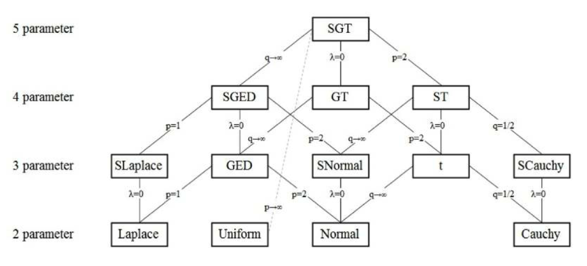

---
#####################
## thesis metadata ##
#####################
title: |
 The importance of higher moments in VaR and CVaR estimation. 
author: 
- name: Faes E.^[Enjo.Faes@student.ams.ac.be]
- name: \ \ \ Mertens de Wilmars S.^[Stephane.MertensdeWilmars@student.ams.ac.be]
- name: \ \ \ Pratesi F.^[Filippo.Pratesi@student.ams.ac.be]
university: Antwerp Management School
university-logo: templates/amslogo.pdf
submitted-text: A thesis submitted for the degree of
degree: Master in Finance
degreedate: June 2021
text: "Prof. dr. Annaert \\ Prof. dr. De Ceuster \\ Prof. dr. Zhang"
abstract: |
  `r paste(readLines("front-and-back-matter/_abstract.Rmd"), collapse = '\n  ')`
acknowledgements: |
  `r paste(readLines("front-and-back-matter/_acknowledgements.Rmd"), collapse = '\n  ')`
dedication: For our families and loved ones
abbreviations: "front-and-back-matter/abbreviations" # path to .tex file with abbreviations

#######################
## bibliography path ##
#######################
bibliography: references.bib
csl: templates/apa.csl
########################
## PDF layout options ###
#########################
masters-submission: false
corrections: false # correction highlighting 

## binding / margins ##
page-layout: twoside #'nobind' for equal margins (PDF output), 'twoside' for two-sided binding (mirror margins and blank pages), leave blank for one-sided binding (left margin > right margin)

## position of page numbers ##
ordinary-page-number-foot-or-head: foot #'foot' puts page number in footer, 'head' in header
ordinary-page-number-position: C  #C = center, R = right, L = left. If page layout is 'twoside', O = odd pages and E = even pages. E.g. RO,LE puts the page number to the right on odd pages and left on even pages
chapter-page-number-foot-or-head: foot #you may want it to be different on the chapter pages
chapter-page-number-position: C

## position of running header ##
running-header: true #indicate current chapter/section in header?
running-header-foot-or-head: head
running-header-position-leftmark: LO #marks the chapter. If layout is 'nobind', only this is used.
running-header-position-rightmark: RE  #marks the section.

draft-mark: false # add a DRAFT mark?
draft-mark-foot-or-head: foot ##'foot' = in footer, 'head' = in header
draft-mark-position: C

## section numbering ##
section-numbering-depth: 2 # to which depth should headings be numbered?

## tables of content ##
toc-depth: 2 # to which depth should headings be included in table of contents?
lof: true # include list of figures in front matter?
lot: true # include list of tables in front matter?
mini-toc: false  # include mini-table of contents at start of each chapter? (this just prepares it; you must also add \minitoc after the chapter titles)
mini-lot: false  # include mini-list of tables by start of each chapter?
mini-lof: false  # include mini-list of figures by start of each chapter?

## code block spacing ##
space-before-code-block: 10pt
space-after-code-block: 8pt

## linespacing ##
linespacing: 22pt plus2pt # 22pt is official for submission & library copies
frontmatter-linespacing: 17pt plus1pt minus1pt #spacing in roman-numbered pages (acknowledgments, table of contents, etc.)

### other stuff ###
abstractseparate: false  # include front page w/ abstract for examination schools?
hidelinks: true # false to highlight clickable links with a colored border
includeline-num: true

### citation and bibliography style ###
bibliography-heading-in-pdf: Works Cited

# biblatex options #
# unless you run into 'biber' error messages, use natbib as it lets you customise your bibliography directly
use-biblatex: true
bib-latex-options: "style=authoryear, sorting=nyt, backend=biber, maxcitenames=2, useprefix, doi=true, isbn=false, uniquename=false" #for science, you might want style=numeric-comp, sorting=none for numerical in-text citation with references in order of appearance

# natbib options #
# natbib runs into fewer errors than biblatex, but to customise your bibliography you need to fiddle with .bst files
use-natbib: false # to use natbib, set this to true, and change "output:bookdown::pdf_book:citation_package:" to "natbib"
natbib-citation-style: authoryear #for science, you might want numbers,square
natbib-bibliography-style: ACM-Reference-Format #or plainnat or some .bst file you download

#####################
## output options  ##
#####################
output:
  bookdown::pdf_book:
    citation_package: biblatex
    template: templates/template.tex
    keep_tex: true
    #pandoc_args: "--lua-filter=scripts_and_filters/colour_and_highlight.lua"
    pandoc_args:
      - '--lua-filter=templates/scholarly-metadata.lua'
      - '--lua-filter=templates/author-info-blocks.lua'
  bookdown::bs4_book: 
    css: 
      - templates/bs4_style.css
      - templates/corrections.css # remove to stop highlighting corrections
    theme:
      primary: "#6D1919"
    repo: https://github.com/ulyngs/oxforddown
    #pandoc_args: "--lua-filter=scripts_and_filters/colour_and_highlight.lua"
  bookdown::gitbook:
    css: templates/style.css
    config:
      sharing:
        facebook: false
        twitter: yes
        all: false
  bookdown::word_document2:
    toc: true   
link-citations: true
documentclass: book
always_allow_html: true #this allows html stuff in word (.docx) output
# The lines below make the 'knit' button render the whole thesis to PDF, HTML, or Word
# When outputting to PDF, you can clean up the files LaTeX generates by running 
# 'file.remove(list.files(pattern = "*.(log|mtc|maf|aux|bbl|blg|xml)"))' in the R console
knit: (function(input, ...) {bookdown::render_book(input, output_format = "bookdown::pdf_book")})
#knit: (function(input, ...) {bookdown::render_book(input, output_format = "bookdown::bs4_book")})
#knit: (function(input, ...) {bookdown::render_book(input, output_format = "bookdown::gitbook")})
#knit: (function(input, ...) {bookdown::render_book(input, output_format = "bookdown::word_document2")})
---

```{r install_packages, include=FALSE}
source('scripts_and_filters/install_packages_if_missing.R')
```

```{r create_chunk_options, include=FALSE, eval=knitr::is_latex_output()}
source('scripts_and_filters/create_chunk_options.R')
source('scripts_and_filters/wrap_lines.R')
```

```{=html}
<!--
Include the create_chunk_options chunk above at the top of your index.Rmd file
This will include code to create additional chunk options (e.g. for adding author references to savequotes)
and to make sure lines in code soft wrap
If you need to create your own additional chunk options, edit the file scripts/create_chunk_options.R
-->
```
<!-- This chunk includes the front page content in HTML output -->

```{r ebook-welcome, child = 'front-and-back-matter/_welcome-ebook.Rmd', eval=knitr::is_html_output()}
```

<!--chapter:end:index.Rmd-->

---
#########################################
# options for knitting a single chapter #
#########################################
output:
  bookdown::pdf_document2:
    template: templates/brief_template.tex
    citation_package: biblatex
  bookdown::html_document2: default
  bookdown::word_document2: default
documentclass: book
bibliography: references.bib
---

# Introduction {.unnumbered}

```{=tex}
\adjustmtc
\markboth{Introduction}{}
```
\noindent A general assumption in finance is that stock returns are normally distributed. However, various authors have shown that this assumption does not hold in practice: stock returns are not normally distributed [Among which @theodossiou2000; @subbotin1923; @theodossiou2015]. For example, @theodossiou2000 mentions that "empirical distributions of log-returns of several financial assets exhibit strong higher-order moment dependencies which exist mainly in daily and weekly log-returns and prevent monthly, bimonthly and quarterly log-returns from obeying the normality law implied by the central limit theorem. As a consequence, price changes do not follow the geometric Brownian motion." So in reality, stock returns exhibit fat-tails and peakedness [@Officer1972], these are some of the so-called stylized facts of returns. \

\noindent Additionally, a point of interest is the predictability of stock prices. @fama1965 explains that the question in academic and business circles is: "To what extent can the past history of a common stock's price be used to make meaningful predictions concerning the future price of the stock?". There are two viewpoints towards the predictability of stock prices. Firstly, some argue that stock prices are unpredictable or very difficult to predict by their past returns (i.e. have very little serial correlation) because they simply follow a Random Walk process [@Fama1970]. On the other hand, Lo & MacKinlay mention that "financial markets *are* predictable to some extent but far from being a symptom of inefficiency or irrationality, predictability is the oil that lubricates the gears of capitalism". Furthermore, there is also no real robust evidence for the predictability of returns themselves, let alone be out-of-sample [@welch2008]. This makes it difficult for corporations to manage market risk, i.e. the variability of stock prices.  \

\noindent Risk, in general, can be defined as the volatility of unexpected outcomes [@jorion2007]. The measure Value at Risk (VaR), developed in response to the financial disaster events of the early 1990s, has been very important in the financial world. Corporations have to manage their risks and thereby include a future risk measurement. The tool of VaR has now become a standard measure of risk for many financial institutions going from banks, that use VaR to calculate the adequacy of their capital structure, to other financial services companies to assess the exposure of their positions and portfolios. The 5% VaR can be informally defined as the maximum loss of a portfolio, during a time horizon, excluding all the negative events with a combined probability lower than 5% while the Conditional Value at Risk (CVaR) can be informally defined as the average of the events that are lower than the VaR. @bali2008 explains that many implementations of the CVaR have the assumption that asset and portfolio's returns are normally distributed but that it is an inconsistency with the evidence empirically available which outlines a more skewed distribution with fatter tails than the normal. This lead to the conclusion that the assumption of normality, which simplifies the computation of VaR, can bring to incorrect numbers, underestimating the probability of extreme events happening. \

\noindent This paper has the aim to replicate and update the research made by @bali2008 on US indexes, analyzing the dynamics proposed with a European outlook. The main contribution of the research is to provide the industry with a new approach to calculating VaR with a flexible tool for modeling the empirical distribution of returns with higher accuracy and characterization of the tails. \

\noindent The paper is organized as follows. Chapter \@ref(lit-rev) discusses at first the alternative distribution than the normal that we are going to evaluate during the analysis (Student's t-distribution, Generalized Error Distribution, Skewed t-distribution, Skewed Generalized Error Distribution, Skewed Generalized t-distribution), then the discrete time GARCH models used (GARCH, IGARCH, EGARCH, GJRGARCH, NAGARCH, TGARCH, TSGARCH or AVGARCH and EWMA) are presented as extensions of the @engle1982 's ARCH model. Chapter \@ref(dat-and-meth) describes the dataset used and the methodology followed in modeling the volatility with the GARCH model by @bollerslev1986 and with its refinements using Maximum likelihood estimation to find the distribution parameters. Then a description is given of how are performed the control tests (un- and conditional coverage test, dynamic quantile test) used in the paper to evaluate the performances of the different GARCH models and underlying distributions. In chapter \@ref(analysis), findings are presented and discussed, in chapter \@ref(Robustness) the findings of the performed tests are shown and interpreted and in chapter \@ref(Conclusion) the investigation and the results are summarized.

<!--chapter:end:01-introduction.Rmd-->

---
#########################################
# options for knitting a single chapter #
#########################################
output:
  bookdown::pdf_document2:
    template: templates/brief_template.tex
    citation_package: biblatex
  bookdown::html_document2: default
  bookdown::word_document2: default
documentclass: book
bibliography: references.bib
---

```{block type='savequote', quote_author='(ref:alexander-quote)', include=knitr::is_latex_output()}
Volatility is unobservable. We can only ever estimate and forecast volatility, and this only within the context of an assumed statistical model. So there is no absolute ‘true’ volatility: what is ‘true’ depends only on the assumed model...

Moreover, volatility is only a sufficient statistic for the dispersion of the returns distribution when we make a normality assumption. In other words, volatility does not provide a full description of the risks that are taken by the investment unless we assume the investment returns are normally distributed.
```
(ref:alexander-quote) --- Alexander (2008) in *Market Risk Analysis Practical Financial Econometrics*

# Literature review {#lit-rev}

\minitoc <!-- this will include a mini table of contents--> <!-- LaTeX normally does not indent the first line after a heading - however, it does so after the mini table of contents. You can manually tell it not to with \noindent -->

## Stylized facts of returns {#styl-facts}

\noindent When analyzing returns as a time-series, we look at log returns. The log returns are similar to simple returns so the stylized facts of returns apply to both. One assumption that is made often in financial applications is that returns are iid, or independently and identically distributed, another is that they are normally distribution. Are these valid assumptions? Below the stylized facts[^1] following @annaert2021 for returns are given.

[^1]: Stylized facts are the statistical properties that appear to be present in many empirical asset returns (across time and markets)

-   Returns are *small and volatile* (with the standard deviation being larger than the mean on average).
-   Returns have very little serial correlation as mentioned by for example @bollerslev1987.
-   Returns exhibit conditional heteroskedasticity, or *volatility clustering*. This effect goes back to @mandelbrot1963. There is no constant variance (homoskedasticity), but it is time-varying. @bollerslev1987 describes it as "rates of return data are characterized by volatile and tranquil periods". @alexander2008 says this will have implications for risk models: following a large shock to the market, the volatility changes and the probability of another large shock is increased significantly.
-   Returns also exhibit *asymmetric volatility*, in that sense volatility increases more after a negative return shock than after a large positive return shock. This is also called the *leverage effect*. @alexander2008 mentions that this leverage effect is pronounced in equity markets: usually there is a strong negative correlation between equity returns and the change in volatility.
-   Returns are *not normally distributed* which is also one of the conclusions by @fama1965. Returns have tails fatter than a normal distribution (leptokurtosis) and thus are riskier than under the normal distribution. Log returns **can** be assumed to be normally distributed. However, this will be examined in our empirical analysis if this is appropriate. This makes that simple returns follow a log-normal distribution, which is a skewed density distribution. A good summary is given by @alexander2008 as: "In general, we need to know more about the distribution of returns than its expected return and its volatility. Volatility tells us the *scale* and the mean tells us the *location*, but the dispersion also depends on the ***shape*** of the distribution. The best dispersion metric would be based on the entire distribution function of returns."

\noindent Firms holding a portfolio have a lot of things to consider: expected return of a portfolio, the probability to get a return lower than some threshold, the probability that an asset in the portfolio drops in value when the market crashes. All the previous requires information about the return distribution or the density function. What we know from the stylized facts of returns that the normal distribution is not appropriate for returns. In appendix we summarize some alternative distributions (T, GED, ST, SGED, SGT) that could be a better approximation of returns than the normal one.

\newpage

## Volatility modeling {#vol-mod}

### Rolling volatility

\noindent When volatility needs to be estimated on a specific trading day, the method used as a descriptive tool would be to use rolling standard deviations. @engle2001 explains the calculation of rolling standard deviations, as the standard deviation over a fixed number of the most recent observations^[For example, for the past month it would then be calculated as the equally weighted average of the squared deviations from the mean (i.e. residuals) from the last 22 observations (the average amount of trading or business days in a month). All these deviations are thus given an equal weight. Also, only a fixed number of past recent observations is examined.]. Engle regards this formulation as the first ARCH model.

### ARCH model

\noindent Autoregressive Conditional Heteroscedasticity (ARCH) models, proposed by @engle1982, was in the first case not used in financial markets but on inflation. Since then, it has been used as one of the workhorses of volatility modeling. To fully capture the logic behind GARCH models, the building blocks are examined in the first place. There are three building blocks of the ARCH model: returns, the innovation process and the variance process (or volatility function), written out for an ARCH(1) in respectively equation \@ref(eq:eq1), \@ref(eq:eq2) and \@ref(eq:eq3). Returns are written as a constant part ($\mu$) and an unexpected part, called noise or the innovation process. The innovation process is the volatility ($\sigma_t$) times $z_t$, which is an independent identically distributed random variable with a mean of 0 (zero-mean) and a variance of 1 (unit-variance). The independent (**i**id), notes the fact that the $z$-values are not correlated, but completely independent of each other. The distribution is not yet assumed. The third component is the variance process or the expression for the volatility. The variance is given by a constant $\omega$, plus the random part which depends on the return shock of the previous period squared ($\varepsilon_{t-1}^2$). In that sense when the uncertainty or surprise in the last period increases, then the variance becomes larger in the next period. The element $\sigma_t^2$ is thus known at time $t-1$, while it is a deterministic function of a random variable observed at time $t-1$ (i.e. $\varepsilon_{t-1}^2$).

```{=tex}
\begin{align} 
y_{t} &= \mu + \varepsilon_t
 (\#eq:eq1)
\end{align}

\begin{align} 
\varepsilon_{t} &= \sigma_t \times z_t, \ where \ z_t \stackrel{iid}{\sim} (0,1)
 (\#eq:eq2)
\end{align} 

\begin{align} 
\sigma_{t}^{2} &= \beta_0 + \beta_1 \times  \varepsilon_{t-1}^2 
 (\#eq:eq3)
\end{align}
```
\noindent From these components we could look at the conditional moments (or expected returns and variance). We can plug in the component $\sigma_t$ into the conditional mean innovation $\varepsilon_{t}$ and use the conditional mean innovation to examine the conditional mean return. In equation \@ref(eq:eq4) and \@ref(eq:eq5) they are derived. Because the random variable $z_t$ is distributed with a zero-mean, the conditional expectation is 0. As a consequence, the conditional mean return in equation \@ref(eq:eq5) is equal to the unconditional mean in the most simple case. But variations are possible using ARMA (eg. AR(1)) processes.

```{=tex}
\begin{align} 
\mathbb{E}_{t-1}(\varepsilon_{t}) = \mathbb{E}_{t-1}(\sqrt{\beta_0 + \beta_1 \times  \varepsilon_{t-1}^2} \times z_t) = \sigma_t\mathbb{E}_{t-1}(z_t) = 0
 (\#eq:eq4)
\end{align} 
```
```{=tex}
\begin{align} 
\mathbb{E}_{t-1}(y_{t}) = \mu + \mathbb{E}_{t-1}(\varepsilon_{t}) = \mu
 (\#eq:eq5)
\end{align}
```
\noindent For the conditional variance, knowing everything that happened until and including period $t-1$ the conditional innovation variance is given by equation \@ref(eq:eq6). This is equal to $\sigma_t^2$, while the variance of $z_t$ is equal to 1. Then it is easy to derive the conditional variance of returns in equation \@ref(eq:eq7), that is why equation \@ref(eq:eq3) is called the variance equation.

```{=tex}
\begin{align} 
var_{t-1}(\varepsilon_t) = \mathbb{E}_{t-1}(\varepsilon_{t}^2) = \mathbb{E}_{t-1}(\sigma_t^2 \times z_t^2) = \sigma_t^2\mathbb{E}_{t-1}(z_t^2) = \sigma_t^2
 (\#eq:eq6)
\end{align} 
```
```{=tex}
\begin{align} 
var_{t-1}(y_t) = var_{t-1}(\varepsilon_t)= \sigma_t^2
 (\#eq:eq7)
\end{align}
```
\noindent The unconditional variance is also interesting to derive, while this is the long-run variance, which will be derived in equation \@ref(eq:eq11). After deriving this using the law of iterated expectations and assuming stationarity for the variance process, one would get equation \@ref(eq:eq8) for the unconditional variance, equal to the constant $c$ and divided by $1-\beta_1$, the slope of the variance equation.

```{=tex}
\begin{align} 
\sigma^2 = \dfrac{\beta_0}{1-\beta_1}
 (\#eq:eq8)
\end{align}
```
\noindent This leads to the properties of ARCH models: Stationarity[^2] condition for variance: $\beta_0>0$ and $0 \le \beta_1 < 1$. But also, zero-mean innovations and uncorrelated innovations. Thus a weak white noise process $\varepsilon_t$. The unconditional 4th moment, kurtosis $\mathbb{E}(\varepsilon_t^4)/\sigma^4$ of an ARCH model is given by equation \@ref(eq:eq9). This term is larger than 3, which implicates fat-tails.

[^2]: Stationarity implies that the series on which the ARCH model is used does not have any trend and has a constant expected mean. Only the conditional variance is changing.

```{=tex}
\begin{align} 
3\dfrac{1-\beta_1^2}{1-3\beta_1^2}
 (\#eq:eq9)
\end{align}
```
\noindent Another property of ARCH models is that it takes into account volatility clustering. Because we know that $var(\varepsilon_t) = \mathbb{E}(\varepsilon_t^2) = \sigma^2 = \omega/(1-\alpha_1)$, we can plug in $\beta_0$ for the conditional variance $var_t(\varepsilon_{t+1}) = \mathbb{E}(\varepsilon_{t+1}^2) = \sigma_{t+1}^2 = c + \alpha_1\times\varepsilon_t^2$. Thus it follows that equation \@ref(eq:eq10) displays volatility clustering. If we examine the RHS, as $\alpha_1>0$ (condition for stationarity), when shock $\varepsilon_t^2$ is larger than what you expect it to be on average $\sigma^2$ the LHS will also be positive. Then the conditional variance will be larger than the unconditional variance. Briefly, large shocks will be followed by more large shocks.

```{=tex}
\begin{align} 
\sigma_{t+1}^2 - \sigma^2 = \alpha_1\times(\varepsilon_t^2 - \sigma^2)
 (\#eq:eq10)
\end{align}
```
\noindent Excess kurtosis can be modeled, even when the conditional distribution is assumed to be normally distributed. The third moment, skewness, can be introduced using a skewed conditional distribution as we saw in part \@ref(conditional-distributions). The serial correlation for squared innovations is positive if fourth moment exists (equation \@ref(eq:eq9), this is volatility clustering once again.

\noindent How will then the variance be forecasted? Well, the conditional variance for the $k$-periods ahead , denoted as period $T+k$, is given by equation \@ref(eq:eq11). This can already be simplified, while we know that $\sigma_{T+1}^2 = \omega + \alpha_1 \times \varepsilon_T^2$ from equation \@ref(eq:eq3).

```{=tex}
\begin{align} 
\begin{split}
\mathbb{E}_T(\varepsilon_{T+k}^2) 
&= \omega\times(1+\alpha_1 + ... + \alpha^{k-2}) + \alpha^{k-1}\times\sigma_{T+1}^2 \\
&= \omega\times(1+\alpha_1 + ... + \alpha^{k-1}) + \alpha^{k}\times\sigma_{T}^2
\end{split}
 (\#eq:eq11)
\end{align}
```
\noindent It can be shown that then the conditional variance in period $T+k$ is equal to equation \@ref(eq:eq12). The LHS is the predicted conditional variance $k$-periods ahead above its unconditional variance, $\sigma^2$. The RHS is the difference current last-observed return residual $\varepsilon_T^2$ above the unconditional average multiplied by $\alpha_1^k$, a decreasing function of $k$ (given that $0 \le\alpha_1 <1$). The further ahead predicting the variance, the closer $\alpha_1^k$ comes to zero, the closer to the unconditional variance, i.e. the long-run variance.

```{=tex}
\begin{align} 
\mathbb{E}_T(\varepsilon_{T+k}^2) - \sigma^2 = \alpha_1^k\times(\varepsilon_T^2 - \sigma^2)
 (\#eq:eq12)
\end{align}
```
### Univariate GARCH models {#univ-garch}

\noindent An improvement of the ARCH model is the Generalized Autoregressive Conditional Heteroscedasticity (GARCH)[^3]. This model and its variants come in to play because of the fact that calculating standard deviations through rolling periods, gives an equal weight to distant and nearby periods, by such not taking into account empirical evidence of volatility clustering, which can be identified as positive autocorrelation in the absolute returns. GARCH models are an extension to ARCH models, as they incorporate both a novel moving average term (not included in ARCH) and the autoregressive component. Furthermore, a second extension is changing the assumption of the underlying distribution. As already explained, the normal distribution is an unrealistic assumption, so other distributions which are described in part \@ref(conditional-distributions) will be used. As @alexander2008 explains, this does not change the formulae of computing the volatility forecasts but it changes the functional form of the likelihood function[^4]. An overview (of a selection) of investigated GARCH models is given in the following table.

[^3]: *Generalized* as it is a generalization by @bollerslev1986 of the ARCH model of @engle1982. *Autoregressive,* as it is a time series model with an autoregressive form (regression on itself). *Conditional heteroscedasticity,* while time variation in conditional variance is built into the model [@alexander2008].

[^4]: which makes the maximum likelihood estimation explained in part \@ref(garch-method) complex with more parameters that have to be estimated.

| Author(s)/user(s)               | Model                      |
|---------------------------------|----------------------------|
| @engle1982                      | ARCH model                 |
| @bollerslev1986                 | GARCH model                |
| @bollerslev1986                 | IGARCH model               |
| @nelson1991                     | EGARCH model               |
| @glosten1993                    | GJRGARCH model             |
| @engle1993                      | NAGARCH model              |
| @zakoian1994                    | TGARCH model               |
| @taylor1986 and @schwert1989    | TSGARCH (or AVGARCH) model |
| @morganguarantytrustcompany1996 | EWMA or RiskMetrics model  |

: GARCH models, the founders

## ACD models {#acd-models}

An extension to GARCH models was proposed by @hansen1994, the autoregressive conditional density estimation model (referred to as ACD models, sometimes ARCD). It focuses on time variation in higher moments (skewness and kurtosis), because the degree and frequency of extreme events seem to be not expected by traditional models. Some GARCH models are already able to capture the dynamics by relying on a different unconditional distribution than the normal distribution (for example skewed distributions like the SGED, SGT), or a model that allows to model these higher moments. However, @ghalanos2016 mentions that these models also assume the shape and skewness parameters to be constant (not time varying). As Ghalanos mentions: "the research on time varying higher moments has mostly explored different parameterizations in terms of dynamics and distributions with little attention to the performance of the models out-of-sample and ability to outperform a GARCH model with respect to VaR." Also one could question the marginal benefits of the ACD, while the estimation procedure is not simple (nonlinear bounding specification of higher moment distribution parameters and interaction). So, are skewness (skewness parameter) and kurtosis ( shape parameters) time varying? The literature investigating higher moments has arguments for and against this statement. In part \@ref(acd-models-meth) the specification is given.

## Value at Risk

Value-at-Risk (VaR) is a risk metric developed simultaniously by @markowitz1952 and Roy1952 to calculate how much money an investment, portfolio, department or institution such as a bank could lose in a market downturn, though in this period it remained mostly a theoretical discussion due to lacking processing power and industry demand for risk management measures. Another important document in literature is the *1996 RiskMetrics Technical Document*, composed by RiskMetrics[^5], @morganguarantytrustcompany1996 (part of JP Morgan), gives a good overview of the computation, but also made use of the name "value-at-risk" over equivalents like "dollars-at-risk" (DaR), "capital-at-risk" (CaR), "income-at-risk" (IaR) and "earnings-at-risk" (EaR). According to @holton2002 VaR gained traction in the last decade of the 20^th^ century when financial institutions started using it to determine their regulatory capital requirements. A $VaR_{99}$ finds the amount that would be the greatest possible loss in 99% of cases. It can be defined as the threshold value $\theta_t$. Put differently, in 1% of cases the loss would be greater than this amount.It is specified as in \@ref(eq:eq22). Christofferson2001 puts forth a general framework for specifying VaR models and comparing between two alternatives models.

[^5]: RiskMetrics Group was the market leader in market and credit risk data and modeling for banks, corporate asset managers and financial intermediaries [@alexander2008].

```{=tex}
\begin{align}
Pr(y_t \le \theta_t | \Omega_{t-1}) \equiv \phi
 (\#eq:eq22)
\end{align}
```
With $y_t$ expected returns in period t, $\Omega_{t-1}$ the information set available in the previous period and $\phi$ the chosen confidence level.

## Conditional Value at Risk

One major shortcoming of the VaR is that it does not provide information on the probability distribution of losses beyond the threshold amount. As VaR lacks subadditivity of different percentile outcomes, [Artzner1998] reject it as a coherent measure of risk. This is problematic, as losses beyond this amount would be more problematic if there is a large probability distribution of extreme losses, than if losses follow say a normal distribution. To solve this issue, they provide a conceptual idea of a Conditional VaR (CVaR) which quantifies the average loss one would expect if the threshold is breached, thereby taking the distribution of the tail into account. Mathematically, a $cVaR_{99}$ is the average of all the $VaR$ with a confidence level equal to or higher than 99. It is commonly referred to as expected shortfall (ES) sometimes and was written out in the form it is used by today by [@bertsimas2004]. It is specified as in \@ref(eq:eq23).

To calculate $\theta_t$, VaR and CVaR require information on the expected distribution mean, variance and other parameters, to be calculated using the previously discussed GARCH models and distributions.

```{=tex}
\begin{align}
Pr(y_t \le \theta_t | \Omega_{t-1}) \equiv \int_{-\infty}^{\theta_t} \! f(y_t | \Omega_{t-1}) \, \mathrm{d}y_t = \phi
 (\#eq:eq23)
\end{align}
```
With the same notations as before, and $f$ the (conditional) probability density function of $y_t$.

According to the BIS framework, banks need to calculate both $VaR_{99}$ and $VaR_{97.5}$ daily to determine capital requirements for equity, using a minimum of one year of daily observations [@baselcommitteeonbankingsupervision2016]. Whenever a daily loss is recorded, this has to be registered as an exception. Banks can use an internal model to calculate their VaRs, but if they have more than 12 exceptions for their $VaR_{99}$ or 30 exceptions for their $VaR_{97.5}$ they have to follow a standardized approach.Similarly, banks must calculate $CVaR_{97.5}$.

## Past literature on the consequences of higher moments for VaR determination {#past-lit}

Here comes the discussion about studies that have looked at higher moments and VaR determination. Also a summary of studies that discusses time-varying higher moments, but not a big part, while it is also only a small part of the empirical findings (couple of GARCH-ACD models).

| Author         | Higher moments                                      |
|----------------|-----------------------------------------------------|
| @hansen1994    | Skewness and kurtosis extended ARCH-model           |
| \\\@harvey1999 | Skewness, Effect of higher moments on lower moments |
| @brooks2005    | Kurtosis, Time varying degrees of freedom           |

: Higher moments and VaR

While it is relatively straightforward to include unconditional higher-moments in VaR and CVaR calculations, it is less simple to do so when the higher moments (in addition to the variance) are time-varying. @hansen1994 extends the ARCH model to include time-varying moments beyond mean and variance. While mean returns and variance are usually the parameters of most interest, disregarding these higher moments could provide an incomplete description of a conditional distribution. The model proposed by @hansen1994 allows for skewness and shape parameters to vary in a skewed-t density function through specifying them as functions of their errors in previous periods (in an similar way how variance is estimated). Applications on U.S. Treasuries and exchange rates are discussed.

\@harvey1999 extends a GARCH(1,1) model to include time varying skewness by estimating it jointly with time varying variance using a skewed t distribution. They find a significant impact of skewness on conditional volatility, suggesting that these moments should be jointly estimated for efficiency. Changes in conditional skewness have an impact on the persistence of volatility shocks. They also find that including skewness causes the leverage effects of variance to dissapear. They apply their methods on different stock indices (both developed and emerging) at daily, weekly and monthly frequency.

@brooks2005 proposes a model based on a t-distribution that allows for both the variance and the degrees of freedom to be time-varying, independently from eachother. Their model allows for both assymetric variance and kurtosis through an indicator function (which has a positive effect on these moments only when the shock is in the right tail). They apply their model on different financial assets in the U.S. and U.K. at daily frequency.

<!--chapter:end:02-literature-review.Rmd-->

---
output:
  #bookdown::html_document2: default
  #bookdown::word_document2: default
  bookdown::pdf_document2: 
    template: templates/brief_template.tex
    citation_package: biblatex
    extra_dependencies: ["booktabs","threeparttable"]
documentclass: book
bibliography: references.bib
---


# Data and methodology {#dat-and-meth}

\chaptermark{Data and methodology}

\minitoc <!-- this will include a mini table of contents-->

```{r dataloading, include=F}
require(readxl)
require(xts)
require(PerformanceAnalytics)
require(kableExtra)
require(rugarch)
require(fitdistrplus)
require(fGarch)
require(tree)  # do we need this?
require(sgt)
# require(tseries) # do we need this
require(openxlsx) 
require(TTR)
require(lmtest)
require(latex2exp)

options(scipen = 999)
knitr::opts_chunk$set(message = FALSE)
knitr::opts_chunk$set(warning = FALSE)
data <- readxl::read_excel("data/datastream.xlsx",col_types = c("date", rep("numeric", 6)),skip = 2) 
colnames(data) <- c("Date",gsub(pattern = " - PRICE INDEX", replacement='' , colnames(data)[2:7]))
Price_indices <- as.xts(data[,-1], order.by = data$Date)
Estoxx <- Price_indices[,1] #see if price index
R <- diff(Estoxx, log = TRUE, na.pad = FALSE)*100

Rbali <- window(R, end = "2004-12-31") #up till end of balis dataset

write.xlsx(R, "data/Eurostoxx50.xlsx", sheetName = "Eurostoxx50", 
  col.names = TRUE, row.names = TRUE, append = FALSE)
```

## Data

\noindent We worked with daily returns on the Euro Stoxx 50 Price Index^[The same analysis has been performed for the INDEX 1, INDEX 2, INDEX 3 and the INDEX 4 indexes with the same conclusions. The findings of these researches are available upon requests.] denoted in EUR from `r format(index(head(Estoxx,1)), '%d %B, %Y')` to `r format(index(tail(Estoxx,1)),'%d %B, %Y')`. It is the leading blue-chip index of the Eurozone, was founded in 1999 and covers 50 of the most liquid and largest (in terms of free-float market capitalization) stocks. For its composition and computation we refer to the factsheet [@EUROSTOXXFactSheet]. The Euro Stoxx 50 Price index was chosen while this one has more data available (going back to `r  format(index(head(Estoxx,1)), '%Y'))`

### Descriptives

#### Table of summary statistics

Equation \@ref(tab:dsTable) provides the main statistics describing the return series analyzed. Let daily returns be computed as $R_{t}=100\left(\ln P_{t}-\ln P_{t-1}\right)$,where $P_{t}$ is the index price at time $t$ and $P_{t-1}$ is the index price at $t-1$.

```{r prepstats, echo=F}

## RETURNS

#selecting relevant statistics only from table.Stats
Statistics <-  table.Stats(R)
Stats.names <- rownames(Statistics)[-c(1,2,4,7,8,10:13)]
Statistics <- Statistics[-c(1,2,4,7,8,10:13),] 
names(Statistics) <- Stats.names

# Skewness test
skewtest <- normtest::skewness.norm.test(coredata(R)) #as you can see the skewness is the same as the table.Stats method
Skewness <- round(skewtest$statistic,4)
names(Skewness) <- "Skewness"
skewness.pvalue <- skewtest$p.value
kurttest <- normtest::kurtosis.norm.test(coredata(R)) #this is normal kurtosis (not excess)
Excess_kurtosis <- round(kurttest$statistic,4) - 3 
names(Excess_kurtosis) <- "Excess Kurtosis"
kurtosis.pvalue <- kurttest$p.value

# Jb test
robustjb_R <- DescTools::JarqueBeraTest(coredata(R)) #robust?
jb_R <- normtest::jb.norm.test(R)

jb_R <- paste0(round(jb_R$statistic,4),"***")
names(jb_R) <- "Jarque-Bera"

# PART 1
Statistics <-  c(Statistics[1:5], Skewness, paste0("(",skewness.pvalue,"***)"), Excess_kurtosis, paste0("(",kurtosis.pvalue,"***)"),jb_R)

## STANDARDIZED RESIDUALS
garchspec.R <- ugarchspec(mean.model = list(armaOrder = c(1,0)),
                     variance.model = list(model = "sGARCH", variance.targeting = F), 
                     distribution.model = "norm")
# Estimate the model
garchfit.R <- ugarchfit(data = R, spec = garchspec.R)

# Compute stdret using residuals()
stdret.R <- residuals(garchfit.R, standardize = TRUE)

Statistics.S <-  table.Stats(stdret.R)
Stats.names.S <- rownames(Statistics.S)[-c(1,2,4,7,8,10:13)]
Statistics.S <- Statistics.S[-c(1,2,4,7,8,10:13),] #selecting relevant columns only
Statistics.S <- Statistics.S[,1]
names(Statistics.S) <- Stats.names.S

# Skewness test
skewtest <- normtest::skewness.norm.test(coredata(stdret.R)) #as you can see the skewness is the same as the table.Stats method
Skewness <- round(skewtest$statistic,4)
names(Skewness) <- "Skewness"
skewness.pvalue <- skewtest$p.value
kurttest <- normtest::kurtosis.norm.test(coredata(stdret.R)) #this is normal kurtosis (not excess)
Excess_kurtosis <- round(kurttest$statistic,4) - 3
names(Excess_kurtosis) <- "Excess Kurtosis"
kurtosis.pvalue <- kurttest$p.value

# Jb test
robustjb_R <- DescTools::JarqueBeraTest(coredata(stdret.R)) #robust?
jb_R <- normtest::jb.norm.test(stdret.R)

jb_R <- paste0(round(jb_R$statistic,4),"***")
names(jb_R) <- "Jarque-Bera"

Statistics.S <- c(Statistics.S[1:5], Skewness, paste0("(",skewness.pvalue,"***)"), Excess_kurtosis, paste0("(",kurtosis.pvalue,"***)"),jb_R)

# for table 1

table1 <- data.frame(Statistics = names(Statistics.S)[c(3,2,4,1,5:10)], `Euro Stoxx 50` = Statistics[c(3,2,4,1,5:10)], `Standardized Residuals`= Statistics.S[c(3,2,4,1,5:10)])


colnames(table1) <- gsub(pattern = '\\.', replacement=' ',colnames(table1))
# JB.Test <- rbind( c(jarque.bera.test(R)$statistic, jarque.bera.test(stdret.R)$statistic) ,
#                   c(jarque.bera.test(R)$p.value, jarque.bera.test(stdret.R)$p.value))
# rownames(JB.Test) <- c("Jarque - Bera", "JB p-values")
# colnames(JB.Test) <- colnames(table1)
# table1 <- rbind(table1, JB.Test)

fn1 <- sprintf(paste0('This table shows the descriptive statistics of the daily percentage returns of %s over the period %s to %s (', nrow(R),' observations). Including arithmetic mean, median, maximum, minimum, standard deviation, skewness, excess kurtosis and the Jarque-Bera test.'),gsub(pattern = '\\.', replacement=' ',colnames(R)),gsub(" UTC", "",min(index(R))),gsub(" UTC", "",max(index(R))))
fn2 <- paste("The standardized residual is derived from a maximum likelihood estimation (simple GARCH model) as follows: ", "$ R_t=\\\\alpha_0+\\\\alpha_1 R_{t-1}+z_t \\\\sigma_t \\\\\\\\ \\\\sigma_t^2=\\\\beta_0+\\\\beta_1 \\\\sigma_{t-1}^2 z_{t-1}^2+\\\\beta_2 \\\\sigma_{t-1}^2, \\\\\\\\$",  "Where $z$ is the standard residual (assumed to have a normal distribution).")
fn3 <- '*, **, *** represent significance levels at the 5%, 1% and <1%.'
```

\noindent The arithmetic mean of the series is `r round(as.numeric(levels(table1[1,2][,drop=T])),3)`% with a standard deviation of `r round(as.numeric(levels(table1[5,2][,drop=T])),3)`% and a median of `r round(as.numeric(levels(table1[2,2][,drop=T])),3)` which translate to an annualized mean of `r round(as.numeric(levels(table1[1,2][,drop=T]))*252,3)`% and an annualized standard deviation of `r round(as.numeric(levels(table1[5,2][,drop=T]))*sqrt(252),3)`%. The skewness statistic is highly significant and negative at `r round(as.numeric(levels(table1[6,2][,drop=T])),3)` and the excess kurtosis is also highly significant and positive at `r round(as.numeric(levels(table1[8,2][,drop=T])),3)`. These 2 statistics give an overview of the distribution of the returns which has thicker tails than the normal distribution with a higher presence of left tail observations. A formal test such as the Jarque-Bera one with its statistic at `r round(normtest::jb.norm.test(R)$statistic,3)` and a high statistical significance, confirms the non normality feeling given by the Skewness and Kurtosis.  \

\noindent The right column of table \@ref(tab:dsTable) displays the same descriptive statistics but for the standardizes residuals obtained from a simple GARCH model as mentioned in table \@ref(tab:dsTable) in Note 2$*$. Again, Skewness statistic at `r round(as.numeric(levels(table1[6,3][,drop=T])),3)` with a high statistical significance level and the excess Kurtosis at `r round(as.numeric(levels(table1[8,3][,drop=T])),3)` also with a high statistical significance, suggest a non normal distribution of the standardized residuals and the Jarque-Bera statistic at `r round(as.numeric(levels(table1[10,3][,drop=T])),3)`, given its high significance, confirms the rejection of the normality assumption.

```{r stats, echo=F, results='asis'}
table1 %>% kbl(caption = "Summary statistics of the returns","latex",
      label = 'dsTable',
      booktabs = T,
      position = "h!",
      digits = 3 )%>%
  kable_classic(full_width = F)%>% 
  footnote(general = "Notes",number=c(fn1,fn2,fn3),threeparttable = T,footnote_as_chunk = F, escape=F, general_title = "") 
```

#### Descriptive figures
**Stylized facts** \
\noindent As can be seen in figure \@ref(fig:plot1) the Euro area equity and later, since 1999 the Euro Stoxx 50 went up during the tech ("dot com") bubble reaching an ATH of €`r max(Estoxx)`. Then, there was a correction to boom again until the burst of the 2008 financial crisis. After which it decreased significantly. With an ATL at `r format(index(Estoxx)[Estoxx == min(Estoxx["2000/"])], '%d %B, %Y')` of €`r min(Estoxx["2000/"])`. There is an improvement, but then the European debt crisis, with it's peak in 2010-2012, occurred. From then there was some improvement until the "health crisis", which arrived in Europe, February 2020. This crisis recovered very quickly reaching already values higher then the pre-COVID crisis level.

```{r plot1, echo=F, fig.cap='Euro Stoxx 50 Price Index prices', fig.align='center', out.width="100%", fig.pos='h'}
par(mfrow = c(1,1))
# plot(as.zoo(Estoxx), screen = 1, col = "steelblue", xaxt = "n", xlab = "Date", ylab = "Price", main = "Euro Stoxx 50 Price Index");
# # axis(1, at = time(as.zoo(Estoxx)), labels = FALSE)
# tt <- time(as.zoo(Estoxx)[endpoints(as.zoo(Estoxx), "years")]);
# axis(side = 1, at = tt, labels = FALSE);
# ix <- seq(1, length(tt), 3);
# fmt <- "%b-%y" # format for axis labels
# labs <- format(tt, fmt);
# # axis(1, at = time(zz)[ix], labels = labs[ix], tcl = -0.7, cex.axis = 0.7)
# axis(side = 1, at = tt[ix], labels = labs[ix], tcl = -0.7, cex.axis = 0.7);
# grid()
# 
# plot(as.zoo(R), screen = 1, col = "steelblue", xaxt = "n", xlab = "Date", ylab ="Log Returns",main = "Euro Stoxx 50 Price Index Log Returns");
# # axis(1, at = time(as.zoo(Estoxx)), labels = FALSE)
# tt <- time(as.zoo(R)[endpoints(as.zoo(R), "years")]);
# axis(side = 1, at = tt, labels = FALSE);
# ix <- seq(1, length(tt), 3);
# fmt <- "%b-%y" # format for axis labels
# labs <- format(tt, fmt);
# # axis(1, at = time(zz)[ix], labels = labs[ix], tcl = -0.7, cex.axis = 0.7)
# axis(side = 1, at = tt[ix], labels = labs[ix], tcl = -0.7, cex.axis = 0.7);
# grid()

# Estoxxdf <- as.data.frame(data[,1:2])
# Estoxxdf["Date"] <- as.Date(Estoxxdf$Date)
# events <- as.Date(c("1999-01-01", "2000-04-14", "2008-09-15", "2011-12-31", "2020-02-20"))
#  + geom_text(aes(x = as.Date("1999-01-01"), label = "Dot com bubble", y =1400), colour = "black", angle = 90) + geom_text(aes(x = as.Date("2007-01-01"), label = "Financial crisis", y =1400), colour = "black", angle = 90)+ geom_text(aes(x = as.Date("2014-01-01"), label = "Eurobond crisis", y =1400), colour = "black", angle = 90) + geom_text(aes(x = as.Date("2020-01-01"), label = "COVID-19 crisis", y =1400), colour = "black", angle = 90) + ylab("Price")
par(mfrow=c(1,1))
plot(as.zoo(Estoxx), screen = 1, col = "steelblue", xlab = "Date", ylab = "Price", main = "Euro Stoxx 50 Price"); grid(); abline(v= index(Estoxx$`EURO STOXX 50`["1999-01-01"]),lty = 2); text(index(Estoxx$`EURO STOXX 50`["1998-07-01"]), y = 1550,"Launch of Euro", cex=0.7, srt=90,font=4);  

abline(v= index(Estoxx$`EURO STOXX 50`["2000-04-14"]),lty = 2); text(index(Estoxx$`EURO STOXX 50`["1999-10-14"]), y = 1550,"Dot com bubble", cex=0.7, srt=90,font=4); 

abline(v= index(Estoxx$`EURO STOXX 50`["2007-12-31"]),lty = 2); text(index(Estoxx$`EURO STOXX 50`["2007-06-27"]), y = 1780,"US housing bubble", cex=0.7, srt=90,font=4);

# abline(v= index(Estoxx$`EURO STOXX 50`["2008-09-15"])); text(index(Estoxx$`EURO STOXX 50`["2008-05-27"]), y = 2170,"Lehman brothers collapse", cex=0.8, srt=90); 

abline(v= index(Estoxx$`EURO STOXX 50`["2011-01-03"]),lty = 2); text(index(Estoxx$`EURO STOXX 50`["2010-08-06"]), y = 2200,"European bond crisis peak", cex=0.7, srt=90,font=4); 

abline(v= index(Estoxx$`EURO STOXX 50`["2020-02-20"]),lty = 2); text(index(Estoxx$`EURO STOXX 50`["2019-08-27"]), y = 1570,"COVID-19 crisis", cex=0.7, srt =90,font=4); 
```

\newpage

\noindent In figure \@ref(fig:plot2) the daily log-returns are visualized. A stylized fact that is observable is the volatility clustering. As can be seen: periods of large volatility are mostly followed by large volatility and small volatility by small volatility.

```{r plot2, echo=F, fig.cap='Euro Stoxx 50 Price Index log returns', fig.align='center', out.width="75%", fig.pos='h'}
# pdf("figures/vol-clustering.pdf") # happened only once
# plot(as.zoo(R), screen = 1, col = "steelblue", xlab = "Date", ylab = "Log Returns",main = "Euro Stoxx 50 Price Log Returns");grid()
# dev.off()
knitr::include_graphics('figures/vol-clustering-final.pdf')
```

```{r plot3, echo=F, fig.cap='Euro Stoxx 50 rolling volatility (22 days, calculated over 252 days)', out.width= "75%", fig.align='center', fig.pos='h'}
#Plotting volatility
par(mfrow = c(1,1))
realized.vol <- xts(apply(R,2,runSD,n=22), index(R))*sqrt(252)
plot.zoo(realized.vol, screen = 1, col = "steelblue", xlab = "Date", ylab = "Annualized 22-day volatility",main = "Euro Stoxx 50 rolling 22-day volatility (annualized)");grid()
# chart.RollingPerformance(R = R, width = 22,FUN = "sd.annualized", scale = 252, main = "One month rolling volatility", colorset="steelblue")
```

\newpage

\noindent In figure \@ref(fig:plot4) the density distribution of the log returns are examined. As can be seen, as already mentioned in part \@ref(styl-facts), log returns are not really normally distributed. So

```{r plot4, echo=F,fig.cap='Density vs. Normal Euro Stoxx 50 log returns)', out.width= "75%", fig.align='center'}
#Histogram to eyeball normality

# h <- hist(R, breaks = 75, density = 10,
#           col = "lightgray", xlab = "Accuracy", main = "Barplot") 
# xfit <- seq(min(R), max(R), length = 40) 
# yfit <- dnorm(xfit, mean = mean(R), sd = sd(R)) 
# yfit <- yfit * diff(h$mids[1:2]) * length(R) 
# lines(xfit, yfit, col = "black", lwd = 1)

chart.Histogram(R = R, methods = c("add.normal"), breaks = 100, main = "Returns Histogram Vs. Normal", colorset = c("steelblue","black", "black"), cex.legend = 0.7, ylim=c(0,0.8)) 
```

\newpage

\noindent ACF plots: to do...

```{r acfplots, echo=F, fig.align='center', fig.cap="Absolute prediction errors", fig.subcap="This figure shows the absolute prediction errors and the autocorrelation function for the Euro Stoxx 50.", out.width= "100%", fig.pos='h'}

# Compute the mean daily return
m <- mean(R)

# Define the series of prediction errors
e <- R - m

# Plot the absolute value of the prediction errors
par(mfrow = c(2,2),mar=c(1,4,4,2)+0.1)
plot.zoo(abs(e), main = "Absolute Prediction Error",col = "steelblue", ylab = expression(paste("|",epsilon,"|")))
plot.zoo(e^2,main = "Squared Prediction Error", col = "steelblue", ylab =(expression(paste(epsilon^2))))
# Plot the acf of the absolute prediction errors
acfPlot(abs(e), lag.max = 22, labels=F)
title("ACF (absolute prediction errors)")
acfPlot(e^2, lag.max = 22, labels=F)
title("ACF (Squared prediction errors)")
```

\clearpage

## Methodology
### Garch models {#garch-method}
\noindent As already mentioned in part \@ref(univ-garch), GARCH models GARCH, EGARCH, IGARCH, GJRGARCH, NGARCH, TGARCH and NAGARCH (or TSGARCH) will be estimated. Additionally the distributions will be examined as well, including the normal, student-t distribution, skewed student-t distribution, generalized error distribution, skewed generalized error distribution and the skewed generalized t distribution. They will be estimated using maximum likelihood^[ As already mentioned, fortunately, @alexios2020 has made it easy for us to implement this methodology in the R language (v.3.6.1) with the package "rugarch" v.1.4-4 (*R univariate garch*), which gives us a bit more time to focus on the results and the interpretation.]. \

\noindent Maximum likelihood estimation is a method to find the distribution parameters that best fit the observed data, through maximization of the likelihood function, or the computationally more efficient log-likelihood function (by taking the natural logarithm). It is assumed that the return data is i.i.d. and that there is some underlying parametrized density function $f$ with one or more parameters that generate the data, defined as a vector $\theta$ (equation \@ref(eq:pdf)). These functions are based on the joint probability distribution of the observed data (equation \@ref(eq:logl)). Subsequently, the (log)likelihood function is maximized using an optimization algorithm (equation \@ref(eq:optim)).

```{=tex}
\begin{align} 
  y_1,y_2,...,y_N \sim i.i.d
    \\
  y_i \sim f(y|\theta)
 (\#eq:pdf)
\end{align}

\begin{align} 
 L(\theta) = \prod^N_{i=1}f(y_i|\theta)
  \\
 \log(L(\theta)) = \sum^N_{i=1} \log f(y_i |\theta)
 (\#eq:logl)
\end{align}

\begin{align} 
\theta^{*} = arg \max_{\theta} [ L] \\
\theta^{*} = arg \max_{\theta} [\log(L)]
 (\#eq:optim)
\end{align}
```
### ACD models {#acd-models-meth}

\noindent Following @ghalanos2016, arguments of ACD models are specified as in @hansen1994. The density function $f(y|\alpha)$ has parameters $\alpha_t = (\mu_t, \sigma_t, \nu_t)$, with equation \@ref(eq:cmean), the conditional mean equation. Equation \@ref(eq:cvariance) as the conditional variance. And $\nu_t=\nu(\theta,x_t)$ the remaining parameters of the distribution like the skewness and kurtosis (shape) parameters.

```{=tex}
\begin{align} 
\mu_{t}=\mu\left(\theta, x_{t}\right)=E\left(y_{t} \mid x_{t}\right)
 (\#eq:cmean)
\end{align}
```
```{=tex}
\begin{align}
\sigma_{t}^{2}=\sigma^{2}\left(\theta, x_{t}\right)=E\left(\left(y_{t}-\mu_{t}^{2}\right) \mid x_{t}\right)
 (\#eq:cvariance)
\end{align}
```
\noindent To further explain the difference between GARCH and ACD. The scaled innovations are given by equation \@ref(eq:scaledinn). The conditional density is given by equation \@ref(eq:conddens) and related to the density function $f(y|\alpha)$ as in equation \@ref(eq:densityconddens).

```{=tex}
\begin{align}
z_{t}(\theta)=\frac{y_{t}-\mu\left(\theta, x_{t}\right)}{\sigma\left(\theta, x_{t}\right)}
(\#eq:scaledinn)
\end{align}
```
```{=tex}
\begin{align}
g\left(z \mid \eta_{t}\right)=\frac{d}{d z} P\left(z_{t}<z \mid \eta_{t}\right)
(\#eq:conddens)
\end{align}
```
```{=tex}
\begin{align}
f\left(y_{t} \mid \mu_{t}, \sigma_{t}^{2}, \eta_{t}\right)=\frac{1}{\sigma_{t}} g\left(z_{t} \mid \eta_{t}\right)
\end{align}
(\#eq:densityconddens)
```
Again @ghalanos2016 makes it easier to implement the somewhat complex ACD models using the R language with package "racd".

### Analysis Tests VaR and cVaR

#### Unconditional coverage test of @kupiec1995

\noindent A number of tests are computed to see if the value-at-risk estimations capture the actual losses well. A first one is the unconditional coverage test by @kupiec1995. The unconditional coverage or proportion of failures method tests if the actual value-at-risk exceedances are consistent with the expected exceedances (a chosen percentile, e.g. 1% percentile) of the VaR model. Following @kupiec1995 and @ghalanos2020, the number of exceedences follow a binomial distribution (with thus probability equal to the significance level or expected proportion) under the null hypothesis of a correct VaR model. The test is conducted as a likelihood ratio test with statistic like in equation \@ref(eq:uccov), with $p$ the probability of an exceedence for a confidence level, $N$ the sample size and $X$ the number of exceedences. The null hypothesis states that the test statistic $L R^{u c}$ is $\chi^2$-distributed with one degree of freedom or that the probability of failure $\hat p$ is equal to the chosen percentile $\alpha$.

```{=tex}
\begin{align}
L R^{u c}=-2 \ln \left(\frac{(1-p)^{N-X} p^{X}}{\left(1-\frac{X}{N}\right)^{N-X}\left(\frac{X}{N}\right)^{X}}\right)
(\#eq:uccov)
\end{align}
```
#### Conditional coverage test of @christoffersen2001

\noindent @christoffersen2001 proposed the conditional coverage test. It is tests for unconditional covrage and serial independence. The serial independence is important while the $L R^{u c}$ can give a false picture while at any point in time it classifies inaccurate VaR estimates as "acceptably accurate" [@bali2007]. For a certain VaR estimate an indicator variable, $I_t(\alpha)$, is computed as equation \@ref(eq:ccov).

```{=tex}
\begin{align}
I_{t}(\alpha)=\left\{\begin{array}{ll}
1 & \text { if exceedence occurs } \\
0 & \text { if no exceedence occurs }
\end{array} .\right.
(\#eq:ccov)
\end{align}
```
\noindent It involves a likelihood ratio test's null hypothesis is that the statistic is $\chi^2$-distributed with two degrees of freedom or that the probability of violation $\hat p$ (unconditional coverage) as well as the conditional coverage (independence) is equal to the chosen percentile $\alpha$. While it tests both unconditional coverage as independence of violations, only this test has been performed and the unconditional coverage test is not reported.

#### Dynamic quantile test

\noindent @engle1999 with the aim to provide completeness to the conditional coverage test of @christoffersen2001 developed the Dynamic quantile test. It consists in testing some restriction in a ...(work-in-progress).


<!--chapter:end:03-Data-meth.Rmd-->

---
output:
  bookdown::pdf_document2:
    template: templates/brief_template.tex
    citation_package: biblatex
  #bookdown::word_document2: default
  #bookdown::html_document2: default
documentclass: book
bibliography: references.bib
---

# Empirical Findings {#analysis}

\minitoc <!-- this will include a mini table of contents-->

## Density of the returns

```{r librariesfindings, include=F}
require(readxl)
require(xts)
require(PerformanceAnalytics)
require(kableExtra)
require(rugarch)
require(fitdistrplus)
require(fGarch)
require(tree)  # do we need this?
require(sgt)
require(devtools)
require(zoo)
require(parallel)
knitr::opts_chunk$set(echo = FALSE)
knitr::opts_chunk$set(message = FALSE)
knitr::opts_chunk$set(warning = FALSE)
# install_bitbucket("alexiosg/racd")
options(knitr.kable.NA = "")

data <- read_excel("data/datastream.xlsx",col_types = c("date", rep("numeric", 6)),skip = 2) #warnings are NA's
colnames(data) <- c("Date",gsub(pattern = " - PRICE INDEX", replacement='' , colnames(data)[2:7]))
Price_indices <- as.xts(data[,-1], order.by = data$Date)
Estoxx <- Price_indices[,1] #see if price index
R <- diff(Estoxx, log = TRUE, na.pad = FALSE)*100
require(readr)
```

### MLE distribution parameters

```{r mlesgt, echo=FALSE}
require(sgt)
require(graphics)
require(stats)
DistMLE <- function(R=R) {
  ### SGT
  X.data <- X ~ coredata(R)
  SGT_start <- list(mu=0,sigma=1, lambda = 0.5, p=2, q=8) # p = kappa, q = nu
  SGT_result <- sgt.mle(X.f = X.data, start = SGT_start)
  names(SGT_result$estimate) <- names(SGT_result$std.error) <-  c("alpha", "beta", "xi", "kappa", "eta")
  SGT_sumResult <- summary(SGT_result)
  SGT_AIC <- 2*length(SGT_result$estimate) - 2*SGT_sumResult$maximum
  SGT_pv <- 2* stats::pnorm(-abs(SGT_result$estimate/(SGT_result$std.error)))
  SGT_significance <- matrix(ncol = 5,nrow = 1)
  colnames(SGT_significance) <-  c("alpha", "beta", "xi", "kappa", "eta")
  for(i in 1:5){
  if(SGT_pv[i]>=0.10){
  SGT_significance[i] <-  ""
  }
  if(SGT_pv[i]<0.10){
  SGT_significance[i] <-  "*"  
  }
  if(SGT_pv[i]<0.05){
  SGT_significance[i] <-  "**"  
  }
  if(SGT_pv[i]<0.01){
  SGT_significance[i] <-  "***"  
  }
  }
  SGT_significance[is.na(SGT_significance)] <- ""

  ### SGED
  SGED_start <- list(mean=0,sd=1, nu = 2, xi = 1.5)
  SGED_result <- fitdist(data = as.vector(coredata(R)), distr = "sged", method = "mle", SGED_start)
  names(SGED_result$estimate) <- names(SGED_result$sd) <-  c("alpha", "beta", "kappa", "xi")
  SGED_sumResult <- summary(SGED_result)
  SGED_AIC <- 2*length(SGED_result$estimate-1) - 2*SGED_sumResult$loglik
  SGED_pv <- 2* stats::pnorm(-abs(SGED_result$estimate/(SGED_result$sd)))
  SGED_pv <- c(SGED_pv[1:2], SGED_pv[4], SGED_pv[3],NA)
  SGED_significance <- matrix(ncol =5,nrow = 1)
  colnames(SGED_significance) <-  c("alpha", "beta", "xi", "kappa", "eta")
  for(i in c(1:4)){
  if(SGED_pv[i]>=0.10){
  SGED_significance[i] <-  ""
  }
  if(SGED_pv[i]<0.10){
  SGED_significance[i] <-  "*"  
  }
  if(SGED_pv[i]<0.05){
  SGED_significance[i] <-  "**"  
  }
  if(SGED_pv[i]<0.01){
  SGED_significance[i] <-  "***"  
  }
  }
  SGED_significance[is.na(SGED_significance)] <- ""

  ### GED
  GED_start <- list(mean = 0, sd = 1, nu = 2)
  GED_result <- fitdist(data = as.vector(R),distr="ged", start = GED_start)
  names(GED_result$estimate) <- names(GED_result$sd) <-  c("alpha", "beta", "kappa")
  GED_sumResult <- summary(GED_result)
  GED_AIC <- 2*length(GED_result$estimate-2) - 2*GED_sumResult$loglik
  GED_pv <- 2* stats::pnorm(-abs(GED_sumResult$estimate/(GED_sumResult$sd)))
  GED_pv <- c(GED_pv[1:2], NA, GED_pv[3], NA)
  GED_significance <- matrix(ncol = 5,nrow = 1)
  colnames(GED_significance) <-  c("alpha", "beta", "xi", "kappa", "eta")
  for(i in c(1,2,4)){
  if(GED_pv[i]>=0.10){
  GED_significance[i] <-  ""
  }
  if(GED_pv[i]<0.10){
  GED_significance[i] <-  "*"  
  }
  if(GED_pv[i]<0.05){
  GED_significance[i] <-  "**"  
  }
    if(GED_pv[i]<0.01){
  GED_significance[i] <-  "***"  
  }
  }
  GED_significance[is.na(GED_significance)] <- ""

  ### ST (fitdist)
  ST_start <- list(mean=0,sd=1, nu = 5, xi=1.5)
  ST_result <- fitdistrplus::fitdist(data = as.vector(coredata(R)), distr = "sstd", method = "mle", ST_start)
  names(ST_result$estimate) <- names(ST_result$sd) <-  c("alpha", "beta", "eta","xi")
  ST_sumResult <- summary(ST_result)
  ST_sumResult$aic
  ST_pvalue <- 2*stats::pnorm(-abs(ST_sumResult$estimate/(ST_sumResult$sd)))
  ST_pvalue <-  c(ST_pvalue[1:2], ST_pvalue[4], NA, ST_pvalue[3])
  ST_significance <- matrix(ncol = 5,nrow = 1)
  colnames(ST_significance) <-  c("alpha", "beta", "xi", "kappa", "eta")
  for(i in c(1:3,5)){
  if(ST_pvalue[i]>=0.10){
  ST_significance[i] <-  ""
  }
  if(ST_pvalue[i]<0.10){
  ST_significance[i] <-  "*"  
  }
  if(ST_pvalue[i]<0.05){
  ST_significance[i] <-  "**"  
  }
    if(ST_pvalue[i]<0.01){
  ST_significance[i] <-  "***"  
  }
  }
  ST_significance[is.na(ST_significance)] <- ""

  ### T (fitdist)
  T_start <- list(mean = 0, sd = 1, nu = 5)
  T_result <- fitdistrplus::fitdist(data = as.vector(coredata(R)), distr = "std", method = "mle", T_start)
  names(T_result$estimate) <- names(T_result$sd) <-  c("alpha", "beta", "eta")
  T_sumResult <- summary(T_result)
  T_pvalues <-  2*stats::pnorm(-abs(T_result$estimate/(T_result$sd)))
  T_pvalues <-  c(T_pvalues[1:2], NA, NA, T_pvalues[3])
  T_significance <- matrix(ncol = 5,nrow = 1)
  colnames(T_significance) <-  c("alpha", "beta", "xi", "kappa", "eta")
  for(i in c(1,2,5)){
  if(T_pvalues[i]>=0.10){
  T_significance[i] <-  ""
  }
  if(T_pvalues[i]<0.10){
  T_significance[i] <-  "*"  
  }
  if(T_pvalues[i]<0.05){
  T_significance[i] <-  "**"  
  }
  if(T_pvalues[i]<0.01){
  T_significance[i] <-  "***"  
  }
  }
  T_significance[is.na(T_significance)] <- ""

  ### Normal (fitdist)
  Normal_start <- list(mean = 0, sd=1)
  Normal_result <- fitdist(as.vector(coredata(R)), "norm","mle", Normal_start)
  names(Normal_result$estimate) <- names(Normal_result$sd) <-  c("alpha", "beta")
  Normal_sumResult <- summary(Normal_result)
  Normal_AIC <- 2*length(Normal_result$estimate-3) - 2*Normal_sumResult$loglik
  Normal_pv <- 2*stats::pnorm(-abs(Normal_result$estimate/(Normal_result$sd)))
  Normal_significance <- matrix(ncol = 5,nrow = 1)
  colnames(Normal_significance) <-  c("alpha", "beta", "xi", "kappa", "eta")
  for(i in c(1:2)){
  if(Normal_pv[i]>=0.10){
  Normal_significance[i] <-  ""
  }
  if(Normal_pv[i]<0.10){
  Normal_significance[i] <-  "*"  
  }
  if(Normal_pv[i]<0.05){
  Normal_significance[i] <-  "**"  
  }
  if(Normal_pv[i]<0.01){
  Normal_significance[i] <-  "***"  
  }
  }
  Normal_significance[is.na(Normal_significance)] <- ""

#maximum likelihood estimates of unconditional distribution functions
Table2 <- matrix(nrow = 6, ncol = 7)
colnames(Table2) <- c("alpha","beta","xi","kappa","eta","LLH","AIC")
rownames(Table2) <- c("SGT","SGED","GED","ST","T","Normal")
# "alpha","beta","xi","kappa","nu","L","AIC"
Table2[1,1:5] <- SGT_result$estimate
Table2[1,6] <- SGT_result$maximum
Table2[1,7] <- SGT_AIC
# "alpha","beta","xi","kappa","nu","L","AIC"
Table2[2,1:2] <- SGED_result$estimate[1:2]
Table2[2,3] <- SGED_result$estimate[4] - 1
Table2[2,4] <- SGED_result$estimate[3]
Table2[2,5] <- Inf
Table2[2,6] <- SGED_result$loglik
Table2[2,7] <- SGT_AIC
# "alpha","beta","xi","kappa","nu","L","AIC"
Table2[3,1:2] <- GED_result$estimate[1:2]
Table2[3,3] <- 0
Table2[3,4] <- GED_result$estimate[3]
Table2[3,5] <- Inf
Table2[3,6] <- GED_result$loglik
Table2[3,7] <- GED_AIC
# "alpha","beta","xi","kappa","nu","L","AIC"
Table2[4,1:2] <- ST_result$estimate[1:2]
Table2[4,3] <- ST_result$estimate[4] - 1
Table2[4,4] <- 2
Table2[4,5] <- ST_result$estimate[3] # eta parameter is not exactly true here... See formula SGT package
Table2[4,6] <- ST_result$loglik
Table2[4,7] <- ST_result$aic
# "alpha","beta","xi","kappa","nu","L","AIC"
Table2[5,1:2] <- T_result$estimate[1:2]
Table2[5,3] <- 0
Table2[5,4] <- 2
Table2[5,5] <- T_result$estimate[3]/2 # eta parameters
Table2[5,6] <- T_result$loglik
Table2[5,7] <- T_result$aic

Table2[6,1:2] <- Normal_result$estimate[1:2]
Table2[6,3] <- 0
Table2[6,4] <- 2
Table2[6,5] <- Inf
Table2[6,6] <- Normal_result$loglik
Table2[6,7] <- Normal_result$aic

#adding SE
Table2_SE <- matrix(nrow = 12, ncol = 7)

Table2_SE <- as.data.frame(Table2_SE)
#coefficients placement
Table2_SE[1,] <- Table2[1,]
Table2_SE[3,] <- Table2[2,]
Table2_SE[5,] <- Table2[3,]
Table2_SE[7,] <- Table2[4,]
Table2_SE[9,] <- Table2[5,]
Table2_SE[11,] <- Table2[6,]
#fixing rownames, in a new column
colnames(Table2_SE) <- c("alpha","beta","xi","kappa","eta","L","AIC")
rownames(Table2_SE) <- 1:12
tablenames <- c("SGT","","SGED","","GED","","ST","","T","","Normal","")
Table2_SE <- cbind(tablenames,Table2_SE)
Table2_SE[c(1,3,5,7,9,11),-1] <- round(Table2_SE[c(1,3,5,7,9,11),-1], 3) #round

#SEs (basic)
# "alpha","beta","xi","kappa","eta","L","AIC"
Table2_SE[2,2:6] <- paste0("(",round(SGT_result$std.error, 3),")",SGT_significance)
# "alpha","beta","xi","kappa","eta","L","AIC"
#sd is correct, but the significance has to be fixed, same for GED, ST and T
Table2_SE[4,2:6] <- paste0("(",round(c(SGED_result$sd[1:2],SGED_result$sd[4], SGED_result$sd[3], NA),3),")", SGED_significance)
# "alpha","beta","xi","kappa","eta","L","AIC"
Table2_SE[6,2:6] <- paste0("(",round(c(GED_result$sd[1:2],NA,GED_result$sd[3],NA), 3),")",GED_significance)
# "alpha","beta","xi","kappa","eta","L","AIC"
Table2_SE[8,2:6] <- paste0("(",round(c(ST_result$sd[1:2],ST_result$sd[4],NA,ST_result$sd[3]),3),")",ST_significance)
# "alpha","beta","xi","kappa","eta","L","AIC"
Table2_SE[10,2:6] <- paste0("(",round(c(T_result$sd[-3],NA,NA,T_result$sd[3]),3),")",T_significance)
# "alpha","beta","xi","kappa","eta","L","AIC"
Table2_SE[12,2:6] <- paste0("(",round(c(Normal_result$sd, NA,NA,NA), 3),")",Normal_significance)


#Remove SE for limiting cases
# Table2_SE[6,4] <- NA
# Table2_SE[c(4,6),6] <- NA

totalresults <- list(table = Table2_SE, results = list(SGT = SGT_sumResult,SGED = SGED_sumResult, GED = GED_sumResult, ST = ST_sumResult, T = T_sumResult, Norm =Normal_sumResult))
return(totalresults)
}
```

```{r MLE tables for different series, include=FALSE, echo=FALSE}
R_dotcom <- window(R, start = "1987-01-01", end = "2001-12-31")
R_GFC <- window(R, start = "2002-01-01", end = "2009-03-31")
R_covid <- window(R, start = "2009-03-31")
length(R_dotcom); length(R_GFC); length(R_covid)

MLE_Full <- DistMLE(R)
MLE_dotcom <- DistMLE(R_dotcom)
MLE_GFC <- DistMLE(R_GFC)
MLE_covid <- DistMLE(R_covid)
```

In table \@ref(tab:MLEtable) we can see the estimated parameters of the unconditional distribution functions. They are presented for the Skewed Generalized T-distribution (SGT) and limiting cases thereof previously discussed. Additionally, maximum likelihood score and the Aikake Information Criterion (AIC) is reported to compare goodness of fit of the different distributions. We find that the SGT-distribution has the highest maximum likelihood score of all. All other distributions have relatively similar likelihood scores, though slightly lower and are therefore not the optimal distributions. However, when considering AIC it is a tie between SGT and SGED. This provides some indication that we have a valid case to test the suitability of different SGED-GARCH VaR models as an alternative for the SGT-GARCH VaR models. While sacrificing some goodness of fit, the SGED distribution has the advantage of requiring one less parameter, which could possibly result in less errors due to misspecification and easier implementation. For the SGT parameters the standard deviation and skewness are both significant at the 1% level. For the SGED parameters, the standard deviation and the skewness are both significant at respectively the 1% and 5% level. Both distributions are right-skewed. For both distributions the shape parameters are significant at the 1% level, though the $q$ parameter was not estimated as it is by design set to infinity due to the SGED being a limiting case of SGT.^[To check whether the relative ranking of distributions still holds in different periods, we have calculated the maximum likelihood score and AIC for three smaller periods: The period up to the dotcom collapse (1987-2001), up to the GFC (2002-2009) and up to the present Covid-crash (2009-2021). There is no qualitative difference in relative ranking with these subsamples. Results are reported in the appendix.]

Additionally, for every distribution fitted with MLE, plots are generated to compare the theoretical distribution with the observed returns. We see that except for the normal distribution which is quite off, the theoretical distributions are close to the actual data, except that they are too peaked. This problem is the least present for the SGT distribution.

```{r table2prep, echo=FALSE}
# par(mfrow = c(3,2), mar = c(1,4,3,3))
Eurostoxx <- DistMLE(R)
table2 <- Eurostoxx$table
table2[table2 == "(NA)"] <- NA
colnames(table2) <- c("", "$\\alpha$","$\\beta$","$\\xi$","$\\kappa$","$\\eta$","$LLH$","AIC")
# table2 <-  data.frame(table2, check.names = F, fix.empty.names = FALSE)
```

```{r table2final,echo=FALSE,eval=FALSE, results='asis'}
kbl(table2,col.names= c("$\\theta$", "$\\alpha$","$\\beta$","$\\xi$","$\\kappa$","$\\eta$","$LLH$","AIC") ,caption = "Maximum likelihood estimates of unconditional distribution functions",
      label = 'MLEtable',"latex",
      booktabs = T,
      position = "h!",
      digits = 3,
    escape=F
      )%>%
  kable_classic(full_width = F)%>%
  footnote(general = "Table contains parameter estimates for SGT-distribution and some of its limiting \\\\\\\\ cases. The underlying data is the daily return series of the Euro Stoxx 50 \\\\\\\\ for the period between December 31. 1986 and April 27. 2021. Standard errors are reported between brackets. $LLH$ is the maximum log-likelihood value. *, ** and *** point out significance at 10%, 5% and 1% level.",threeparttable = T,footnote_as_chunk = F, escape=F, general_title = "Notes") %>%
  kable_styling(latex_options = "scale_down")
```

## Constant higher moments

<!--# Here comes our main part [FILIPPO] -> to do!  -->

```{r garchcode, echo=FALSE}
distributions <- c("norm", "std", "sstd", "ged", "sged")
Models.garch <- c("sGARCH", "eGARCH","fGARCH.AVGARCH","fGARCH.NAGARCH", "gjrGARCH", "fGARCH.TGARCH", "iGARCH", "EWMA")
Models.garch.clean <-  toupper(gsub("fGARCH.", "", Models.garch)) # we use this for tables

for(i in 1:length(Models.garch)){
assign(paste0("garchspec.",Models.garch[i]),vector(mode = "list", length = length(distributions)))
assign(paste0("garchfit.",Models.garch[i]),vector(mode = "list", length = length(distributions)))
assign(paste0("stdret.",Models.garch[i]),vector(mode = "list", length = length(distributions)))
}

#.sGARCH--------------------------
for(i in 1:length(distributions)){
# Specify a GARCH model with constant mean
garchspec.sGARCH[[i]] <- ugarchspec(mean.model = list(armaOrder = c(1,0)),
                     variance.model = list(model = "sGARCH", garchOrder = c(1,1), variance.targeting = F),
                     distribution.model = distributions[i])
# Estimate the model
garchfit.sGARCH[[i]] <- ugarchfit(data = R, spec = garchspec.sGARCH[[i]])
# Compute stdret using residuals()
stdret.sGARCH[[i]] <- residuals(garchfit.sGARCH[[i]], standardize = TRUE)
}

#.eGARCH-------------------
for(i in 1:length(distributions)){
# Specify a GARCH model with constant mean
garchspec.eGARCH[[i]] <- ugarchspec(mean.model = list(armaOrder = c(1,0)),
                     variance.model = list(model = "eGARCH", variance.targeting = F),
                     distribution.model = distributions[i])
# Estimate the model
garchfit.eGARCH[[i]] <- ugarchfit(data = R, spec = garchspec.eGARCH[[i]])
# Compute stdret using residuals()
stdret.eGARCH[[i]] <- residuals(garchfit.eGARCH[[i]], standardize = TRUE)
}

#.fGARCH.NAGARCH------------------------
for(i in 1:length(distributions)){
# Specify a GARCH model with constant mean
garchspec.fGARCH.NAGARCH[[i]] <- ugarchspec(mean.model = list(armaOrder = c(1,0)),
                     variance.model = list(model = "fGARCH", submodel = "NAGARCH", variance.targeting = F),
                     distribution.model = distributions[i])
# Estimate the model
garchfit.fGARCH.NAGARCH[[i]] <- ugarchfit(data = R, spec = garchspec.fGARCH.NAGARCH[[i]])
# Compute stdret using residuals()
stdret.fGARCH.NAGARCH[[i]] <- residuals(garchfit.fGARCH.NAGARCH[[i]], standardize = TRUE)
}

#.fGARCH.AVGARCH------------------------
for(i in 1:length(distributions)){
# Specify a GARCH model with constant mean
garchspec.fGARCH.AVGARCH[[i]] <- ugarchspec(mean.model = list(armaOrder = c(1,0)),
                     variance.model = list(model = "fGARCH", submodel = "AVGARCH", variance.targeting = F),
                     distribution.model = distributions[i])
# Estimate the model
garchfit.fGARCH.AVGARCH[[i]] <- ugarchfit(data = R, spec = garchspec.fGARCH.AVGARCH[[i]])
# Compute stdret using residuals()
stdret.fGARCH.AVGARCH[[i]] <- residuals(garchfit.fGARCH.AVGARCH[[i]], standardize = TRUE)
}

#.gjrGARCH------------------
for(i in 1:length(distributions)){
# Specify a GARCH model with constant mean
garchspec.gjrGARCH[[i]] <- ugarchspec(mean.model = list(armaOrder = c(1,0)),
                     variance.model = list(model = "gjrGARCH", variance.targeting = F),
                     distribution.model = distributions[i])
# Estimate the model
garchfit.gjrGARCH[[i]] <- ugarchfit(data = R, spec = garchspec.gjrGARCH[[i]])
# Compute stdret using residuals()
stdret.gjrGARCH[[i]] <- residuals(garchfit.gjrGARCH[[i]], standardize = TRUE)
}

#fGARCH.TGARCH-------------------
for(i in 1:length(distributions)){
# Specify a GARCH model with constant mean
garchspec.fGARCH.TGARCH[[i]] <- ugarchspec(mean.model = list(armaOrder = c(1,0)),
                     variance.model = list(model = "fGARCH", submodel = "TGARCH", variance.targeting = F),
                     distribution.model = distributions[i])
# Estimate the model
garchfit.fGARCH.TGARCH[[i]] <- ugarchfit(data = R, spec = garchspec.fGARCH.TGARCH[[i]])
# Compute stdret using residuals()
stdret.fGARCH.TGARCH[[i]] <- residuals(garchfit.fGARCH.TGARCH[[i]], standardize = TRUE)
}

#.iGARCH--------------------
for(i in 1:length(distributions)){
# Specify a GARCH model with constant mean
garchspec.iGARCH[[i]] <- ugarchspec(mean.model = list(armaOrder = c(1,0)),
                     variance.model = list(model = "iGARCH", variance.targeting = F),
                     distribution.model = distributions[i])
# Estimate the model
garchfit.iGARCH[[i]] <- ugarchfit(data = R, spec = garchspec.iGARCH[[i]])
# Compute stdret using residuals()
stdret.iGARCH[[i]] <- residuals(garchfit.iGARCH[[i]], standardize = TRUE)
}

#.EWMA-----------------
# we need EWMA
for(i in 1:length(distributions)){
# Specify a GARCH model with constant mean
garchspec.EWMA[[i]] <- ugarchspec(mean.model = list(armaOrder = c(1,0)),
                     variance.model = list(model = "iGARCH", variance.targeting = F),
                     distribution.model = distributions[i], fixed.pars = list(omega=0))
# Estimate the model
garchfit.EWMA[[i]] <- ugarchfit(data = R, spec = garchspec.EWMA[[i]])
# Compute stdret using residuals()
stdret.EWMA[[i]] <- residuals(garchfit.EWMA[[i]], standardize = TRUE)
}


#  make the histogram
#
# chart.Histogram(stdret.iGARCH[[1]], methods = c("add.normal","add.density" ),
#                 colorset = c("gray","red","blue"))
```

```{r table3prep, echo=FALSE}
require(plyr)
require(dplyr)
require(stringr)
Table.GARCH.function <- function(GARCHfit.object = garchfit.eGARCH){
#Making objects to fill   
list.table.3.tmp <- vector(mode = "list", length = length(distributions)*2)
list.table.3 <- vector(mode = "list", length = length(distributions))
names(list.table.3) <- distributions
ref.distr <- seq(from = 1, to = length(distributions)*2, by = 2)
#Retriving all the data from the original lists
for(i in 1:length(distributions)){
    list.table.3.tmp[[ref.distr[i]]] <- GARCHfit.object[[i]]@fit$coef
    list.table.3.tmp[[ref.distr[i]+1]] <- GARCHfit.object[[i]]@fit$tval
}
#From list of vectors of different lengths to list of matrixes with empty spaces filled with NAs
for(i in 1:length(distributions)){
  list.table.3[[i]] <- cbind(list.table.3.tmp[[ref.distr[i]]], list.table.3.tmp[[ref.distr[i]+1]][match(names(list.table.3.tmp[[ref.distr[i]]]), names(list.table.3.tmp[[ref.distr[i]+1]]))])
}
#Function to rearrange the list from a list of matrices to list of vectors
list.restructure <- function(object = list.table.3){
  len.table <- length(object)
  len.inside.list <- rep(NA, len.table)
  for(i in 1:len.table){len.inside.list[i] <- nrow(object[[i]])}
  adj.list <- vector(mode = "list", length = len.table)
  ref.list <- vector(mode = "list", length = len.table)
  names.list <- vector(mode = "list", length = len.table)
  for(i in 1:len.table){ref.list[[i]] <- seq(from = 1, to = len.inside.list[i]*2, by = 2)}
  for(i in 1:len.table){adj.list[[i]] <- names.list[[i]] <- rep(NA, len.inside.list[i]*2)}
  for(i in 1:len.table){
      adj.list[[i]][ref.list[[i]]] <- round(object[[i]][,1],3)
      adj.list[[i]][ref.list[[i]]+1] <- paste0("(", round(object[[i]][,2],3),")")
  }
  for(i in 1:len.table){
    names.list[[i]][ref.list[[i]]] <- rownames(object[[i]])
    names.list[[i]][ref.list[[i]]+1] <- paste0("p-val ",rownames(object[[i]]))
    #names.list[[i]][ref.list[[i]]+1] <- ""
    }
  names(adj.list) <- distributions
  for(i in 1:len.table){names(adj.list[[i]]) <- names.list[[i]]}
  return(adj.list)
}
#Unlisting and removing NAs
adj.list <- list.restructure(object = list.table.3)
table.3.matrix <- matrix(unlist(lapply(adj.list, `length<-`, max(lengths(adj.list)))),ncol = length(distributions),nrow = max(lengths(adj.list)), byrow = F)
colnames(table.3.matrix) <- names(adj.list)
table.3.matrix[is.na(table.3.matrix)] <- ""
table.3.matrix[table.3.matrix=="(NA)"] <- ""
#Adjustments for std & ged distributions
table.3.matrix[c(length(table.3.matrix[,2])-1,length(table.3.matrix[,2])),2] <- tail(table.3.matrix[table.3.matrix[,2]!="",2],2)
table.3.matrix[c(length(table.3.matrix[,2])-3,length(table.3.matrix[,2])-2),2] <- ""
table.3.matrix[c(length(table.3.matrix[,4])-1,length(table.3.matrix[,4])),4] <- tail(table.3.matrix[table.3.matrix[,4]!="",4],2)
table.3.matrix[c(length(table.3.matrix[,4])-3,length(table.3.matrix[,4])-2),4] <- ""
#Log-Likelyhoods
LLH <- rep(NA, length(distributions))
for(i in 1:length(distributions)){LLH[i] <- GARCHfit.object[[i]]@fit$LLH}
names.table.3 <- revalue(names(adj.list[[3]]), c("mu"="$\\alpha_0$", "ar1"="$\\alpha_1$", "omega"= "$\\beta_0$", "alpha1"="$\\beta_1$", "beta1"="$\\beta_2$", "gamma1"="$\\gamma$", "skew"="$\\xi$", "shape"="$\\kappa$", "eta11"="$rot$", "eta21"="$shift$"), warn_missing = F)
kappa.object <- cbind(matrix(data = "", nrow = 2, ncol = 3) ,table.3.matrix[(nrow(table.3.matrix)-1):(nrow(table.3.matrix)),4:5])
eta <- cbind(table.3.matrix[(nrow(table.3.matrix)-1):(nrow(table.3.matrix)),1:3], matrix(data = "", nrow = 2, ncol = 2) )
table.3.matrix[(nrow(table.3.matrix)-1):(nrow(table.3.matrix)),] <- kappa.object
table.3.matrix <- rbind(table.3.matrix, eta, round(LLH,3))
table.3.matrix <- cbind(c(names.table.3,"$\\eta$","p-val eta","$LLH$"), table.3.matrix)
table.3.matrix <- as.data.frame(table.3.matrix, row.names = c(names.table.3,"$\\eta$","","LLH"))
return(table.3.matrix)
}

#PARTIAL RESULTS

Table.3.iGARCH <- Table.GARCH.function(GARCHfit.object = garchfit.iGARCH)
Table.3.eGARCH <- Table.GARCH.function(GARCHfit.object = garchfit.eGARCH)
Table.3.gjrGARCH <- Table.GARCH.function(GARCHfit.object = garchfit.gjrGARCH)
Table.3.sGARCH <- Table.GARCH.function(GARCHfit.object = garchfit.sGARCH)
Table.3.EWMA <- Table.GARCH.function(GARCHfit.object = garchfit.EWMA)
Table.3.fGARCH.AVGARCH <- Table.GARCH.function(GARCHfit.object = garchfit.fGARCH.AVGARCH)
Table.3.fGARCH.NAGARCH <- Table.GARCH.function(GARCHfit.object = garchfit.fGARCH.NAGARCH)
Table.3.fGARCH.TGARCH <- Table.GARCH.function(GARCHfit.object = garchfit.fGARCH.TGARCH)

Table.3.function <- function(distribution = "sstd"){
ref <- which(names(Table.3.eGARCH)==distribution)#Reference column
#Taking all the relevant values
AVGARCH <- Table.3.fGARCH.AVGARCH[,c(1,ref)]
iGARCH <- Table.3.iGARCH[,c(1,ref)]
eGARCH <- Table.3.eGARCH[,c(1,ref)]
sGARCH <- Table.3.sGARCH[,c(1,ref)]
gjrGARCH <- Table.3.gjrGARCH[,c(1,ref)]
EWMA <- Table.3.EWMA[,c(1,ref)]
NAGARCH <- Table.3.fGARCH.NAGARCH[,c(1,ref)]
TGARCH <- Table.3.fGARCH.TGARCH[,c(1,ref)]
#Assigning the right names to columns
colnames(AVGARCH)[-1] <- rep("AVGARCH", length(colnames(AVGARCH)[-1]))
colnames(iGARCH)[-1] <- rep("iGARCH", length(colnames(iGARCH)[-1]))
colnames(eGARCH)[-1] <- rep("eGARCH", length(colnames(eGARCH)[-1]))
colnames(sGARCH)[-1] <- rep("sGARCH", length(colnames(sGARCH)[-1]))
colnames(gjrGARCH)[-1] <- rep("gjrGARCH", length(colnames(gjrGARCH)[-1]))
colnames(EWMA)[-1] <- rep("EWMA", length(colnames(EWMA)[-1]))
colnames(NAGARCH)[-1] <- rep("NAGARCH", length(colnames(NAGARCH)[-1]))
colnames(TGARCH)[-1] <- rep("TGARCH", length(colnames(TGARCH)[-1]))
#Binding all the columns & cleaning & ordering data
Table3 <- full_join(full_join(full_join(full_join(full_join(full_join(full_join(sGARCH, iGARCH),eGARCH),gjrGARCH),EWMA),NAGARCH),TGARCH),AVGARCH)
Table3[is.na(Table3)] <- ""
Table3 <- rbind(Table3[Table3[,1]!="$LLH$",], Table3[Table3[,1]=="$LLH$",])
Table3[substr(Table3[,1],1,5)=="p-val",1] <- ""
colnames(Table3) <- c("", colnames(Table3)[-1])
return(Table3)
}

Table.3 <- vector(mode = "list", length = length(distributions))
names(Table.3) <- c("Norm", "T", "ST", "GED", "SGED")
for(i in 1:length(distributions)){
  Table.3[[i]] <- suppressMessages(Table.3.function(distribution = distributions[i]))
}
#Kabling

fn1.3 <- sprintf(paste0('This table shows the maximum likelihood estimates of various ST-GARCH \\\\\\\\ models. The daily returns used on the ',str_to_title(gsub(pattern = '\\.', replacement=' ',colnames(R)))," Price index cover the  \\\\\\\\ periodfrom ",gsub(" UTC", "",format(min(index(R)), '%d %B, %Y'))," to ",gsub(" UTC", "",format(max(index(R)),'%d %B, %Y')), " (", nrow(R)," observations)."))
fn2.3 <- sprintf("The mean process is modeled as follows: $R_t= \\\\alpha_0+ \\\\alpha_1 \\\\times R_{t-1}+ \\\\varepsilon_t \\\\\\\\$ Where, in the %s GARCH models estimated, $\\\\gamma$ is the asymmetry in volatility \\\\\\\\, $\\\\xi, \\\\kappa$ and $\\\\eta$ are constant and $t$ statistics are displayed in parenthesis. \\\\\\\\$LLH$ is the maximized log likelihood value.", ncol(Table.3$ST)-1)


```

\noindent \@ref(tab:Table3) presents the maximum likelihood estimates for `r ncol(Table.3$ST)-1` symmetric and asymmetric GARCH models based on the ST distribution with constant skewness and kurtosis parameters ($t$ values are presented in parenthesis). The parameters in the conditional mean equations ($\alpha_0$) are all statistically significant with $t$ values from `r min(as.numeric(str_remove_all(Table.3$ST[2,-1], "[()]")))` to `r max(as.numeric(str_remove_all(Table.3$ST[2,-1], "[()]")))`. The AR(1) coefficient, $\alpha_1$, has parameters going from `r min(as.numeric(Table.3$ST[3,-1]))` to `r max(as.numeric(Table.3$ST[3,-1]))` with $t$ values ranging from `r min(as.numeric(str_remove_all(Table.3$ST[4,-1], "[()]")))` to `r max(as.numeric(str_remove_all(Table.3$ST[4,-1], "[()]")))` not suggesting a high significance and indicating slight negative autocorrelation. The GARCH parameters in the conditional variance equations ($\beta_0$) are generally statistically significant with $t$ values ranging from `r min(as.numeric(str_remove_all(Table.3$ST[6,-1], "[()]")), na.rm = TRUE)` to `r max(as.numeric(str_remove_all(Table.3$ST[6,-1], "[()]")), na.rm = TRUE)`. The results of $\beta_1$ and $\beta_2$ show the presence of significant time-variation in the conditional volatility of the Euro Stoxx 50 Price Index daily returns, in fact, the sum of $\beta_1$ and $\beta_2$ for the GARCH parameters is close to one (from `r min(as.numeric(str_remove_all(as.numeric(Table.3$ST[7,-1])+as.numeric(Table.3$ST[9,-1]), "[()]")), na.rm = TRUE)` to `r max(as.numeric(str_remove_all(as.numeric(Table.3$ST[7,-1])+as.numeric(Table.3$ST[9,-1]), "[()]")), na.rm = TRUE)`), suggesting the presence of persistence in the volatility of the returns. The parameter $\xi$ is highly significant for all the `r ncol(Table.3$ST)-1` models tested with values ranging from `r min(as.numeric(str_remove_all(Table.3$ST[11,-1], "[()]")), na.rm = TRUE)` to `r max(as.numeric(str_remove_all(Table.3$ST[11,-1], "[()]")), na.rm = TRUE)` confirming the presence of Skewness in the returns. The shape parameter $\eta$, which, in our case, measures the number of degrees of freedom, determining the tail behavior, is significant for all the models and ranges between `r min(as.numeric(str_remove_all(Table.3$ST[15,-1], "[()]")), na.rm = TRUE)` and `r max(as.numeric(str_remove_all(Table.3$ST[15,-1], "[()]")), na.rm = TRUE)`. The parameter $\gamma$, which is present only for eGARCH and gjrGARCH is significant and with values around `r round(mean(as.numeric(str_remove_all(Table.3$ST[17,-1], "[()]")), na.rm = TRUE),2)`. The absolute value function in fGARCH models (NAGARCH, TGARCH and AVGARCH) is subject to the $shift$ and the $rot$ parameters whose values are always positive and statistically significant. According to the log likelihood values ($LLH$), displayed in \@ref(tab:Table3), the model with the highest value is `r colnames(Table.3$ST[,-1])[which.max(as.numeric(str_remove_all(Table.3$ST[23,-1], "[()]")))]` while, excluding the non-standard GARCH models from the analysis, the model that performs best is `r colnames(Table.3$ST[,-c(1,7,8,9)])[which.max(as.numeric(str_remove_all(Table.3$ST[23,-c(1,7,8,9)], "[()]")))]`.

```{r table3final, echo=F, results='asis'}
kbl(Table.3$ST[-c(13,14),], col.names = toupper(colnames(Table.3$ST)),caption = "Maximum likelihood estimates of the ST-GARCH models with constant skewness and kurtosis parameters","latex",
      label = 'Table3',
      booktabs = T, row.names = F, escape = F )%>%
  #kable_classic(full_width = F)%>%
  footnote(general = c(fn1.3,fn2.3),threeparttable = T,footnote_as_chunk = F, escape=F, general_title = "Notes")%>%
  kable_styling(latex_options = "scale_down")
```

\newpage

As you can see in table \@ref(tab:aicTable) the AIC for the skewed student's t-distribution (ST) is the best from all the models. As also shown in appendix part \@ref(goodness-of-fit). The best in all distributions of the GARCH models seems to be the NAGARCH model, but we do not want to overfit our models because of an in-sample estimation. That is why a parsimonous model like the EGARCH (which has the highest maximum likelihood for the standard GARCH models that are considered), but also the model AVGARCH will be examined using the ST distribution while it has the second-best (lowest) AIC.

```{r aictableprep, echo=F}
aic_sGARCH <- vector(length=length(distributions))
for (i in 1:length(distributions)) {
  aic_sGARCH[i] = infocriteria(garchfit.sGARCH[[i]])[1]
}

aic_iGARCH <- vector(length=length(distributions))
for (i in 1:length(distributions)) {
  aic_iGARCH[i] = infocriteria(garchfit.iGARCH[[i]])[1]
}

aic_EWMA <- vector(length=length(distributions))
for (i in 1:length(distributions)) {
  aic_EWMA[i] = infocriteria(garchfit.EWMA[[i]])[1]
}

aic_eGARCH <- vector(length=length(distributions))
for (i in 1:length(distributions)) {
  aic_eGARCH[i] = infocriteria(garchfit.eGARCH[[i]])[1]
}

aic_gjrGARCH <- vector(length=length(distributions))
for (i in 1:length(distributions)) {
  aic_gjrGARCH[i] = infocriteria(garchfit.gjrGARCH[[i]])[1]
}

aic_naGARCH <- vector(length=length(distributions))
for (i in 1:length(distributions)) {
  aic_naGARCH[i] = infocriteria(garchfit.fGARCH.NAGARCH[[i]])[1]
}

aic_tGARCH <- vector(length=length(distributions))
for (i in 1:length(distributions)) {
  aic_tGARCH[i] = infocriteria(garchfit.fGARCH.TGARCH[[i]])[1]
}

aic_avgarch <- vector(length=length(distributions))
for (i in 1:length(distributions)) {
  aic_avgarch[i] = infocriteria(garchfit.fGARCH.AVGARCH[[i]])[1]
}

aics <- matrix(ncol=length(Models.garch), nrow = length(distributions))
rownames(aics) <- distributions
colnames(aics) <- Models.garch.clean[c(1,7,8,2,5,4,6,3)]
aics[,1] <- aic_sGARCH
aics[,2] <- aic_iGARCH
aics[,3] <- aic_EWMA
aics[,4] <- aic_eGARCH
aics[,5] <- aic_gjrGARCH
aics[,6] <- aic_naGARCH
aics[,7] <- aic_tGARCH
aics[,8] <- aic_avgarch

tableAIC <- as.data.frame(round(aics,4))
# try 2
tableAIC$SGARCH = cell_spec(tableAIC$SGARCH, color = ifelse(tableAIC$SGARCH==min(tableAIC$SGARCH), "green", "black"))

# for ourselves: quick conditional formatting
#require(condformat)
# cf <-  condformat(tableAIC) %>%
#   rule_fill_discrete(SGARCH,expression =SGARCH==min(SGARCH), colours = c("FALSE" = "white", "TRUE" = "lightgreen")) %>%
#   rule_fill_discrete(IGARCH,expression =IGARCH==min(IGARCH), colours = c("FALSE" = "white", "TRUE" = "lightgreen")) %>%
#   rule_fill_discrete(EWMA,expression =EWMA==min(EWMA), colours = c("FALSE" = "white", "TRUE" = "lightgreen")) %>%
#   rule_fill_discrete(EGARCH,expression =EGARCH==min(EGARCH), colours = c("FALSE" = "white", "TRUE" = "lightgreen")) %>%
#   rule_fill_discrete(GJRGARCH,expression =GJRGARCH==min(GJRGARCH), colours = c("FALSE" = "white", "TRUE" = "lightgreen")) %>%
#   rule_fill_discrete(NAGARCH,expression =NAGARCH==min(NAGARCH), colours = c("FALSE" = "white", "TRUE" = "lightgreen"))  %>%
#   rule_fill_discrete(TGARCH,expression =TGARCH==min(TGARCH), colours = c("FALSE" = "white", "TRUE" = "lightgreen")) %>%
#   rule_fill_discrete(AVGARCH,expression =AVGARCH==min(AVGARCH), colours = c("FALSE" = "white", "TRUE" = "lightgreen"))
```

```{r aictablelatex, echo=F, results='asis'}
aics %>% kbl(caption = "Model selection according to AIC",format = "latex",
      label = 'aicTable',
      booktabs = T,
      position = "h!",
      digits = 3 )%>%
  kable_classic(full_width = F)%>%
  footnote(general = "Notes",number="This table shows the AIC value for the respective model",threeparttable = T,footnote_as_chunk = F, escape=F, general_title = "") %>%
  kable_styling(latex_options = "scale_down")
```

\newpage

### Value-at-risk

As already mentioned 2 candidate models seem to be very appropriate. This includes the EGARCH and the NAGARCH So to check if they perform well out-of-sample we conduct a backtest by using a rolling forecasting technique.  A simple graph is shown in figure \@ref(fig:figVaRinsample) for the EGARCH-ST model. 
<!-- It seems that the VaR model for $\alpha=0.05$ underestimates the downside events, while the VaR model for $\alpha=0.01$ overestimates a lot of the downside events. -->
```{r figVaRinsample, fig.cap="Value-at-Risk (in-sample) for the EGARCH-ST model", fig.align='center', out.width='60%', echo=FALSE}
par(mfrow = c(2,1))
par(mar = c(2.1, 3.1, 1.1, 3.1))
Conditional.variance <- sigma(garchfit.eGARCH[[3]])
Conditional.mean <- fitted(garchfit.eGARCH[[3]])
n <- garchfit.eGARCH[[3]]@fit$coef["shape"]
VaR05 <- as.numeric(Conditional.mean + Conditional.variance*qdist("sstd",p=0.05,
shape = coef(garchfit.eGARCH[[3]])["shape"],skew  = coef(garchfit.eGARCH[[3]])["skew"]))
plot(as.matrix(R), type = "l" , xlab = "" ,
ylab = "95% VaR value", col = "darkgray"); lines(VaR05,col = adjustcolor("red",alpha.f=0.5)); legend ("topleft", bty = "n", lty = c (1,1) , col = c("darkgrey", adjustcolor("red" ,alpha.f =0.5)) ,legend = c(expression(R[t]), expression(VaR[0.05][","][t])))

VaR01 <- as.numeric(Conditional.mean + Conditional.variance*qdist("sstd",p=0.01,
shape = coef(garchfit.eGARCH[[3]])["shape"],skew  = coef(garchfit.eGARCH[[3]])["skew"]))
plot(as.matrix(R), type = "l" , xlab = "T" ,
ylab = "99% VaR value", col = "darkgray"); lines(VaR01, col = adjustcolor("green",alpha.f=0.5)); legend ("topleft", bty = "n", lty = c (1,1) , col = c("darkgrey", adjustcolor("green" ,alpha.f =0.5)) ,legend = c(expression(R[t]), expression(VaR[0.01][","][t])))
```


Let us examine this further using a rolling window approach whilst forecasting 1-day ahead results with re-estimating [note for prof. Annaert: choices: n.start = 1500 days before the end of the series, refit.every = 100, solver = hybrid using a cluster = 10 to run on 10 cores to speed up the process of estimation of the roll object (took 5-10 minutes per backtest with some solvers...)]{.correction} the parameters every 100 days. Figure \@ref(fig:figbacktest) shows that choosing an appropriate forecast period is important, while it includes the decline in 2016 with among which Brexit and the recent Covid-crisis.
```{r figbacktest, fig.cap = "Selected period to start forecast from",out.width='70%', fig.align='center', echo=FALSE}
par(mfrow = c(1,1), mar = c(2, 2, 2, 2))
xtsExtra::plot.xts(Estoxx, col = 'steelblue', screens = 1, blocks = list(start.time = paste(head(tail(index(Estoxx),1500), 1)), end.time = paste(index(tail(Estoxx, 1))), col = 'grey90'), main = 'Euro Stoxx 50', minor.ticks = FALSE)
```

\newpage

```{r garchroll, eval = FALSE, echo = FALSE}
#VaR garchroll forecasting and backtesting skewed student t
# EGARCH parsimonous model sstd
specialdate <- head(tail(index(Estoxx),1500), 1)
n2015 <- length(R[paste0("/",specialdate)])
cl = makePSOCKcluster(10)
backtest1<-ugarchroll(garchspec.eGARCH[[3]],
                      data = R,
                      n.ahead = 1,
                      n.start = n2015,
                      forecast.length=1,
                      refit.every = 100,
                      solver = "hybrid",
                      refit.window="moving",
                      calculate.VaR=TRUE,
                      VaR.alpha=c(0.01,0.05), 
                      cluster = cl, 
                      keep.coef=TRUE)
stopCluster(cl)

Repbacktest1<- report(backtest1,type="VaR",VaR.alpha=0.01,conf.level=0.95)
Repbacktest2<-report(backtest1,type="VaR",VaR.alpha=0.05,conf.level=0.95)
# NAGARCH sstd
cl = makePSOCKcluster(10)
backtest2 <-ugarchroll(garchspec.fGARCH.NAGARCH[[3]],
                      data = R,
                      n.ahead = 1,
                      n.start = 2500,
                      refit.every = 252,
                      solver = "hybrid",
                      refit.window="moving",
                      calculate.VaR=TRUE,
                      VaR.alpha=c(0.01,0.05), 
                      cluster = cl, 
                      keep.coef=TRUE)
stopCluster(cl)

Repbacktest3<-report(backtest2,type="VaR",VaR.alpha=0.01,conf.level=0.95)
Repbacktest4<-report(backtest2,type="VaR",VaR.alpha=0.05,conf.level=0.95)

```

As you can see in figure \@ref(fig.)

```{r figurebacktests2,fig.cap = "Comparison between VaR-EGARCH-ST and VaR-NAGARCH-N", fig.align='center', echo=FALSE, eval = FALSE}
# EGARCH with sstd vs NAGARCH with sstd
par(mfrow = c(3,2), mar = c(2.5,2.5,1.5,2.5))
# EGARCH with SSTD
plot(backtest1,which=4,VaR.alpha=c(0.01),
legend("topright",bty="n",legend= bquote(~ alpha == "0.01"))
title(main = "EGARCH-ST (1%)")
plot(backtest1,which=4,VaR.alpha=0.05)
legend("topright",bty="n",legend= bquote(~ alpha == "0.05"))
title(main = "EGARCH-ST (5%)")

# NAGARCH with SSTD
plot(backtest2,which=4,Var.alpha=0.01)
legend("topright",bty="n",legend= bquote(~ alpha == "0.01"))
title(main = "NAGARCH-ST (1%)")
plot(backtest2,which=4,VaR.alpha=0.05)
legend("topright",bty="n",legend= bquote(~ alpha == "0.05"))
title(main = "NAGARCH-ST (5%)")

```

### Expected shortfall

```{r}
# Bootstrap Test for the Expected Shortfall?
# V-TEST?

# what's in rugarch?
```

\clearpage

## Time-varying higher moments
```{r acdcode, eval = FALSE}
# ACD specification
sGARCH_ACDspec = racd::acdspec(mean.model = list(armaOrder = c(1, 0)), variance.model = list(variance.targeting = FALSE),distribution.model = list(model = 'sstd', skewOrder = c(1, 1, 1), shapeOrder = c(1,1,1), skewmodel = 'pwl', shapemodel = 'pwl'))

# sGARCH, takes 6 minutes
fit = racd::acdfit(sGARCH_ACDspec, R, solver = 'msoptim', solver.control = list(restarts = 10)) #very long process: starts from different starting values to find an optimum

cl = makePSOCKcluster(10)
rollacd = racd::acdroll(sGARCH_ACDspec, data = R, n.start = 2500, refit.every = 500,refit.window = "moving", solver = "hybrid", calculate.VaR = TRUE, VaR.alpha = 0.05, cluster = cl,fit.control = list(), solver.control = list())
stopCluster(cl)
cl = makePSOCKcluster(10)
rollacd = resume(rollacd, solver = 'optim')
stopCluster(cl)
```

```{r figureACDmoments, fig.cap = "Dynamics of the ACD model", fig.align='center', fig.subcap="This figure plots the conditional mean, the conditional volatility. The implied conditional time varying skewwness and excess kurtosis for the Euro Stoxx 50 series.", eval=FALSE}
par(mfrow = c(2, 2), mai = c(0.4, 0.75, 0.2, 0.3))
plot.zoo(fitted(fit),main = 'Conditional Mean', col = 'steelblue',xlab = "Time", ylab = "")
plot(as.zoo(abs(R)), main = 'Conditional Sigma',col = c('grey'),xlab = "Time", ylab = "");lines(as.zoo(sigma(fit)),col= 'steelblue'); legend(x="topleft", legend = c("absolute log-returns", "conditional volatility"), col = c('grey', 'steelblue'),lty = c(1,1), bty = 'n', cex = 0.8)

plot(as.zoo(racd::skewness(fit)), col = 'steelblue', ylab = "", main = 'Conditional Skewness',xlab = "Time")
plot(as.zoo(racd::kurtosis(fit)), col = 'steelblue', ylab = "", main = 'Conditional Excess Kurtosis',xlab = "Time")
```


# Robustcheck testtitle (#Robusttest)


checks checks checks


<!--chapter:end:04-Findings.Rmd-->

---
output:
  #bookdown::html_document2: default
  #bookdown::word_document2: default
  bookdown::pdf_document2: 
    template: templates/brief_template.tex
    citation_package: biblatex
documentclass: book
bibliography: references.bib
---


\minitoc <!-- this will include a mini table of contents-->

# Robustness Analysis {#Robustness}

```{r setuprobustness, include=F}
require(readxl)
require(xts)
require(PerformanceAnalytics)
require(kableExtra)
require(rugarch)
require(fitdistrplus)
require(fGarch) 
require(tree)  # do we need this?
require(sgt)
require(devtools)
require(condformat)
require(zoo)
knitr::opts_chunk$set(echo = FALSE)
knitr::opts_chunk$set(message = FALSE)
knitr::opts_chunk$set(warning = FALSE)
# install_bitbucket("alexiosg/racd")
options(knitr.kable.NA = "")

data <- read_excel("data/datastream.xlsx",col_types = c("date", rep("numeric", 6)),skip = 2) #warnings are NA's
colnames(data) <- c("Date",gsub(pattern = " - PRICE INDEX", replacement='' , colnames(data)[2:7]))
Price_indices <- as.xts(data[,-1], order.by = data$Date)
Estoxx <- Price_indices[,1] #see if price index
R <- diff(Estoxx, log = TRUE, na.pad = FALSE)*100
```

## Backtest
```{r eval=FALSE}
model = c('sGARCH', 'iGARCH', 'eGARCH', 'gjrGARCH', 'fGARCH', 'fGARCH', 'fGARCH')
submodel = c(NA, NA, NA, NA, 'TGARCH', 'AVGARCH','NAGARCH')

spec1 <- spec2 <- spec3 <- spec4 <- spec5 <- vector(mode = 'list', length = 7)
#.norm-----
for (i in 1:7) {
  spec1[[i]] = ugarchspec(mean.model = list(armaOrder = c(1, 0)), variance.model = list(model = model[i], submodel = if (i >= 5) submodel[i] else NULL))
}
#.sstd-----
for (i in 1:7) {spec2[[i]] = ugarchspec(mean.model = list(armaOrder = c(1, 0)), variance.model = list(model = model[i], submodel = if (i >= 5) submodel[i] else NULL), distribution = 'sstd')
}
#.std-----
for (i in 1:7) {
  spec3[[i]] = ugarchspec(mean.model = list(armaOrder = c(1, 0)), variance.model = list(model = model[i], submodel = if (i >= 5) submodel[i] else NULL), distribution = 'std')}
#.sged-----
for (i in 1:7) {
  spec4[[i]] = ugarchspec(mean.model = list(armaOrder = c(1, 0)), variance.model = list(model = model[i], submodel = if (i >= 5) submodel[i] else NULL), distribution = 'sged')}
#.ged-----
for (i in 1:7) {
  spec5[[i]] = ugarchspec(mean.model = list(armaOrder = c(1, 0)), variance.model = list(model = model[i], submodel = if (i >= 5) submodel[i] else NULL), distribution = 'ged')}

#.ugarchroll-----
spec = c(spec1, spec2, spec3, spec4, spec5)
cluster = makePSOCKcluster(15)
clusterExport(cluster, c('spec', 'R'))
clusterEvalQ(cluster, library(rugarch))
# Out of sample estimation
n = length(spec)
fitlist = vector(mode = 'list', length = n)
start <- Sys.time()
for (i in 1:n) {
tmp = ugarchroll(spec[[i]], R, n.ahead = 1, forecast.length = 1500, refit.every = 50, refit.window = 'moving', windows.size = 1500, solver = 'hybrid', calculate.VaR = FALSE, cluster = cluster, keep.coef = FALSE)
if (!is.null(tmp@model$noncidx)) {
tmp = resume(tmp, solver = 'solnp', fit.control = list(scale = 1), solver.control = list(tol = 1e-07, delta = 1e-06), cluster = cluster)
if (!is.null(tmp@model$noncidx))
fitlist[[i]] = NA
} else {
fitlist[[i]] = as.data.frame(tmp, which = 'density')
}
}
Sys.time() - start
```

```{r eval=FALSE}
vmodels = c('SGARCH(1,1)', 'IGARCH(1,1)', 'EGARCH(1,1)', 'GJRGARCH(1,1)', 'TGARCH(1,1)','AVGARCH(1,1)', 'NAGARCH(1,1)')
modelnames = c(paste(vmodels, '-NORM', sep = ''), paste(vmodels, '-ST', sep = ''), paste(vmodels, '-T', sep = ''), paste(vmodels, '-SGED', sep = ''),paste(vmodels, '-GED', sep = ''))
q1 = q5 = px = matrix(NA, ncol = 35, nrow = 1500)
dist = c(rep('norm', 7), rep('sstd', 7), rep('std', 7), rep('sged', 7),rep('ged', 7))
# use apply since nig and gh distributions are not yet vectorized
for (i in 1:35) {
q1[, i] = as.numeric(apply(fitlist[[i]], 1, function(x) qdist(dist[i], 0.01, mu = x['Mu'], sigma = x['Sigma'], skew = x['Skew'], shape = x['Shape'])))
q5[, i] = as.numeric(apply(fitlist[[i]], 1, function(x) qdist(dist[i], 0.05, mu = x['Mu'], sigma = x['Sigma'], skew = x['Skew'], shape = x['Shape'])))
px[, i] = as.numeric(apply(fitlist[[i]], 1, function(x) pdist(dist[i], x['Realized'], mu = x['Mu'], sigma = x['Sigma'], skew = x['Skew'], shape = x['Shape'])))
}
VaR1cc = apply(q1, 2, function(x) VaRTest(0.01, actual = fitlist[[1]][, 'Realized'], VaR = x)$cc.LRp)
VaR1cc = apply(q1, 2, function(x) VaRTest(0.01, actual = fitlist[[1]][, 'Realized'], VaR = x)$cc.LRp)
VaR5cc = apply(q5, 2, function(x) VaRTest(0.05, actual = fitlist[[1]][, 'Realized'], VaR = x)$cc.LRp)
# BT1 = apply(px, 2, function(x) BerkowitzTest(qnorm(x), tail.test = TRUE, alpha = 0.01)$LRp)
# BT5 = apply(px, 2, function(x) BerkowitzTest(qnorm(x), tail.test = TRUE, alpha = 0.05)$LRp)
VTable = cbind(VaR1cc, VaR5cc)
rownames(VTable) = modelnames
colnames(VTable) = c('VaR.CC(1%)', 'VaR.CC(5%)')#, 'BT(1%)', 'BT(5%)')
```

```{r eval=FALSE}
dists <- regmatches(rownames(VTable),gregexpr("(?<=-).*",rownames(VTable),perl=T)) %>% unlist
garchmodel <- gsub("-.*","",rownames(VTable))


VTable <- as.data.frame(VTable)
V2Table <- VTable %>% mutate(dist = dists, model = garchmodel)
# V2Table <-V2Table %>% filter(dist != "NORM")
V2Table_long <- V2Table %>%
  gather("Stat", "Value", -c(dist, model))
ggplot(V2Table_long, aes(x=model, y = Value, fill=Stat)) +   geom_col(position = "dodge") + facet_wrap(~dist) + geom_hline(yintercept=0.05, 
                color = "blue", size=0.3) + geom_hline(yintercept=0.01,  
                color = "black", size=0.3) + 
scale_fill_manual("legend", values = c("VaR.CC(5%)" = "steelblue", "VaR.CC(1%)" = "grey")) + theme_bw() + theme(axis.text.x=element_text(angle = 90)) + theme(
    legend.position = "top",
    legend.box.just = "right",
    legend.margin = margin(1, 1, 1, 1)
    ) + theme(
    legend.box.background = element_rect(color="black", size=0.3),
    legend.box.margin = margin(2, 2, 2, 2)
) + theme(legend.title = element_blank())


```

## Specification checks
In order to check if the models are specified correctly, some specification checks have to be performed. The specification checks have to be done on the standardized residuals of the estimated GARCH model given by the following equation: 
$$ 
\hat{Z_t} = \dfrac{\hat{\varepsilon_t}}{\hat{\sigma_t}} = \dfrac{R_t - \hat{\mu}}{\hat{\sigma_t}}
$$

### Figures control tests
Autocorrelation function of the standardized residuals and autocorrelation function of the squared standardized residuals.

Then the density can be examined standardized residuals and compared with the normal distribution. 

Also the QQ-plot can be examined.

### Residual heteroscedasticity
Ljung-Box test on the squared or absolute standardized residuals.  

 

<!-- ### GMM test -->
zero-mean
unit-variance
not skewed
no excess kurtosis
no serial correlation in the squares
no serial correlation in the cubes
no serial correlation in the squares

<!--chapter:end:05-Robustness.Rmd-->

---
#########################################
# options for knitting a single chapter #
#########################################
output:
  #bookdown::html_document2: default
  #bookdown::word_document2: default
  bookdown::pdf_document2:
    template: templates/brief_template.tex
documentclass: book
bibliography: references.bib
---


# Conclusion {#Conclusion}

<!--chapter:end:06-conclusion.Rmd-->

---
output:
  pdf_document: default
  html_document: default
---

`r if(knitr:::is_latex_output()) '\\startappendices'`

`r if(!knitr:::is_latex_output()) '# (APPENDIX) Appendix {-}'`

<!-- If you feel it necessary to include an appendix, it goes here. The first appendix should include the commands above. -->

# Appendix to literature review

#### Alternatives to the normal distribution {#conditional-distributions}

###### SGT (Skewed Generalized t-distribution) {#sgtinfo}

\noindent The SGT distribution is introduced by @theodossiou1998 and applied by @bali2007 and @bali2008. According to @bali2008 the proposed solutions (use of historical simulation, student's t-distribution, generalized error distribution or a mixture of two normal distributions) to the non-normality of standardized financial returns only partially solved the issues of accounting for skewness and leptokurtosis.The Pdf of the SGT distribition is given by eqution \@ref(eq:sgt). B is the beta function (also called Euler integral).

```{=tex}
\begin{equation}
\begin{array}{c}
f_{S G T}(x ; \mu, \sigma, \xi, \kappa, \eta)=\frac{\kappa}{2 v \sigma \eta^{1 / \kappa} B\left(\frac{1}{\kappa}, \eta\right)\left(\frac{|x-\mu +m|^{\kappa}}{\eta(v \sigma)^{\kappa}(\xi \operatorname{sign}(x-\mu + m)+1)^{\kappa}}+1\right)^{\frac{1}{\kappa}+\eta}} \\

m=\frac{2 v \sigma \xi \eta^{\frac{1}{\kappa}} B\left(\frac{2}{\kappa}, \eta-\frac{1}{\kappa}\right)}{B\left(\frac{1}{\kappa}, \eta\right)}
\end{array}

v=\frac{\eta^{-\frac{1}{\kappa}}}{\sqrt{\left(3 \xi^{2}+1\right) \frac{B\left(\frac{3}{\kappa}, \eta-\frac{2}{\kappa}\right)}{B\left(\frac{1}{\kappa}, \eta\right)}-4 \xi^{2} \frac{B\left(\frac{2}{\kappa}, \eta-\frac{1}{\kappa}\right)^{2}}{B\left(\frac{1}{\kappa}, \eta\right)^{2}}}}
\end{array}
(\#eq:sgt)
\end{equation}
```
\noindent Following @theodossiou1998 however, there are two parameters, $\kappa$[^appendices-1]and $\eta$[^appendices-2]) for the shape in the SGT distribution. $\kappa$ is the peakedness parameter. $\eta$ is the tail-thickness parameter. It is equal to the degrees of freedom $\nu$ divided by 2 if $\xi = 0$ and $\kappa = 2$. As shown in the following figure[^appendices-3] \@ref(fig:figure) adapted by Carter Davis using , from the SGT the other distributions in the figure are limiting cases of the SGT.

[^appendices-1]: Referred to as $\kappa$ by @theodossiou1998 and @bali2008, but $p$ by Carter Davis in the "sgt" package.

[^appendices-2]: Also referred to as $n$ by @theodossiou1998 and $\eta$ by @bali2008, but $q$ by Carter Davis in the "sgt" packages.

[^appendices-3]: Source: [https://cran.r-project.org/web/packages/sgt](https://cran.r-project.org/web/packages/sgt%22)

```{r figure, echo=FALSE, fig.cap="SGT distribution and limiting cases, out.width = '100%', fig.align='center', out.width='100%'}

```

###### Student's t-distribution

\noindent A common alternative for the normal distribution is the Student t distribution. Similarly to the normal distribution, it is also symmetric (skewness is equal to zero if $\nu > 3$). The probability density function (pdf), consistent with @ghalanos2020, is given by equation \@ref(eq:stdghalanos). As will be seen in \@ref(vol-mod), GARCH models are used for volatility modeling in practice. @bollerslev1987 examined the use of the GARCH-Student or GARCH-t model as an alternative to the standard Normal distribution, which relaxes the assumption of conditional normality by assuming the standardized innovation to follow a standardized Student t-distribution [@bollerslev2008].

```{=tex}
\begin{align}
f(x; \mu, \sigma,\nu) = \dfrac{\Gamma(\dfrac{\nu+1}{2})}{\Gamma(\dfrac{\nu}{2})\sqrt{\sigma \pi \nu}} \left(1+\dfrac{(x-\mu)^2}{\sigma \nu}\right)^{-(\nu+1)/2}
 (\#eq:stdghalanos)
\end{align}
```
\noindent where $\mu, \sigma$ and $\nu$ are respectively the mean, scale and shape (tail-thickness) parameters. $\nu/2$ is equal to the $\eta$[^appendices-4] parameter of the SGT distribution with other restrictions (see part \@ref(sgtinfo)). The symbol $\Gamma$ is the Gamma function.

[^appendices-4]: Also referred to as $n$ by @theodossiou1998 or $q$ by Carter Davis in the "sgt" package.

\noindent Unlike the normal distribution, which depends on two parameters only, the student t distribution allows for fatter tails. This kurtosis coefficient is given by equation \@ref(eq:kurt) if $\nu>4$. This is useful while the standardized residuals of stock returns appear to have fatter tails than the normal distribution following @bollerslev2008.

```{=tex}
\begin{align}
kurt = 3 + \dfrac{6}{\nu-4}
 (\#eq:kurt)
\end{align}
```
###### Generalized Error Distribution

\noindent The GED distribution is nested in the generalized t distribution by @mcdonald1988 and is used in the GED-GARCH model by @nelson1991 to model stock market returns. This model replaced the assumption of conditional normally distributed error terms by standardized innovations that following a generalized error distribution. It is a symmetric, uni-modal distribution (location parameter is the mode, median and mean). This is also sometimes called the exponential power distribution [@bollerslev2008]. The conditional density (pdf) is given by equation \@ref(eq:ged) following @ghalanos2020.

```{=tex}
\begin{align}
f(x; \mu, \sigma, \kappa) = \dfrac{\kappa e^{-\frac{1}{2}\left|\dfrac{x-\mu}{\sigma}\right|^\kappa}}{2^{1+1/\kappa}\sigma\Gamma(1/\kappa)}
 (\#eq:ged)
\end{align}
```
where $\mu, \sigma$ and $\kappa$ are respectively the mean, scale and shape parameters.

###### Skewed t-distribution

\noindent The density function can be derived following @fernández1998 who showed how to introduce skewness into uni-modal standardized distributions [@trottier2015]. The first equation from @trottier2015, here equation \@ref(eq:skeweddist) presents the skewed t-distribution.

```{=tex}
\begin{align}
f_{\xi}(z) \equiv \frac{2 \sigma_{\xi}}{\xi+\xi^{-1}} f_{1}\left(z_{\xi}\right), \quad z_{\xi} \equiv\left\{\begin{array}{ll}
\xi^{-1}\left(\sigma_{\xi} z+\mu_{\xi}\right) & \text { if } z \geq-\mu_{\xi} / \sigma_{\xi} \\
\xi\left(\sigma_{\xi} z+\mu_{\xi}\right) & \text { if } z<-\mu_{\xi} / \sigma_{\xi}
\end{array}\right.
 (\#eq:skeweddist)
\end{align}
```
\noindent where $\mu_{\xi} \equiv M_{1}\left(\xi-\xi^{-1}\right), \quad \sigma_{\xi}^{2} \equiv\left(1-M_{1}^{2}\right)\left(\xi^{2}+\xi^{-2}\right)+2 M_{1}^{2}-1, \quad M_{1} \equiv 2 \int_{0}^{\infty} u f_{1}(u) d u$ and $\xi$ between $0$ and $\infty$. $f_1(\cdot)$ is in this case equation \@ref(eq:stdghalanos), the pdf of the student t distribution coming to equation \@ref(eq:stdist), which has the parameterization following the SGT parameters.

```{=tex}
\begin{equation}
\begin{array}{c}f_{S T}(x ; \alpha, \beta, \xi, \eta)=\frac{\Gamma\left(\frac{1}{2}+\eta\right)}{\sqrt{\beta\pi \eta} \Gamma(\eta)\left(\frac{|x-\alpha+m|^{2}}{\eta\beta(\xi \operatorname{sign}(x-\alpha+m)+1)^{2}}+1\right)^{\frac{1}{2}+\eta}} \\m=\frac{2 \xi \sqrt{\beta\eta} \Gamma\left(\eta-\frac{1}{2}\right)}{\sqrt{\pi} \Gamma\left(\eta+\frac{1}{2}\right)}\end{array}
 (\#eq:stdist)
\end{equation}
```
\noindent According to @giot2003; @giot2004, the skewed t-distribution outperforms the symmetric density distributions.

###### Skewed Generalized Error Distribution

\noindent A further distribution to analyse is the SGED distribution of @theodossiou2000. It is applied in GARCH models by @lee2008. The SGED distribution extends the Generalized Error Distribution (GED) to allow for skewness and leptokurtosis. The density function can be derived following @fernández1998 who showed how to introduce skewness into uni-modal standardized distributions [@trottier2015]. It can also be found in @theodossiou2000. The pdf is then given by the same equation \@ref(eq:skeweddist) as the skewed t-distribution but with $f_1(\cdot)$ equal to equation \@ref(eq:ged). To then get equation \@ref(eq:sged).

```{=tex}
\begin{equation}
\begin{array}{c}
f_{S G E D}(x ; \mu, \sigma, \xi, \kappa)=\frac{\kappa e^{-\left(\frac{|x-\mu+m|}{v \sigma(1+\xi \operatorname{sig}(x-\mu+m))}\right)^{\kappa}}}{2 \nu \sigma \Gamma(1 / \kappa)} \\
m=\frac{2^{\frac{2}{\kappa}} \nu \sigma \xi \Gamma\left(\frac{1}{2}+\frac{1}{\kappa}\right)}{\sqrt{\pi}}
\end{array}

v=\sqrt{\frac{\pi \Gamma\left(\frac{1}{\kappa}\right)}{\pi\left(1+3 \xi^{2}\right) \Gamma\left(\frac{3}{\kappa}\right)-16^{\frac{1}{\kappa}} \lambda^{2} \Gamma\left(\frac{1}{2}+\frac{1}{\kappa}\right)^{2} \Gamma\left(\frac{1}{\kappa}\right)}}
\end{array}
(\#eq:sged)
\end{equation}
```
#### GARCH models

All the GARCH models are estimated using the package "rugarch" by @alexios2020. We use specifications similar to @ghalanos2020. Parameters have to be restricted so that the variance output always is positive, except for the EGARCH model, as this model mathematically ensures the output is positive.

###### Symmetric (normal) GARCH model

\noindent The standard GARCH model [@bollerslev1986] is written consistent with @ghalanos2020 as in equation \@ref(eq:eq13) without external regressors.

```{=tex}
\begin{align}
\sigma_t^2 = \beta_0  +  {\beta_1}\varepsilon _{t-j}^2 + {\beta_2}\sigma_{t-j}^2
 (\#eq:eq13)
\end{align}
```
\noindent where $\sigma_t^2$ denotes the conditional variance, $\beta_0$ the intercept and $\varepsilon_t^2$ the residuals from the used mean process. The GARCH order is defined by $(q, p)$ (ARCH, GARCH), which is here $(1, 1)$. As @ghalanos2020 describes: "one of the key features of the observed behavior of financial data which GARCH models capture is volatility clustering which may be quantified in the persistence parameter $\hat{P}$ specified as in equation \@ref(eq:eq14) for a GARCH model of order $(1,1)$.

```{=tex}
\begin{align}
\hat{P} =  \beta_1  + \beta_2.
 (\#eq:eq14)
\end{align}
```
\noindent The unconditional variance of the standard GARCH model of Bollerslev is very similar to the ARCH model, but with the Garch parameter ($\beta_2$) included as in equation \@ref(eq:eq15).

```{=tex}
\begin{equation}
\begin{split}
\hat{\sigma}^2 
&= \dfrac{\beta_0}{1 - \hat{P}} \\
&= \dfrac{\beta_1}{1 - \beta_1 - \beta_2}
\end{split}
 (\#eq:eq15)
\end{equation}
```
###### IGARCH model

\noindent Following @ghalanos2020, the integrated GARCH model [@bollerslev1986] can also be estimated. This model assumes the persistence $\hat{P} = 1$. This is done by Ghalanos, by setting the sum of the ARCH and GARCH parameters to 1. Because of this unit-persistence, the unconditional variance cannot be calculated.

###### GJRGARCH model

\noindent The GJRGARCH model [@glosten1993], which is an alternative for the asymmetric GARCH (AGARCH) by @engle1990 and @engle1993, models both positive as negative shocks on the conditional variance asymmetrically by using an indicator variable $I_t-j$, it is specified as in equation \@ref(eq:eq17).

```{=tex}
\begin{align}
\sigma_t^2 = \beta_0 + \alpha_1 \varepsilon_{t-1}^2 + \gamma_j I_{t-1} \varepsilon_{t-1}^2 + \beta_2 \sigma_{t-1}^2
 (\#eq:eq17)
\end{align}
```
\noindent where $\gamma_j$ represents the *leverage* term. The indicator function $I$ takes on value 1 for $\varepsilon \le 0$, 0 otherwise. Because of the indicator function, persistence of the model now crucially depends on the asymmetry of the conditional distribution used according to @ghalanos2020.

###### EGARCH model

\noindent The EGARCH model or exponential GARCH model [@nelson1991] is defined as in equation \@ref(eq:eq16). The advantage of the EGARCH model is that there are no parameter restrictions, since the output is log variance (which cannot be negative mathematically), instead of variance.

```{=tex}
\begin{align}
\log_e(\sigma_t^2) = \beta_0 + \beta_1 z_{t-1} + \gamma_1 (|z_{t-1}| - E|z_{t-1}|)+ \beta_2 \log_e(\sigma_{t-j}^2)
 (\#eq:eq16)
\end{align}
```
\noindent where $\alpha_j$ captures the sign effect and $\gamma_j$ the size effect.

###### NAGARCH model

\noindent The NAGARCH or nonlinear asymmetric model [@engle1993]. It is specified as in equation \@ref(eq:eq18). The model is *asymmetric* as it allows for positive and negative shocks to differently affect conditional variance and *nonlinear* because a large shock is not a linear transformation of a small shock.

```{=tex}
\begin{align}
\sigma_t^2 = \beta_0 + \beta_1 (\varepsilon_{t-1}+ \gamma_1 \sqrt{\sigma_{t-1}})^2 + \beta_2 \sigma_{t-1}^2
 (\#eq:eq18)
\end{align}
```
As before, $\gamma_1$ represents the *leverage* term.

###### TGARCH model

\noindent The TGARCH or threshold model [@zakoian1994] also models asymmetries in volatility depending on the sign of the shock, but contrary to the GJRGARCH model it uses the conditional standard deviation instead of conditional variance. It is specified as in \@ref(eq:eq19).

```{=tex}
\begin{align}
\sigma_t = \beta_0 + \beta_1^+ \varepsilon_{t-1}^+ \beta_1^{-} + \varepsilon_{t-1}^{-}) + \beta_2 \sigma_{t-1}
 (\#eq:eq19)
\end{align}
```
\noindent where $\varepsilon_{t-j}^+$ is equal to $\varepsilon_{t-j}$ if the term is negative and equal to 0 if the term is positive. The reverse applies to $\varepsilon_{t-j}^-$. They cite @davidian1987 who find that using volatility instead of variance as scaling input variable gives better variance estimates. This is due to absolute residuals (contrary to squared residuals with variance) more closely predicting variance for non-normal distributions.

###### TSGARCH model

\noindent The absolute value Garch model or TS-Garch model, as named after @taylor1986 and @schwert1989, models the conditional standard deviation and is intuitively specified like a normal GARCH model, but with the absolute value of the shock term. It is specified as in \@ref(eq:eq20).

```{=tex}
\begin{align}
\sigma_t = \beta_0 + \beta_1 \left|\varepsilon_{t-1}\right|) + \beta_2 \sigma_{t-1}
 (\#eq:eq20)
\end{align}
```
\newpage

###### EWMA

\noindent An alternative to the series of GARCH models is the exponentially weighted moving average or EWMA model. This model calculates conditional variance based on the shocks from previous periods. The idea is that by including a smoothing parameter $\xi$ more weight is assigned to recent periods than distant periods. The $\xi$ must be less than 1. It is specified as in \@ref(eq:eq21).

```{=tex}
\begin{align}
\sigma_t^2 = (1-\xi) \sum\limits_{j=1}^\infty (\xi^j \varepsilon_{t-j}^2)
 (\#eq:eq21)
\end{align}
```
In practice a $\xi$ of 0.94 is often used, such as by the financial risk management company RiskMetrics$^{TM}$ model of J.P. Morgan [@morganguarantytrustcompany1996].

\newpage

# Appendix to findings

#### Goodness of fit {#goodness-of-fit}

As already mentioned, next to testing the models in part \@ref(analysis), we also tested other models using the different distributions. This we did in order to check if distributions that capture the higher moment effects are really better in terms of goodness of fit. We did a small data mining experiment with 248 models that were estimated. This can ofcourse lead to overfitting if we from this list of models select the one with the lowest AIC for example. However, we can decide if there is a trend using the different distributions for the several GARCH models. Thus, in this experiment, our rule of thumb was to examine general trends. Six cases were examined. First, in figure \@ref(fig:aic1), symmetric GARCH with symmetric distributions are looked at. As you can see the student's t distribution (T) performs better than general error distribution (GED), that performs better than the normal distribution (NORM) according to both the AIC and BIC. Which is consistent with the literature that found that the assumption of the normal distribution is a rather poor assumption.

```{r aic1, fig.align='center',fig.cap='Goodness of fit symmetric GARCH and distributions', out.width='100%', echo=F}
knitr::include_graphics("figures/aicfigures/symmetric aics.pdf")
```

First, in figure \@ref(fig:aic2), symmetric GARCH with the best symmetric distribution (T) and the other distributions (SGED, ST) are looked at. As you can see consistent with @giot2003 the skewed student's t (ST) distribution outperforms the symmetric distributions. It also outperforms in terms of goodness of fit the SGED.

```{r aic2, fig.align='center',fig.cap='Goodness of fit symmetric GARCH and other distributions', out.width='100%', echo=F}
knitr::include_graphics("figures/aicfigures/symmetric aics2.pdf")
```

In figure \@ref(fig:aic3) you can see the same patter as in figure \@ref(fig:aic1), the student's t distribution performs best among the symmetric distributions.

```{r aic3, fig.align='center',fig.cap='Goodness of fit asymmetric GARCH and symmetric distributions', out.width='100%', echo=F}
knitr::include_graphics("figures/aicfigures/asymmetric aics.pdf")
```

In figure \@ref(fig:aic4) the same patter arises as in figure \@ref(fig:aic2), the skewed student's t distribution again seems to be the most optimal one to use. Therefore the ST distribution is chosen as final model for the Euro Stoxx 50 index.

<!--chapter:end:front-and-back-matter/98-appendices.Rmd-->

`r if(!knitr:::is_latex_output()) '# References {-}'`

<!-- If you're outputting to LaTeX, the heading and references will be generated by the OxThesis LaTeX template. This .Rmd file serves only to add the References headline to gitbook output before  the references are added by pandoc -->

<!--chapter:end:front-and-back-matter/99-references.Rmd-->

